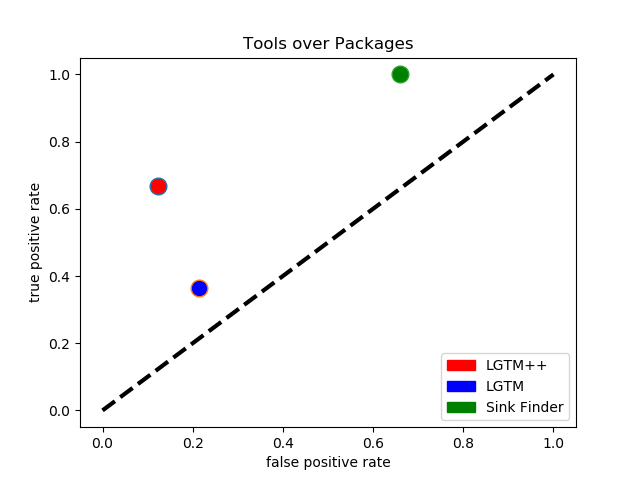

# Queries Report

This report shows the results of the LGTM query set versus our LGTM++ query set. The SinkFinder's results are also included.

## Results

The tools being used are our additional quieries (LGTM++), the built in queries from codeQL (LGTM), and the sinkfinder we've developed previously. The packages were the list of 50 from Comcast (except for 2 that wouldn't compile) and 2 additional packages from cves we found to be relevant. Overall, LGTM++ had the highest true positive rate with the smallest false positive rate. The further from the line on the left side, the better the tool.

## Scoring

Each tool was scored using our benchmark's scorecard generator process. This is process that mimic's OWASP's scoring schema. The automation script runs the queries over each package and outputs each result (empty file if nothing is found) in a csv file. The scorecard script reads each file and counts the true/false positives/negatives. The index.csv indicates the location of of all true positives in the packages to help with scoring.

## LGTM 

The scorecard is in the repository labeled `LGTM over Packages.csv`. The false positive rate is 0.21, the true positive rate is 0.36, and the corresponding score is 0.14. The queries used are in the json `LGTM.json` and are `CodeInjection.ql` and `Eval.ql`. 

## LGTM++

The scorecard is in the repository labeled `LGTM++ over Packages.csv`. The false positive rate is 0.12, the true positive rate is 0.66, and the corresponding score is 0.54. The query used are in the json `LGTM++.json` and is `customCodeInjection2.ql`. 

## SinkFinder

The scorecard is in the repository labeled `SinkFinder over Packages.csv`. The false positive rate is 0.66, the true positive rate is 1, and the corresponding score is 0.34. This tool was run over the same package list and manually counted.