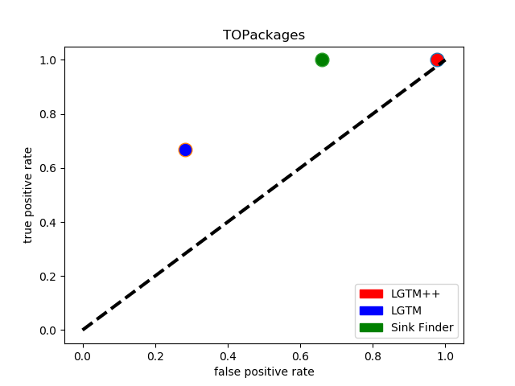

# Queries Report

This report shows the results of the LGTM query set versus our LGTM++ query set. The SinkFinder's results are also included.

## Results Summary


The tools being used are our additional queries (LGTM++), the built in queries from codeQL (LGTM), and the SinkFinder we've developed previously. The included packages are:

- the list of "50" from Comcast  (49 really) (except for 2 that wouldn't compile)
- 3 additional packages from CVEs we found to be relevant.

In total, there are therefore 50 benchmarks. 

**Bottom line**: LGTM++ has more expressive power than LGTM. Advantage to LGTM++ with a high true positive rate. Not all queries that were in SinkFinder have been ported over (Roughly: 5 in 11 were ported). 

### Queries

#### Classic Sink Finder

AST pattern matching for eval and the obfuscated variants. Roughly 10 patterns. 


#### LGTM

List of queries included.
- `CodeInjection.ql` - LGTM query designed for Code Injection. (`ql/security` folder of LGTM distribution). However it does not find anything from the benchmark list. Since it was designed for specific vulnerabilities, additional benchmarks must be added to demonstrate its value. 
- `Eval.ql` - LGTM query designed for finding `Eval`.

#### LGTM++
This is not a superset of LGTM. It is a replacement.

list of queries included
- `customCodeInjection.ql` - Our custom query for finding eval.
- `customCodeInjection2.ql` - a variant of the previous query.

LGTM++ finds the save vulnerabilities as the default LGTM

## Scoring

Each tool was scored using our benchmark's scorecard generator process. This is process that mimic's OWASP's scoring schema. The False Positives are each line reported in the output. The True Negative are each package the tool ignored. The True Positives are the correctly reported line from the tool's output. The False Negative are the known vulneralbilities missed by the tool. The index.csv indicates the location of of all true positives in the packages to help with scoring. 

**Recall formulas for the rates**

- true positive rate = TP / (TP+FN*)
- false positive rate = FP / (FP + TN)

*False Negatives are not all known. This is found from reported cves and manual analysis.

**How do we count, no duplicates**

Counted by hand so no mistakes could be made.

## LGTM

The scorecard is in the repository labeled `LGTM over Packages.csv`. The queries used are in the json `LGTM.json`.

| **CWE**               | **TP**     | **FN***    | **TN**      | **FP**      | **Total**           | **TPR**                        | **FPR**                        | **Score**                         |
| --------------------- | ---------- | ---------- | ----------- | ----------- | ------------------- | ------------------------------ | ------------------------------ | --------------------------------- |
| **94:Code injection** | 4          | 2          | 38          | 15          | 59                  | 0.6666666666666670             | 0.2830188679245280             | 0.38364779874213800               |
|                       | Total TP:4 | Total FN:2 | Total TN:38 | Total FP:15 | Total Test Cases:59 | Average TPR:0.6666666666666666 | Average FPR:0.2830188679245283 | Average Score:0.38364779874213834 |

## LGTM++

The scorecard is in the repository labeled `LGTM++ over Packages.csv`. The query used are in the json `LGTM++.json`.

| **CWE**               | **TP**     | **FN***    | **TN**      | **FP**       | **Total**            | **TPR**       | **FPR**         | **Score**          |
| --------------------- | ---------- | ---------- | ----------- | ------------ | -------------------- | ------------- | --------------- | ------------------ |
| **94:Code injection** | 6          | 0          | 23          | 931          | 960                  | 1             | 0.975890985     | 0.024109015        |
|                       | Total TP:6 | Total FN:0 | Total TN:23 | Total FP:931 | Total Test Cases:960 | Average TPR:1 | Average FPR:.97 | Average Score:.024 |

## SinkFinder

The scorecard is in the repository labeled `SinkFinder over Packages.csv`. This tool was run over the same package list.

| **CWE**               | **TP**     | **FN***    | **TN**      | **FP**      | **Total**            | **TPR**       | **FPR**          | **Score**          |
| --------------------- | ---------- | ---------- | ----------- | ----------- | -------------------- | ------------- | ---------------- | ------------------ |
| **94:Code injection** | 6          | 0          | 34          | 66          | 106                  | 1             | 0.66             | 0.34               |
|                       | Total TP:6 | Total FN:0 | Total TN:34 | Total FP:66 | Total Test Cases:106 | Average TPR:1 | Average FPR:0.66 | Average Score:0.34 |

# Include the Raw DATA

### LGTM

| **Use of eval** | **The 'eval' function and the 'Function' constructor execute strings as code. This is dangerous and impedes program analysis and understanding. Consequently, these two functions should not be used.** | **recommendation** | **Do not use eval or the Function constructor.** | **/backbone-localstorage-0.3.2/package/test/vendor/jquery.js** | **612** | **5** | **612** | **41** |
| --------------- | ------------------------------------------------------------ | ------------------ | ------------------------------------------------ | ------------------------------------------------------------ | ------- | ----- | ------- | ------ |
| **Use of eval** | The 'eval' function and the 'Function' constructor execute strings as code. This is dangerous and impedes program analysis and understanding. Consequently, these two functions should not be used. | recommendation     | Do not use eval or the Function constructor.     | /flot-3.2.5/package/source/jquery.js                         | 565     | 5     | 565     | 41     |
| **Use of eval** | The 'eval' function and the 'Function' constructor execute strings as code. This is dangerous and impedes program analysis and understanding. Consequently, these two functions should not be used. | recommendation     | Do not use eval or the Function constructor.     | /twitter-bootstrap-2.1.1/package/docs/assets/js/jquery.js    | 2       | 11362 | 2       | 11377  |
| **Use of eval** | The 'eval' function and the 'Function' constructor execute strings as code. This is dangerous and impedes program analysis and understanding. Consequently, these two functions should not be used. | recommendation     | Do not use eval or the Function constructor.     | /twitter-bootstrap-2.1.1/package/js/tests/vendor/jquery.js   | 2       | 11362 | 2       | 11377  |
| **Use of eval** | The 'eval' function and the 'Function' constructor execute strings as code. This is dangerous and impedes program analysis and understanding. Consequently, these two functions should not be used. | recommendation     | Do not use eval or the Function constructor.     | /angular-1.7.8/package/angular.js                            | 1289    | 7     | 1289    | 22     |
| **Use of eval** | The 'eval' function and the 'Function' constructor execute strings as code. This is dangerous and impedes program analysis and understanding. Consequently, these two functions should not be used. | recommendation     | Do not use eval or the Function constructor.     | /angular-1.7.8/package/angular.js                            | 16418   | 15    | 16422   | 17     |
| **Use of eval** | The 'eval' function and the 'Function' constructor execute strings as code. This is dangerous and impedes program analysis and understanding. Consequently, these two functions should not be used. | recommendation     | Do not use eval or the Function constructor.     | /backbone-localstorage-0.3.2/package/test/vendor/jquery.js   | 569     | 15    | 569     | 46     |
| **Use of eval** | The 'eval' function and the 'Function' constructor execute strings as code. This is dangerous and impedes program analysis and understanding. Consequently, these two functions should not be used. | recommendation     | Do not use eval or the Function constructor.     | /backbone-localstorage-0.3.2/package/test/vendor/underscore.js | 1206    | 16    | 1206    | 68     |
| **Use of eval** | The 'eval' function and the 'Function' constructor execute strings as code. This is dangerous and impedes program analysis and understanding. Consequently, these two functions should not be used. | recommendation     | Do not use eval or the Function constructor.     | /depot-0.1.6/package/specs/vendor/chai.js                    | 2333    | 34    | 2333    | 60     |
| **Use of eval** | The 'eval' function and the 'Function' constructor execute strings as code. This is dangerous and impedes program analysis and understanding. Consequently, these two functions should not be used. | recommendation     | Do not use eval or the Function constructor.     | /flot-3.2.5/package/source/jquery.js                         | 524     | 13    | 524     | 44     |
| **Use of eval** | The 'eval' function and the 'Function' constructor execute strings as code. This is dangerous and impedes program analysis and understanding. Consequently, these two functions should not be used. | recommendation     | Do not use eval or the Function constructor.     | /jade-1.11.0/package/bin/jade.js                             | 78      | 12    | 78      | 40     |
| **Use of eval** | The 'eval' function and the 'Function' constructor execute strings as code. This is dangerous and impedes program analysis and understanding. Consequently, these two functions should not be used. | recommendation     | Do not use eval or the Function constructor.     | /jade-1.11.0/package/jade.js                                 | 220     | 8     | 220     | 39     |
| **Use of eval** | The 'eval' function and the 'Function' constructor execute strings as code. This is dangerous and impedes program analysis and understanding. Consequently, these two functions should not be used. | recommendation     | Do not use eval or the Function constructor.     | /jade-1.11.0/package/jade.js                                 | 4510    | 5     | 4510    | 67     |
| **Use of eval** | The 'eval' function and the 'Function' constructor execute strings as code. This is dangerous and impedes program analysis and understanding. Consequently, these two functions should not be used. | recommendation     | Do not use eval or the Function constructor.     | /jade-1.11.0/package/jade.js                                 | 6252    | 10    | 6252    | 31     |
| **Use of eval** | The 'eval' function and the 'Function' constructor execute strings as code. This is dangerous and impedes program analysis and understanding. Consequently, these two functions should not be used. | recommendation     | Do not use eval or the Function constructor.     | /jade-1.11.0/package/lib/index.js                            | 218     | 8     | 218     | 39     |
| **Use of eval** | The 'eval' function and the 'Function' constructor execute strings as code. This is dangerous and impedes program analysis and understanding. Consequently, these two functions should not be used. | recommendation     | Do not use eval or the Function constructor.     | /jquery-migrate-3.1.0/package/test/data/jquery-2.2.3.js      | 343     | 5     | 343     | 20     |
| **Use of eval** | The 'eval' function and the 'Function' constructor execute strings as code. This is dangerous and impedes program analysis and understanding. Consequently, these two functions should not be used. | recommendation     | Do not use eval or the Function constructor.     | /jsdiff-1.1.1/package/readme.js                              | 9       | 36    | 9       | 77     |
| **Use of eval** | The 'eval' function and the 'Function' constructor execute strings as code. This is dangerous and impedes program analysis and understanding. Consequently, these two functions should not be used. | recommendation     | Do not use eval or the Function constructor.     | /prototype-0.0.5/package/lib/String.js                       | 100     | 64    | 100     | 75     |
| **Use of eval** | The 'eval' function and the 'Function' constructor execute strings as code. This is dangerous and impedes program analysis and understanding. Consequently, these two functions should not be used. | recommendation     | Do not use eval or the Function constructor.     | /prototype-0.0.5/package/lib/String.js                       | 201     | 46    | 201     | 67     |
| **Use of eval** | The 'eval' function and the 'Function' constructor execute strings as code. This is dangerous and impedes program analysis and understanding. Consequently, these two functions should not be used. | recommendation     | Do not use eval or the Function constructor.     | /twitter-bootstrap-2.1.1/package/docs/assets/js/jquery.js    | 2       | 10894 | 2       | 10918  |
| **Use of eval** | The 'eval' function and the 'Function' constructor execute strings as code. This is dangerous and impedes program analysis and understanding. Consequently, these two functions should not be used. | recommendation     | Do not use eval or the Function constructor.     | /twitter-bootstrap-2.1.1/package/js/tests/phantom.js         | 11      | 54    | 11      | 65     |
| **Use of eval** | The 'eval' function and the 'Function' constructor execute strings as code. This is dangerous and impedes program analysis and understanding. Consequently, these two functions should not be used. | recommendation     | Do not use eval or the Function constructor.     | /twitter-bootstrap-2.1.1/package/js/tests/phantom.js         | 19      | 44    | 19      | 56     |
| **Use of eval** | The 'eval' function and the 'Function' constructor execute strings as code. This is dangerous and impedes program analysis and understanding. Consequently, these two functions should not be used. | recommendation     | Do not use eval or the Function constructor.     | /twitter-bootstrap-2.1.1/package/js/tests/vendor/jquery.js   | 2       | 10894 | 2       | 10918  |
| **Use of eval** | The 'eval' function and the 'Function' constructor execute strings as code. This is dangerous and impedes program analysis and understanding. Consequently, these two functions should not be used. | recommendation     | Do not use eval or the Function constructor.     | /vis-4.21.0-EOL/package/dist/vis.js                          | 34455   | 40    | 34455   | 55     |
| **Use of eval** | The 'eval' function and the 'Function' constructor execute strings as code. This is dangerous and impedes program analysis and understanding. Consequently, these two functions should not be used. | recommendation     | Do not use eval or the Function constructor.     | /vis-4.21.0-EOL/package/docs/js/ie-emulation-modes-warning.js | 28      | 26    | 28      | 79     |
| **Use of eval** | The 'eval' function and the 'Function' constructor execute strings as code. This is dangerous and impedes program analysis and understanding. Consequently, these two functions should not be used. | recommendation     | Do not use eval or the Function constructor.     | /vis-4.21.0-EOL/package/examples/graph3d/playground/playground.js | 386     | 3     | 386     | 10     |
| **Use of eval** | The 'eval' function and the 'Function' constructor execute strings as code. This is dangerous and impedes program analysis and understanding. Consequently, these two functions should not be used. | recommendation     | Do not use eval or the Function constructor.     | /vis-4.21.0-EOL/package/examples/timeline/other/requirejs/scripts/require.js | 35      | 39    | 35      | 45     |

### LGTM++

| Code injection custom 2 | Interpreting unsanitized user input as code allows a malicious user arbitrary code execution. | warning | Here                    | /depot-0.1.6/package/specs/vendor/chai.js                    | 2333  | 34    | 2333  | 60    |
| ----------------------- | ------------------------------------------------------------ | ------- | ----------------------- | ------------------------------------------------------------ | ----- | ----- | ----- | ----- |
| Code injection custom 2 | Interpreting unsanitized user input as code allows a malicious user arbitrary code execution. | warning | Here                    | /jade-1.11.0/package/bin/jade.js                             | 78    | 12    | 78    | 40    |
| Code injection custom 2 | Interpreting unsanitized user input as code allows a malicious user arbitrary code execution. | warning | Here                    | /jade-1.11.0/package/jade.js                                 | 4510  | 5     | 4510  | 67    |
| Code injection custom 2 | Interpreting unsanitized user input as code allows a malicious user arbitrary code execution. | warning | Here                    | /prototype-0.0.5/package/lib/String.js                       | 100   | 64    | 100   | 75    |
| Code injection custom 2 | Interpreting unsanitized user input as code allows a malicious user arbitrary code execution. | warning | Here                    | /prototype-0.0.5/package/lib/String.js                       | 201   | 46    | 201   | 67    |
| Code injection custom 2 | Interpreting unsanitized user input as code allows a malicious user arbitrary code execution. | warning | Here                    | /twitter-bootstrap-2.1.1/package/js/tests/phantom.js         | 11    | 54    | 11    | 65    |
| Code injection custom 2 | Interpreting unsanitized user input as code allows a malicious user arbitrary code execution. | warning | Here                    | /twitter-bootstrap-2.1.1/package/js/tests/phantom.js         | 19    | 44    | 19    | 56    |
| Code injection custom 2 | Interpreting unsanitized user input as code allows a malicious user arbitrary code execution. | warning | Here                    | /vis-4.21.0-EOL/package/dist/vis.js                          | 34455 | 40    | 34455 | 55    |
| Code injection custom 2 | Interpreting unsanitized user input as code allows a malicious user arbitrary code execution. | warning | Here                    | /vis-4.21.0-EOL/package/examples/graph3d/playground/playground.js | 386   | 3     | 386   | 10    |
| Code injection custom 2 | Interpreting unsanitized user input as code allows a malicious user arbitrary code execution. | warning | Here                    | /vis-4.21.0-EOL/package/examples/timeline/other/requirejs/scripts/require.js | 35    | 39    | 35    | 45    |
| Function                | Interpreting unsanitized user input as code allows a malicious user arbitrary code execution. Pattern used for []() methods | warning | Got it!                 | /angular-1.7.8/package/angular.js                            | 1289  | 7     | 1289  | 22    |
| Function                | Interpreting unsanitized user input as code allows a malicious user arbitrary code execution. Pattern used for []() methods | warning | Got it!                 | /angular-1.7.8/package/angular.js                            | 16418 | 15    | 16422 | 17    |
| Function                | Interpreting unsanitized user input as code allows a malicious user arbitrary code execution. Pattern used for []() methods | warning | Got it!                 | /backbone-localstorage-0.3.2/package/test/vendor/jquery.js   | 569   | 15    | 569   | 46    |
| Function                | Interpreting unsanitized user input as code allows a malicious user arbitrary code execution. Pattern used for []() methods | warning | Got it!                 | /backbone-localstorage-0.3.2/package/test/vendor/underscore.js | 1206  | 16    | 1206  | 68    |
| Function                | Interpreting unsanitized user input as code allows a malicious user arbitrary code execution. Pattern used for []() methods | warning | Got it!                 | /flot-3.2.5/package/source/jquery.js                         | 524   | 13    | 524   | 44    |
| Function                | Interpreting unsanitized user input as code allows a malicious user arbitrary code execution. Pattern used for []() methods | warning | Got it!                 | /jade-1.11.0/package/jade.js                                 | 220   | 8     | 220   | 39    |
| Function                | Interpreting unsanitized user input as code allows a malicious user arbitrary code execution. Pattern used for []() methods | warning | Got it!                 | /jade-1.11.0/package/jade.js                                 | 1227  | 3     | 1227  | 38    |
| Function                | Interpreting unsanitized user input as code allows a malicious user arbitrary code execution. Pattern used for []() methods | warning | Got it!                 | /jade-1.11.0/package/jade.js                                 | 4503  | 10    | 4503  | 81    |
| Function                | Interpreting unsanitized user input as code allows a malicious user arbitrary code execution. Pattern used for []() methods | warning | Got it!                 | /jade-1.11.0/package/jade.js                                 | 6252  | 10    | 6252  | 31    |
| Function                | Interpreting unsanitized user input as code allows a malicious user arbitrary code execution. Pattern used for []() methods | warning | Got it!                 | /jade-1.11.0/package/lib/index.js                            | 218   | 8     | 218   | 39    |
| Function                | Interpreting unsanitized user input as code allows a malicious user arbitrary code execution. Pattern used for []() methods | warning | Got it!                 | /jade-1.11.0/package/lib/lexer.js                            | 30    | 3     | 30    | 38    |
| Function                | Interpreting unsanitized user input as code allows a malicious user arbitrary code execution. Pattern used for []() methods | warning | Got it!                 | /jsdiff-1.1.1/package/readme.js                              | 9     | 36    | 9     | 77    |
| Function                | Interpreting unsanitized user input as code allows a malicious user arbitrary code execution. Pattern used for []() methods | warning | Got it!                 | /mocha-6.2.0/package/mocha.js                                | 13217 | 13    | 13217 | 119   |
| Function                | Interpreting unsanitized user input as code allows a malicious user arbitrary code execution. Pattern used for []() methods | warning | Got it!                 | /should-13.2.3/package/as-function.js                        | 1364  | 5     | 1366  | 28    |
| Function                | Interpreting unsanitized user input as code allows a malicious user arbitrary code execution. Pattern used for []() methods | warning | Got it!                 | /should-13.2.3/package/as-function.js                        | 1380  | 5     | 1382  | 28    |
| Function                | Interpreting unsanitized user input as code allows a malicious user arbitrary code execution. Pattern used for []() methods | warning | Got it!                 | /should-13.2.3/package/as-function.js                        | 1567  | 5     | 1569  | 28    |
| Function                | Interpreting unsanitized user input as code allows a malicious user arbitrary code execution. Pattern used for []() methods | warning | Got it!                 | /should-13.2.3/package/as-function.js                        | 2470  | 5     | 2470  | 24    |
| Function                | Interpreting unsanitized user input as code allows a malicious user arbitrary code execution. Pattern used for []() methods | warning | Got it!                 | /should-13.2.3/package/cjs/should.js                         | 1364  | 5     | 1366  | 28    |
| Function                | Interpreting unsanitized user input as code allows a malicious user arbitrary code execution. Pattern used for []() methods | warning | Got it!                 | /should-13.2.3/package/cjs/should.js                         | 1380  | 5     | 1382  | 28    |
| Function                | Interpreting unsanitized user input as code allows a malicious user arbitrary code execution. Pattern used for []() methods | warning | Got it!                 | /should-13.2.3/package/cjs/should.js                         | 1567  | 5     | 1569  | 28    |
| Function                | Interpreting unsanitized user input as code allows a malicious user arbitrary code execution. Pattern used for []() methods | warning | Got it!                 | /should-13.2.3/package/cjs/should.js                         | 2470  | 5     | 2470  | 24    |
| Function                | Interpreting unsanitized user input as code allows a malicious user arbitrary code execution. Pattern used for []() methods | warning | Got it!                 | /should-13.2.3/package/cjs/should.js                         | 2946  | 38    | 2946  | 60    |
| Function                | Interpreting unsanitized user input as code allows a malicious user arbitrary code execution. Pattern used for []() methods | warning | Got it!                 | /should-13.2.3/package/es6/should.js                         | 1360  | 5     | 1362  | 28    |
| Function                | Interpreting unsanitized user input as code allows a malicious user arbitrary code execution. Pattern used for []() methods | warning | Got it!                 | /should-13.2.3/package/es6/should.js                         | 1376  | 5     | 1378  | 28    |
| Function                | Interpreting unsanitized user input as code allows a malicious user arbitrary code execution. Pattern used for []() methods | warning | Got it!                 | /should-13.2.3/package/es6/should.js                         | 1563  | 5     | 1565  | 28    |
| Function                | Interpreting unsanitized user input as code allows a malicious user arbitrary code execution. Pattern used for []() methods | warning | Got it!                 | /should-13.2.3/package/es6/should.js                         | 2466  | 5     | 2466  | 24    |
| Function                | Interpreting unsanitized user input as code allows a malicious user arbitrary code execution. Pattern used for []() methods | warning | Got it!                 | /should-13.2.3/package/es6/should.js                         | 2942  | 38    | 2942  | 60    |
| Function                | Interpreting unsanitized user input as code allows a malicious user arbitrary code execution. Pattern used for []() methods | warning | Got it!                 | /should-13.2.3/package/should.js                             | 2765  | 5     | 2767  | 28    |
| Function                | Interpreting unsanitized user input as code allows a malicious user arbitrary code execution. Pattern used for []() methods | warning | Got it!                 | /should-13.2.3/package/should.js                             | 2781  | 5     | 2783  | 28    |
| Function                | Interpreting unsanitized user input as code allows a malicious user arbitrary code execution. Pattern used for []() methods | warning | Got it!                 | /should-13.2.3/package/should.js                             | 2968  | 5     | 2970  | 28    |
| Function                | Interpreting unsanitized user input as code allows a malicious user arbitrary code execution. Pattern used for []() methods | warning | Got it!                 | /should-13.2.3/package/should.js                             | 3871  | 5     | 3871  | 24    |
| Function                | Interpreting unsanitized user input as code allows a malicious user arbitrary code execution. Pattern used for []() methods | warning | Got it!                 | /should-13.2.3/package/should.js                             | 4347  | 38    | 4347  | 60    |
| Function                | Interpreting unsanitized user input as code allows a malicious user arbitrary code execution. Pattern used for []() methods | warning | Got it!                 | /static-eval-2.0.5/package/index.js                          | 176   | 20    | 176   | 71    |
| Function                | Interpreting unsanitized user input as code allows a malicious user arbitrary code execution. Pattern used for []() methods | warning | Got it!                 | /twitter-bootstrap-2.1.1/package/docs/assets/js/jquery.js    | 2     | 10894 | 2     | 10918 |
| Function                | Interpreting unsanitized user input as code allows a malicious user arbitrary code execution. Pattern used for []() methods | warning | Got it!                 | /twitter-bootstrap-2.1.1/package/js/tests/vendor/jquery.js   | 2     | 10894 | 2     | 10918 |
| Function                | Interpreting unsanitized user input as code allows a malicious user arbitrary code execution. Pattern used for []() methods | warning | Got it!                 | /uglify-to-browserify-2.1.0/package/test/index.js            | 14    | 5     | 14    | 44    |
| Function                | Interpreting unsanitized user input as code allows a malicious user arbitrary code execution. Pattern used for []() methods | warning | Got it!                 | /uglify-to-browserify-2.1.0/package/test/index.js            | 35    | 12    | 35    | 56    |
| Function                | Interpreting unsanitized user input as code allows a malicious user arbitrary code execution. Pattern used for []() methods | warning | Got it!                 | /vis-4.21.0-EOL/package/dist/vis.js                          | 4057  | 5     | 4057  | 27    |
| Function                | Interpreting unsanitized user input as code allows a malicious user arbitrary code execution. Pattern used for []() methods | warning | Got it!                 | /vis-4.21.0-EOL/package/dist/vis.js                          | 34455 | 11    | 34455 | 33    |
| Function                | Interpreting unsanitized user input as code allows a malicious user arbitrary code execution. Pattern used for []() methods | warning | Got it!                 | /vis-4.21.0-EOL/package/docs/js/ie-emulation-modes-warning.js | 28    | 26    | 28    | 79    |
| window                  | Interpreting unsanitized user input as code allows a malicious user arbitrary code execution. Pattern for using call to global window. | warning | Potential vulnerability | /backbone-localstorage-0.3.2/package/test/vendor/jquery.js   | 612   | 5     | 612   | 41    |
| window                  | Interpreting unsanitized user input as code allows a malicious user arbitrary code execution. Pattern for using call to global window. | warning | Potential vulnerability | /flot-3.2.5/package/source/jquery.js                         | 565   | 5     | 565   | 41    |
| Custom Eval Property    | Interpreting unsanitized user input as code allows a malicious user arbitrary code execution. Pattern focused on array-like properties | warning | here                    | /alt-0.18.6/package/dist/alt.js                              | 659   | 6     | 659   | 46    |
| Custom Eval Property    | Interpreting unsanitized user input as code allows a malicious user arbitrary code execution. Pattern focused on array-like properties | warning | here                    | /angular-1.7.8/package/angular.js                            | 2602  | 13    | 2602  | 72    |
| Custom Eval Property    | Interpreting unsanitized user input as code allows a malicious user arbitrary code execution. Pattern focused on array-like properties | warning | here                    | /angular-1.7.8/package/angular.js                            | 6251  | 11    | 6251  | 24    |
| Custom Eval Property    | Interpreting unsanitized user input as code allows a malicious user arbitrary code execution. Pattern focused on array-like properties | warning | here                    | /angular-1.7.8/package/angular.js                            | 6291  | 9     | 6298  | 10    |
| Custom Eval Property    | Interpreting unsanitized user input as code allows a malicious user arbitrary code execution. Pattern focused on array-like properties | warning | here                    | /angular-1.7.8/package/angular.js                            | 6372  | 16    | 6372  | 50    |
| Custom Eval Property    | Interpreting unsanitized user input as code allows a malicious user arbitrary code execution. Pattern focused on array-like properties | warning | here                    | /angular-1.7.8/package/angular.js                            | 6376  | 16    | 6376  | 52    |
| Custom Eval Property    | Interpreting unsanitized user input as code allows a malicious user arbitrary code execution. Pattern focused on array-like properties | warning | here                    | /angular-1.7.8/package/angular.js                            | 6630  | 9     | 6630  | 71    |
| Custom Eval Property    | Interpreting unsanitized user input as code allows a malicious user arbitrary code execution. Pattern focused on array-like properties | warning | here                    | /angular-1.7.8/package/angular.js                            | 9279  | 15    | 9279  | 33    |
| Custom Eval Property    | Interpreting unsanitized user input as code allows a malicious user arbitrary code execution. Pattern focused on array-like properties | warning | here                    | /angular-1.7.8/package/angular.js                            | 11382 | 27    | 11391 | 14    |
| Custom Eval Property    | Interpreting unsanitized user input as code allows a malicious user arbitrary code execution. Pattern focused on array-like properties | warning | here                    | /angular-1.7.8/package/angular.js                            | 11444 | 13    | 11444 | 38    |
| Custom Eval Property    | Interpreting unsanitized user input as code allows a malicious user arbitrary code execution. Pattern focused on array-like properties | warning | here                    | /angular-1.7.8/package/angular.js                            | 13976 | 29    | 13976 | 48    |
| Custom Eval Property    | Interpreting unsanitized user input as code allows a malicious user arbitrary code execution. Pattern focused on array-like properties | warning | here                    | /angular-1.7.8/package/angular.js                            | 16892 | 14    | 16892 | 57    |
| Custom Eval Property    | Interpreting unsanitized user input as code allows a malicious user arbitrary code execution. Pattern focused on array-like properties | warning | here                    | /angular-1.7.8/package/angular.js                            | 16896 | 14    | 16896 | 64    |
| Custom Eval Property    | Interpreting unsanitized user input as code allows a malicious user arbitrary code execution. Pattern focused on array-like properties | warning | here                    | /angular-1.7.8/package/angular.js                            | 16900 | 14    | 16900 | 64    |
| Custom Eval Property    | Interpreting unsanitized user input as code allows a malicious user arbitrary code execution. Pattern focused on array-like properties | warning | here                    | /angular-1.7.8/package/angular.js                            | 16902 | 14    | 16907 | 7     |
| Custom Eval Property    | Interpreting unsanitized user input as code allows a malicious user arbitrary code execution. Pattern focused on array-like properties | warning | here                    | /angular-1.7.8/package/angular.js                            | 16930 | 25    | 16930 | 62    |
| Custom Eval Property    | Interpreting unsanitized user input as code allows a malicious user arbitrary code execution. Pattern focused on array-like properties | warning | here                    | /angular-1.7.8/package/angular.js                            | 16941 | 27    | 16941 | 64    |
| Custom Eval Property    | Interpreting unsanitized user input as code allows a malicious user arbitrary code execution. Pattern focused on array-like properties | warning | here                    | /angular-1.7.8/package/angular.js                            | 16964 | 22    | 16964 | 59    |
| Custom Eval Property    | Interpreting unsanitized user input as code allows a malicious user arbitrary code execution. Pattern focused on array-like properties | warning | here                    | /angular-1.7.8/package/angular.js                            | 17449 | 31    | 17449 | 56    |
| Custom Eval Property    | Interpreting unsanitized user input as code allows a malicious user arbitrary code execution. Pattern focused on array-like properties | warning | here                    | /angular-1.7.8/package/angular.js                            | 19193 | 13    | 19193 | 56    |
| Custom Eval Property    | Interpreting unsanitized user input as code allows a malicious user arbitrary code execution. Pattern focused on array-like properties | warning | here                    | /angular-1.7.8/package/angular.js                            | 22764 | 17    | 22764 | 36    |
| Custom Eval Property    | Interpreting unsanitized user input as code allows a malicious user arbitrary code execution. Pattern focused on array-like properties | warning | here                    | /angular-1.7.8/package/angular.js                            | 22775 | 17    | 22775 | 36    |
| Custom Eval Property    | Interpreting unsanitized user input as code allows a malicious user arbitrary code execution. Pattern focused on array-like properties | warning | here                    | /angular-1.7.8/package/angular.js                            | 22787 | 27    | 22787 | 70    |
| Custom Eval Property    | Interpreting unsanitized user input as code allows a malicious user arbitrary code execution. Pattern focused on array-like properties | warning | here                    | /angular-1.7.8/package/angular.js                            | 30768 | 22    | 30768 | 49    |
| Custom Eval Property    | Interpreting unsanitized user input as code allows a malicious user arbitrary code execution. Pattern focused on array-like properties | warning | here                    | /angular-1.7.8/package/angular.js                            | 31072 | 19    | 31072 | 44    |
| Custom Eval Property    | Interpreting unsanitized user input as code allows a malicious user arbitrary code execution. Pattern focused on array-like properties | warning | here                    | /angular-1.7.8/package/angular.js                            | 34148 | 9     | 34150 | 10    |
| Custom Eval Property    | Interpreting unsanitized user input as code allows a malicious user arbitrary code execution. Pattern focused on array-like properties | warning | here                    | /angular-1.7.8/package/angular.js                            | 34365 | 9     | 34367 | 10    |
| Custom Eval Property    | Interpreting unsanitized user input as code allows a malicious user arbitrary code execution. Pattern focused on array-like properties | warning | here                    | /angular-mocks-1.7.8/package/angular-mocks.js                | 977   | 11    | 977   | 20    |
| Custom Eval Property    | Interpreting unsanitized user input as code allows a malicious user arbitrary code execution. Pattern focused on array-like properties | warning | here                    | /angular-mocks-1.7.8/package/angular-mocks.js                | 2044  | 9     | 2044  | 17    |
| Custom Eval Property    | Interpreting unsanitized user input as code allows a malicious user arbitrary code execution. Pattern focused on array-like properties | warning | here                    | /angular-mocks-1.7.8/package/angular-mocks.js                | 2048  | 9     | 2048  | 38    |
| Custom Eval Property    | Interpreting unsanitized user input as code allows a malicious user arbitrary code execution. Pattern focused on array-like properties | warning | here                    | /angular-mocks-1.7.8/package/angular-mocks.js                | 2126  | 15    | 2126  | 73    |
| Custom Eval Property    | Interpreting unsanitized user input as code allows a malicious user arbitrary code execution. Pattern focused on array-like properties | warning | here                    | /angular-mocks-1.7.8/package/angular-mocks.js                | 2137  | 16    | 2137  | 69    |
| Custom Eval Property    | Interpreting unsanitized user input as code allows a malicious user arbitrary code execution. Pattern focused on array-like properties | warning | here                    | /angular-mocks-1.7.8/package/angular-mocks.js                | 2464  | 7     | 2464  | 22    |
| Custom Eval Property    | Interpreting unsanitized user input as code allows a malicious user arbitrary code execution. Pattern focused on array-like properties | warning | here                    | /angular-resource-1.7.8/package/angular-resource.js          | 859   | 23    | 866   | 14    |
| Custom Eval Property    | Interpreting unsanitized user input as code allows a malicious user arbitrary code execution. Pattern focused on array-like properties | warning | here                    | /asynckit-0.4.0/package/lib/abort.js                         | 27    | 5     | 27    | 20    |
| Custom Eval Property    | Interpreting unsanitized user input as code allows a malicious user arbitrary code execution. Pattern focused on array-like properties | warning | here                    | /backbone-1.4.0/package/backbone.js                          | 1015  | 14    | 1015  | 51    |
| Custom Eval Property    | Interpreting unsanitized user input as code allows a malicious user arbitrary code execution. Pattern focused on array-like properties | warning | here                    | /backbone-1.4.0/package/backbone.js                          | 1059  | 9     | 1059  | 41    |
| Custom Eval Property    | Interpreting unsanitized user input as code allows a malicious user arbitrary code execution. Pattern focused on array-like properties | warning | here                    | /backbone-1.4.0/package/backbone.js                          | 1460  | 16    | 1460  | 44    |
| Custom Eval Property    | Interpreting unsanitized user input as code allows a malicious user arbitrary code execution. Pattern focused on array-like properties | warning | here                    | /backbone-1.4.0/package/backbone.js                          | 1463  | 16    | 1463  | 51    |
| Custom Eval Property    | Interpreting unsanitized user input as code allows a malicious user arbitrary code execution. Pattern focused on array-like properties | warning | here                    | /backbone-1.4.0/package/backbone.js                          | 1466  | 16    | 1466  | 73    |
| Custom Eval Property    | Interpreting unsanitized user input as code allows a malicious user arbitrary code execution. Pattern focused on array-like properties | warning | here                    | /backbone-1.4.0/package/backbone.js                          | 1469  | 16    | 1469  | 85    |
| Custom Eval Property    | Interpreting unsanitized user input as code allows a malicious user arbitrary code execution. Pattern focused on array-like properties | warning | here                    | /backbone-1.4.0/package/backbone.js                          | 1999  | 9     | 1999  | 93    |
| Custom Eval Property    | Interpreting unsanitized user input as code allows a malicious user arbitrary code execution. Pattern focused on array-like properties | warning | here                    | /backbone-localstorage-0.3.2/package/test/vendor/backbone.js | 223   | 7     | 223   | 47    |
| Custom Eval Property    | Interpreting unsanitized user input as code allows a malicious user arbitrary code execution. Pattern focused on array-like properties | warning | here                    | /backbone-localstorage-0.3.2/package/test/vendor/backbone.js | 813   | 14    | 818   | 8     |
| Custom Eval Property    | Interpreting unsanitized user input as code allows a malicious user arbitrary code execution. Pattern focused on array-like properties | warning | here                    | /backbone-localstorage-0.3.2/package/test/vendor/backbone.js | 860   | 9     | 860   | 41    |
| Custom Eval Property    | Interpreting unsanitized user input as code allows a malicious user arbitrary code execution. Pattern focused on array-like properties | warning | here                    | /backbone-localstorage-0.3.2/package/test/vendor/backbone.js | 969   | 14    | 969   | 54    |
| Custom Eval Property    | Interpreting unsanitized user input as code allows a malicious user arbitrary code execution. Pattern focused on array-like properties | warning | here                    | /backbone-localstorage-0.3.2/package/test/vendor/backbone.js | 1486  | 9     | 1486  | 93    |
| Custom Eval Property    | Interpreting unsanitized user input as code allows a malicious user arbitrary code execution. Pattern focused on array-like properties | warning | here                    | /backbone-localstorage-0.3.2/package/test/vendor/jquery.js   | 161   | 9     | 161   | 41    |
| Custom Eval Property    | Interpreting unsanitized user input as code allows a malicious user arbitrary code execution. Pattern focused on array-like properties | warning | here                    | /backbone-localstorage-0.3.2/package/test/vendor/jquery.js   | 2310  | 12    | 2310  | 40    |
| Custom Eval Property    | Interpreting unsanitized user input as code allows a malicious user arbitrary code execution. Pattern focused on array-like properties | warning | here                    | /backbone-localstorage-0.3.2/package/test/vendor/jquery.js   | 2438  | 14    | 2438  | 40    |
| Custom Eval Property    | Interpreting unsanitized user input as code allows a malicious user arbitrary code execution. Pattern focused on array-like properties | warning | here                    | /backbone-localstorage-0.3.2/package/test/vendor/jquery.js   | 2530  | 11    | 2530  | 43    |
| Custom Eval Property    | Interpreting unsanitized user input as code allows a malicious user arbitrary code execution. Pattern focused on array-like properties | warning | here                    | /backbone-localstorage-0.3.2/package/test/vendor/jquery.js   | 2722  | 34    | 2722  | 104   |
| Custom Eval Property    | Interpreting unsanitized user input as code allows a malicious user arbitrary code execution. Pattern focused on array-like properties | warning | here                    | /backbone-localstorage-0.3.2/package/test/vendor/jquery.js   | 2859  | 17    | 2859  | 90    |
| Custom Eval Property    | Interpreting unsanitized user input as code allows a malicious user arbitrary code execution. Pattern focused on array-like properties | warning | here                    | /backbone-localstorage-0.3.2/package/test/vendor/jquery.js   | 3203  | 8     | 3213  | 9     |
| Custom Eval Property    | Interpreting unsanitized user input as code allows a malicious user arbitrary code execution. Pattern focused on array-like properties | warning | here                    | /backbone-localstorage-0.3.2/package/test/vendor/jquery.js   | 3211  | 10    | 3211  | 115   |
| Custom Eval Property    | Interpreting unsanitized user input as code allows a malicious user arbitrary code execution. Pattern focused on array-like properties | warning | here                    | /backbone-localstorage-0.3.2/package/test/vendor/jquery.js   | 3249  | 5     | 3249  | 82    |
| Custom Eval Property    | Interpreting unsanitized user input as code allows a malicious user arbitrary code execution. Pattern focused on array-like properties | warning | here                    | /backbone-localstorage-0.3.2/package/test/vendor/jquery.js   | 5039  | 7     | 5039  | 20    |
| Custom Eval Property    | Interpreting unsanitized user input as code allows a malicious user arbitrary code execution. Pattern focused on array-like properties | warning | here                    | /backbone-localstorage-0.3.2/package/test/vendor/jquery.js   | 6442  | 4     | 6442  | 43    |
| Custom Eval Property    | Interpreting unsanitized user input as code allows a malicious user arbitrary code execution. Pattern focused on array-like properties | warning | here                    | /backbone-localstorage-0.3.2/package/test/vendor/jquery.js   | 8111  | 4     | 8111  | 23    |
| Custom Eval Property    | Interpreting unsanitized user input as code allows a malicious user arbitrary code execution. Pattern focused on array-like properties | warning | here                    | /backbone-localstorage-0.3.2/package/test/vendor/jquery.js   | 8614  | 4     | 8614  | 41    |
| Custom Eval Property    | Interpreting unsanitized user input as code allows a malicious user arbitrary code execution. Pattern focused on array-like properties | warning | here                    | /backbone-localstorage-0.3.2/package/test/vendor/jquery.js   | 9216  | 23    | 9218  | 4     |
| Custom Eval Property    | Interpreting unsanitized user input as code allows a malicious user arbitrary code execution. Pattern focused on array-like properties | warning | here                    | /backbone-localstorage-0.3.2/package/test/vendor/jquery.js   | 9261  | 5     | 9261  | 41    |
| Custom Eval Property    | Interpreting unsanitized user input as code allows a malicious user arbitrary code execution. Pattern focused on array-like properties | warning | here                    | /backbone-localstorage-0.3.2/package/test/vendor/underscore.js | 242   | 12    | 247   | 6     |
| Custom Eval Property    | Interpreting unsanitized user input as code allows a malicious user arbitrary code execution. Pattern focused on array-like properties | warning | here                    | /depot-0.1.6/package/specs/vendor/mocha.js                   | 2041  | 10    | 2041  | 54    |
| Custom Eval Property    | Interpreting unsanitized user input as code allows a malicious user arbitrary code execution. Pattern focused on array-like properties | warning | here                    | /depot-0.1.6/package/specs/vendor/mocha.js                   | 5398  | 25    | 5398  | 44    |
| Custom Eval Property    | Interpreting unsanitized user input as code allows a malicious user arbitrary code execution. Pattern focused on array-like properties | warning | here                    | /director-1.2.8/package/build/director.js                    | 58    | 9     | 58    | 42    |
| Custom Eval Property    | Interpreting unsanitized user input as code allows a malicious user arbitrary code execution. Pattern focused on array-like properties | warning | here                    | /director-1.2.8/package/build/director.js                    | 338   | 13    | 338   | 30    |
| Custom Eval Property    | Interpreting unsanitized user input as code allows a malicious user arbitrary code execution. Pattern focused on array-like properties | warning | here                    | /director-1.2.8/package/lib/director/browser.js              | 49    | 9     | 49    | 42    |
| Custom Eval Property    | Interpreting unsanitized user input as code allows a malicious user arbitrary code execution. Pattern focused on array-like properties | warning | here                    | /director-1.2.8/package/lib/director/router.js               | 81    | 13    | 81    | 30    |
| Custom Eval Property    | Interpreting unsanitized user input as code allows a malicious user arbitrary code execution. Pattern focused on array-like properties | warning | here                    | /eslint-utils-1.2.0/package/index.js                         | 412   | 37    | 412   | 65    |
| Custom Eval Property    | Interpreting unsanitized user input as code allows a malicious user arbitrary code execution. Pattern focused on array-like properties | warning | here                    | /eslint-utils-1.2.0/package/index.js                         | 633   | 16    | 633   | 56    |
| Custom Eval Property    | Interpreting unsanitized user input as code allows a malicious user arbitrary code execution. Pattern focused on array-like properties | warning | here                    | /eslint-utils-1.2.0/package/index.mjs                        | 408   | 37    | 408   | 65    |
| Custom Eval Property    | Interpreting unsanitized user input as code allows a malicious user arbitrary code execution. Pattern focused on array-like properties | warning | here                    | /eslint-utils-1.2.0/package/index.mjs                        | 629   | 16    | 629   | 56    |
| Custom Eval Property    | Interpreting unsanitized user input as code allows a malicious user arbitrary code execution. Pattern focused on array-like properties | warning | here                    | /flot-3.2.5/package/dist/es5/jquery.flot.js                  | 1     | 74056 | 1     | 74082 |
| Custom Eval Property    | Interpreting unsanitized user input as code allows a malicious user arbitrary code execution. Pattern focused on array-like properties | warning | here                    | /flot-3.2.5/package/dist/es5/jquery.flot.js                  | 1     | 75794 | 1     | 75805 |
| Custom Eval Property    | Interpreting unsanitized user input as code allows a malicious user arbitrary code execution. Pattern focused on array-like properties | warning | here                    | /flot-3.2.5/package/dist/es5/jquery.flot.js                  | 1     | 75825 | 1     | 75836 |
| Custom Eval Property    | Interpreting unsanitized user input as code allows a malicious user arbitrary code execution. Pattern focused on array-like properties | warning | here                    | /flot-3.2.5/package/dist/es5/jquery.flot.js                  | 1     | 75897 | 1     | 75908 |
| Custom Eval Property    | Interpreting unsanitized user input as code allows a malicious user arbitrary code execution. Pattern focused on array-like properties | warning | here                    | /flot-3.2.5/package/dist/es5/jquery.flot.js                  | 1     | 75926 | 1     | 75937 |
| Custom Eval Property    | Interpreting unsanitized user input as code allows a malicious user arbitrary code execution. Pattern focused on array-like properties | warning | here                    | /flot-3.2.5/package/lib/globalize.js                         | 380   | 9     | 380   | 53    |
| Custom Eval Property    | Interpreting unsanitized user input as code allows a malicious user arbitrary code execution. Pattern focused on array-like properties | warning | here                    | /flot-3.2.5/package/lib/jquery.event.drag.js                 | 141   | 2     | 141   | 79    |
| Custom Eval Property    | Interpreting unsanitized user input as code allows a malicious user arbitrary code execution. Pattern focused on array-like properties | warning | here                    | /flot-3.2.5/package/source/jquery.flot.hover.js              | 289   | 13    | 289   | 62    |
| Custom Eval Property    | Interpreting unsanitized user input as code allows a malicious user arbitrary code execution. Pattern focused on array-like properties | warning | here                    | /flot-3.2.5/package/source/jquery.flot.touch.js              | 62    | 21    | 62    | 34    |
| Custom Eval Property    | Interpreting unsanitized user input as code allows a malicious user arbitrary code execution. Pattern focused on array-like properties | warning | here                    | /flot-3.2.5/package/source/jquery.flot.touch.js              | 65    | 21    | 65    | 36    |
| Custom Eval Property    | Interpreting unsanitized user input as code allows a malicious user arbitrary code execution. Pattern focused on array-like properties | warning | here                    | /flot-3.2.5/package/source/jquery.flot.touch.js              | 71    | 21    | 71    | 38    |
| Custom Eval Property    | Interpreting unsanitized user input as code allows a malicious user arbitrary code execution. Pattern focused on array-like properties | warning | here                    | /flot-3.2.5/package/source/jquery.flot.touch.js              | 74    | 21    | 74    | 34    |
| Custom Eval Property    | Interpreting unsanitized user input as code allows a malicious user arbitrary code execution. Pattern focused on array-like properties | warning | here                    | /flot-3.2.5/package/source/jquery.js                         | 1128  | 8     | 1141  | 8     |
| Custom Eval Property    | Interpreting unsanitized user input as code allows a malicious user arbitrary code execution. Pattern focused on array-like properties | warning | here                    | /flot-3.2.5/package/source/jquery.js                         | 1137  | 11    | 1137  | 90    |
| Custom Eval Property    | Interpreting unsanitized user input as code allows a malicious user arbitrary code execution. Pattern focused on array-like properties | warning | here                    | /flot-3.2.5/package/source/jquery.js                         | 2121  | 6     | 2121  | 60    |
| Custom Eval Property    | Interpreting unsanitized user input as code allows a malicious user arbitrary code execution. Pattern focused on array-like properties | warning | here                    | /flot-3.2.5/package/source/jquery.js                         | 2286  | 11    | 2286  | 41    |
| Custom Eval Property    | Interpreting unsanitized user input as code allows a malicious user arbitrary code execution. Pattern focused on array-like properties | warning | here                    | /flot-3.2.5/package/source/jquery.js                         | 2973  | 6     | 2973  | 19    |
| Custom Eval Property    | Interpreting unsanitized user input as code allows a malicious user arbitrary code execution. Pattern focused on array-like properties | warning | here                    | /flot-3.2.5/package/source/jquery.js                         | 4457  | 12    | 4457  | 40    |
| Custom Eval Property    | Interpreting unsanitized user input as code allows a malicious user arbitrary code execution. Pattern focused on array-like properties | warning | here                    | /flot-3.2.5/package/source/jquery.js                         | 4722  | 14    | 4722  | 40    |
| Custom Eval Property    | Interpreting unsanitized user input as code allows a malicious user arbitrary code execution. Pattern focused on array-like properties | warning | here                    | /flot-3.2.5/package/source/jquery.js                         | 4804  | 11    | 4804  | 43    |
| Custom Eval Property    | Interpreting unsanitized user input as code allows a malicious user arbitrary code execution. Pattern focused on array-like properties | warning | here                    | /flot-3.2.5/package/source/jquery.js                         | 4991  | 34    | 4991  | 104   |
| Custom Eval Property    | Interpreting unsanitized user input as code allows a malicious user arbitrary code execution. Pattern focused on array-like properties | warning | here                    | /flot-3.2.5/package/source/jquery.js                         | 5127  | 15    | 5127  | 89    |
| Custom Eval Property    | Interpreting unsanitized user input as code allows a malicious user arbitrary code execution. Pattern focused on array-like properties | warning | here                    | /flot-3.2.5/package/source/jquery.js                         | 6195  | 4     | 6195  | 32    |
| Custom Eval Property    | Interpreting unsanitized user input as code allows a malicious user arbitrary code execution. Pattern focused on array-like properties | warning | here                    | /flot-3.2.5/package/source/jquery.js                         | 6200  | 5     | 6200  | 44    |
| Custom Eval Property    | Interpreting unsanitized user input as code allows a malicious user arbitrary code execution. Pattern focused on array-like properties | warning | here                    | /flot-3.2.5/package/source/jquery.js                         | 7363  | 5     | 7363  | 52    |
| Custom Eval Property    | Interpreting unsanitized user input as code allows a malicious user arbitrary code execution. Pattern focused on array-like properties | warning | here                    | /flot-3.2.5/package/source/jquery.js                         | 7385  | 15    | 7385  | 58    |
| Custom Eval Property    | Interpreting unsanitized user input as code allows a malicious user arbitrary code execution. Pattern focused on array-like properties | warning | here                    | /flot-3.2.5/package/source/jquery.js                         | 7963  | 4     | 7963  | 23    |
| Custom Eval Property    | Interpreting unsanitized user input as code allows a malicious user arbitrary code execution. Pattern focused on array-like properties | warning | here                    | /flot-3.2.5/package/source/jquery.js                         | 8339  | 4     | 8339  | 30    |
| Custom Eval Property    | Interpreting unsanitized user input as code allows a malicious user arbitrary code execution. Pattern focused on array-like properties | warning | here                    | /flot-3.2.5/package/source/jquery.js                         | 8944  | 23    | 8946  | 4     |
| Custom Eval Property    | Interpreting unsanitized user input as code allows a malicious user arbitrary code execution. Pattern focused on array-like properties | warning | here                    | /flot-3.2.5/package/source/jquery.js                         | 8989  | 5     | 8989  | 41    |
| Custom Eval Property    | Interpreting unsanitized user input as code allows a malicious user arbitrary code execution. Pattern focused on array-like properties | warning | here                    | /jade-1.11.0/package/jade.js                                 | 648   | 12    | 648   | 42    |
| Custom Eval Property    | Interpreting unsanitized user input as code allows a malicious user arbitrary code execution. Pattern focused on array-like properties | warning | here                    | /jade-1.11.0/package/jade.js                                 | 1167  | 12    | 1167  | 37    |
| Custom Eval Property    | Interpreting unsanitized user input as code allows a malicious user arbitrary code execution. Pattern focused on array-like properties | warning | here                    | /jade-1.11.0/package/jade.js                                 | 2115  | 10    | 2115  | 23    |
| Custom Eval Property    | Interpreting unsanitized user input as code allows a malicious user arbitrary code execution. Pattern focused on array-like properties | warning | here                    | /jade-1.11.0/package/jade.js                                 | 2117  | 10    | 2117  | 26    |
| Custom Eval Property    | Interpreting unsanitized user input as code allows a malicious user arbitrary code execution. Pattern focused on array-like properties | warning | here                    | /jade-1.11.0/package/jade.js                                 | 2118  | 10    | 2118  | 26    |
| Custom Eval Property    | Interpreting unsanitized user input as code allows a malicious user arbitrary code execution. Pattern focused on array-like properties | warning | here                    | /jade-1.11.0/package/jade.js                                 | 2129  | 10    | 2129  | 24    |
| Custom Eval Property    | Interpreting unsanitized user input as code allows a malicious user arbitrary code execution. Pattern focused on array-like properties | warning | here                    | /jade-1.11.0/package/jade.js                                 | 4838  | 13    | 4838  | 29    |
| Custom Eval Property    | Interpreting unsanitized user input as code allows a malicious user arbitrary code execution. Pattern focused on array-like properties | warning | here                    | /jade-1.11.0/package/jade.js                                 | 8754  | 5     | 8754  | 27    |
| Custom Eval Property    | Interpreting unsanitized user input as code allows a malicious user arbitrary code execution. Pattern focused on array-like properties | warning | here                    | /jade-1.11.0/package/jade.js                                 | 8768  | 5     | 8768  | 27    |
| Custom Eval Property    | Interpreting unsanitized user input as code allows a malicious user arbitrary code execution. Pattern focused on array-like properties | warning | here                    | /jade-1.11.0/package/jade.js                                 | 8775  | 5     | 8775  | 47    |
| Custom Eval Property    | Interpreting unsanitized user input as code allows a malicious user arbitrary code execution. Pattern focused on array-like properties | warning | here                    | /jade-1.11.0/package/jade.js                                 | 8805  | 87    | 8805  | 109   |
| Custom Eval Property    | Interpreting unsanitized user input as code allows a malicious user arbitrary code execution. Pattern focused on array-like properties | warning | here                    | /jade-1.11.0/package/jade.js                                 | 8823  | 8     | 8823  | 30    |
| Custom Eval Property    | Interpreting unsanitized user input as code allows a malicious user arbitrary code execution. Pattern focused on array-like properties | warning | here                    | /jade-1.11.0/package/jade.js                                 | 8842  | 7     | 8842  | 29    |
| Custom Eval Property    | Interpreting unsanitized user input as code allows a malicious user arbitrary code execution. Pattern focused on array-like properties | warning | here                    | /jade-1.11.0/package/jade.js                                 | 8859  | 5     | 8859  | 27    |
| Custom Eval Property    | Interpreting unsanitized user input as code allows a malicious user arbitrary code execution. Pattern focused on array-like properties | warning | here                    | /jade-1.11.0/package/lib/compiler.js                         | 225   | 12    | 225   | 42    |
| Custom Eval Property    | Interpreting unsanitized user input as code allows a malicious user arbitrary code execution. Pattern focused on array-like properties | warning | here                    | /jade-1.11.0/package/lib/filters-client.js                   | 6     | 12    | 6     | 37    |
| Custom Eval Property    | Interpreting unsanitized user input as code allows a malicious user arbitrary code execution. Pattern focused on array-like properties | warning | here                    | /jade-1.11.0/package/lib/filters.js                          | 47    | 12    | 47    | 37    |
| Custom Eval Property    | Interpreting unsanitized user input as code allows a malicious user arbitrary code execution. Pattern focused on array-like properties | warning | here                    | /jade-1.11.0/package/lib/lexer.js                            | 918   | 10    | 918   | 23    |
| Custom Eval Property    | Interpreting unsanitized user input as code allows a malicious user arbitrary code execution. Pattern focused on array-like properties | warning | here                    | /jade-1.11.0/package/lib/lexer.js                            | 920   | 10    | 920   | 26    |
| Custom Eval Property    | Interpreting unsanitized user input as code allows a malicious user arbitrary code execution. Pattern focused on array-like properties | warning | here                    | /jade-1.11.0/package/lib/lexer.js                            | 921   | 10    | 921   | 26    |
| Custom Eval Property    | Interpreting unsanitized user input as code allows a malicious user arbitrary code execution. Pattern focused on array-like properties | warning | here                    | /jade-1.11.0/package/lib/lexer.js                            | 932   | 10    | 932   | 24    |
| Custom Eval Property    | Interpreting unsanitized user input as code allows a malicious user arbitrary code execution. Pattern focused on array-like properties | warning | here                    | /jquery-3.4.1/package/dist/jquery.js                         | 2061  | 12    | 2061  | 40    |
| Custom Eval Property    | Interpreting unsanitized user input as code allows a malicious user arbitrary code execution. Pattern focused on array-like properties | warning | here                    | /jquery-3.4.1/package/dist/jquery.js                         | 2194  | 14    | 2194  | 40    |
| Custom Eval Property    | Interpreting unsanitized user input as code allows a malicious user arbitrary code execution. Pattern focused on array-like properties | warning | here                    | /jquery-3.4.1/package/dist/jquery.js                         | 2300  | 11    | 2300  | 43    |
| Custom Eval Property    | Interpreting unsanitized user input as code allows a malicious user arbitrary code execution. Pattern focused on array-like properties | warning | here                    | /jquery-3.4.1/package/dist/jquery.js                         | 2501  | 34    | 2501  | 67    |
| Custom Eval Property    | Interpreting unsanitized user input as code allows a malicious user arbitrary code execution. Pattern focused on array-like properties | warning | here                    | /jquery-3.4.1/package/dist/jquery.js                         | 2656  | 16    | 2656  | 89    |
| Custom Eval Property    | Interpreting unsanitized user input as code allows a malicious user arbitrary code execution. Pattern focused on array-like properties | warning | here                    | /jquery-3.4.1/package/dist/jquery.js                         | 2980  | 9     | 2980  | 41    |
| Custom Eval Property    | Interpreting unsanitized user input as code allows a malicious user arbitrary code execution. Pattern focused on array-like properties | warning | here                    | /jquery-3.4.1/package/dist/jquery.js                         | 3523  | 8     | 3536  | 10    |
| Custom Eval Property    | Interpreting unsanitized user input as code allows a malicious user arbitrary code execution. Pattern focused on array-like properties | warning | here                    | /jquery-3.4.1/package/dist/jquery.js                         | 3531  | 10    | 3534  | 10    |
| Custom Eval Property    | Interpreting unsanitized user input as code allows a malicious user arbitrary code execution. Pattern focused on array-like properties | warning | here                    | /jquery-3.4.1/package/dist/jquery.js                         | 3759  | 5     | 3759  | 86    |
| Custom Eval Property    | Interpreting unsanitized user input as code allows a malicious user arbitrary code execution. Pattern focused on array-like properties | warning | here                    | /jquery-3.4.1/package/dist/jquery.js                         | 5455  | 6     | 5455  | 19    |
| Custom Eval Property    | Interpreting unsanitized user input as code allows a malicious user arbitrary code execution. Pattern focused on array-like properties | warning | here                    | /jquery-3.4.1/package/dist/jquery.js                         | 6215  | 4     | 6215  | 45    |
| Custom Eval Property    | Interpreting unsanitized user input as code allows a malicious user arbitrary code execution. Pattern focused on array-like properties | warning | here                    | /jquery-3.4.1/package/dist/jquery.js                         | 6932  | 23    | 6934  | 4     |
| Custom Eval Property    | Interpreting unsanitized user input as code allows a malicious user arbitrary code execution. Pattern focused on array-like properties | warning | here                    | /jquery-3.4.1/package/dist/jquery.js                         | 6982  | 5     | 6982  | 41    |
| Custom Eval Property    | Interpreting unsanitized user input as code allows a malicious user arbitrary code execution. Pattern focused on array-like properties | warning | here                    | /jquery-3.4.1/package/dist/jquery.js                         | 8510  | 6     | 8510  | 19    |
| Custom Eval Property    | Interpreting unsanitized user input as code allows a malicious user arbitrary code execution. Pattern focused on array-like properties | warning | here                    | /jquery-3.4.1/package/dist/jquery.slim.js                    | 2061  | 12    | 2061  | 40    |
| Custom Eval Property    | Interpreting unsanitized user input as code allows a malicious user arbitrary code execution. Pattern focused on array-like properties | warning | here                    | /jquery-3.4.1/package/dist/jquery.slim.js                    | 2194  | 14    | 2194  | 40    |
| Custom Eval Property    | Interpreting unsanitized user input as code allows a malicious user arbitrary code execution. Pattern focused on array-like properties | warning | here                    | /jquery-3.4.1/package/dist/jquery.slim.js                    | 2300  | 11    | 2300  | 43    |
| Custom Eval Property    | Interpreting unsanitized user input as code allows a malicious user arbitrary code execution. Pattern focused on array-like properties | warning | here                    | /jquery-3.4.1/package/dist/jquery.slim.js                    | 2501  | 34    | 2501  | 67    |
| Custom Eval Property    | Interpreting unsanitized user input as code allows a malicious user arbitrary code execution. Pattern focused on array-like properties | warning | here                    | /jquery-3.4.1/package/dist/jquery.slim.js                    | 2656  | 16    | 2656  | 89    |
| Custom Eval Property    | Interpreting unsanitized user input as code allows a malicious user arbitrary code execution. Pattern focused on array-like properties | warning | here                    | /jquery-3.4.1/package/dist/jquery.slim.js                    | 2980  | 9     | 2980  | 41    |
| Custom Eval Property    | Interpreting unsanitized user input as code allows a malicious user arbitrary code execution. Pattern focused on array-like properties | warning | here                    | /jquery-3.4.1/package/dist/jquery.slim.js                    | 3523  | 8     | 3536  | 10    |
| Custom Eval Property    | Interpreting unsanitized user input as code allows a malicious user arbitrary code execution. Pattern focused on array-like properties | warning | here                    | /jquery-3.4.1/package/dist/jquery.slim.js                    | 3531  | 10    | 3534  | 10    |
| Custom Eval Property    | Interpreting unsanitized user input as code allows a malicious user arbitrary code execution. Pattern focused on array-like properties | warning | here                    | /jquery-3.4.1/package/dist/jquery.slim.js                    | 3759  | 5     | 3759  | 86    |
| Custom Eval Property    | Interpreting unsanitized user input as code allows a malicious user arbitrary code execution. Pattern focused on array-like properties | warning | here                    | /jquery-3.4.1/package/dist/jquery.slim.js                    | 5455  | 6     | 5455  | 19    |
| Custom Eval Property    | Interpreting unsanitized user input as code allows a malicious user arbitrary code execution. Pattern focused on array-like properties | warning | here                    | /jquery-3.4.1/package/dist/jquery.slim.js                    | 6215  | 4     | 6215  | 45    |
| Custom Eval Property    | Interpreting unsanitized user input as code allows a malicious user arbitrary code execution. Pattern focused on array-like properties | warning | here                    | /jquery-3.4.1/package/dist/jquery.slim.js                    | 7717  | 6     | 7717  | 19    |
| Custom Eval Property    | Interpreting unsanitized user input as code allows a malicious user arbitrary code execution. Pattern focused on array-like properties | warning | here                    | /jquery-3.4.1/package/external/sizzle/dist/sizzle.js         | 1549  | 12    | 1549  | 40    |
| Custom Eval Property    | Interpreting unsanitized user input as code allows a malicious user arbitrary code execution. Pattern focused on array-like properties | warning | here                    | /jquery-3.4.1/package/external/sizzle/dist/sizzle.js         | 1682  | 14    | 1682  | 40    |
| Custom Eval Property    | Interpreting unsanitized user input as code allows a malicious user arbitrary code execution. Pattern focused on array-like properties | warning | here                    | /jquery-3.4.1/package/external/sizzle/dist/sizzle.js         | 1788  | 11    | 1788  | 43    |
| Custom Eval Property    | Interpreting unsanitized user input as code allows a malicious user arbitrary code execution. Pattern focused on array-like properties | warning | here                    | /jquery-3.4.1/package/external/sizzle/dist/sizzle.js         | 1989  | 34    | 1989  | 67    |
| Custom Eval Property    | Interpreting unsanitized user input as code allows a malicious user arbitrary code execution. Pattern focused on array-like properties | warning | here                    | /jquery-3.4.1/package/external/sizzle/dist/sizzle.js         | 2144  | 16    | 2144  | 89    |
| Custom Eval Property    | Interpreting unsanitized user input as code allows a malicious user arbitrary code execution. Pattern focused on array-like properties | warning | here                    | /jquery-3.4.1/package/src/core/init.js                       | 68    | 9     | 68    | 41    |
| Custom Eval Property    | Interpreting unsanitized user input as code allows a malicious user arbitrary code execution. Pattern focused on array-like properties | warning | here                    | /jquery-3.4.1/package/src/deferred.js                        | 90    | 8     | 103   | 10    |
| Custom Eval Property    | Interpreting unsanitized user input as code allows a malicious user arbitrary code execution. Pattern focused on array-like properties | warning | here                    | /jquery-3.4.1/package/src/deferred.js                        | 98    | 10    | 101   | 10    |
| Custom Eval Property    | Interpreting unsanitized user input as code allows a malicious user arbitrary code execution. Pattern focused on array-like properties | warning | here                    | /jquery-3.4.1/package/src/deferred.js                        | 326   | 5     | 326   | 86    |
| Custom Eval Property    | Interpreting unsanitized user input as code allows a malicious user arbitrary code execution. Pattern focused on array-like properties | warning | here                    | /jquery-3.4.1/package/src/effects/Tween.js                   | 38    | 23    | 40    | 4     |
| Custom Eval Property    | Interpreting unsanitized user input as code allows a malicious user arbitrary code execution. Pattern focused on array-like properties | warning | here                    | /jquery-3.4.1/package/src/effects/Tween.js                   | 88    | 5     | 88    | 41    |
| Custom Eval Property    | Interpreting unsanitized user input as code allows a malicious user arbitrary code execution. Pattern focused on array-like properties | warning | here                    | /jquery-3.4.1/package/src/event/trigger.js                   | 148   | 6     | 148   | 19    |
| Custom Eval Property    | Interpreting unsanitized user input as code allows a malicious user arbitrary code execution. Pattern focused on array-like properties | warning | here                    | /jquery-3.4.1/package/src/event.js                           | 571   | 6     | 571   | 19    |
| Custom Eval Property    | Interpreting unsanitized user input as code allows a malicious user arbitrary code execution. Pattern focused on array-like properties | warning | here                    | /jquery-3.4.1/package/src/manipulation.js                    | 477   | 4     | 477   | 45    |
| Custom Eval Property    | Interpreting unsanitized user input as code allows a malicious user arbitrary code execution. Pattern focused on array-like properties | warning | here                    | /jquery-migrate-3.1.0/package/build/release.js               | 182   | 21    | 182   | 64    |
| Custom Eval Property    | Interpreting unsanitized user input as code allows a malicious user arbitrary code execution. Pattern focused on array-like properties | warning | here                    | /jquery-migrate-3.1.0/package/build/release.js               | 230   | 4     | 230   | 25    |
| Custom Eval Property    | Interpreting unsanitized user input as code allows a malicious user arbitrary code execution. Pattern focused on array-like properties | warning | here                    | /jquery-migrate-3.1.0/package/dist/jquery-migrate.js         | 647   | 5     | 660   | 7     |
| Custom Eval Property    | Interpreting unsanitized user input as code allows a malicious user arbitrary code execution. Pattern focused on array-like properties | warning | here                    | /jquery-migrate-3.1.0/package/dist/jquery-migrate.js         | 655   | 7     | 658   | 7     |
| Custom Eval Property    | Interpreting unsanitized user input as code allows a malicious user arbitrary code execution. Pattern focused on array-like properties | warning | here                    | /jquery-migrate-3.1.0/package/src/deferred.js                | 30    | 5     | 43    | 7     |
| Custom Eval Property    | Interpreting unsanitized user input as code allows a malicious user arbitrary code execution. Pattern focused on array-like properties | warning | here                    | /jquery-migrate-3.1.0/package/src/deferred.js                | 38    | 7     | 41    | 7     |
| Custom Eval Property    | Interpreting unsanitized user input as code allows a malicious user arbitrary code execution. Pattern focused on array-like properties | warning | here                    | /jquery-migrate-3.1.0/package/test/core.js                   | 253   | 1     | 260   | 3     |
| Custom Eval Property    | Interpreting unsanitized user input as code allows a malicious user arbitrary code execution. Pattern focused on array-like properties | warning | here                    | /jquery-migrate-3.1.0/package/test/core.js                   | 313   | 1     | 321   | 2     |
| Custom Eval Property    | Interpreting unsanitized user input as code allows a malicious user arbitrary code execution. Pattern focused on array-like properties | warning | here                    | /jquery-migrate-3.1.0/package/test/data/jquery-2.2.3.js      | 1974  | 12    | 1974  | 40    |
| Custom Eval Property    | Interpreting unsanitized user input as code allows a malicious user arbitrary code execution. Pattern focused on array-like properties | warning | here                    | /jquery-migrate-3.1.0/package/test/data/jquery-2.2.3.js      | 2103  | 14    | 2103  | 40    |
| Custom Eval Property    | Interpreting unsanitized user input as code allows a malicious user arbitrary code execution. Pattern focused on array-like properties | warning | here                    | /jquery-migrate-3.1.0/package/test/data/jquery-2.2.3.js      | 2203  | 11    | 2203  | 43    |
| Custom Eval Property    | Interpreting unsanitized user input as code allows a malicious user arbitrary code execution. Pattern focused on array-like properties | warning | here                    | /jquery-migrate-3.1.0/package/test/data/jquery-2.2.3.js      | 2404  | 34    | 2404  | 67    |
| Custom Eval Property    | Interpreting unsanitized user input as code allows a malicious user arbitrary code execution. Pattern focused on array-like properties | warning | here                    | /jquery-migrate-3.1.0/package/test/data/jquery-2.2.3.js      | 2560  | 16    | 2560  | 89    |
| Custom Eval Property    | Interpreting unsanitized user input as code allows a malicious user arbitrary code execution. Pattern focused on array-like properties | warning | here                    | /jquery-migrate-3.1.0/package/test/data/jquery-2.2.3.js      | 2878  | 9     | 2878  | 41    |
| Custom Eval Property    | Interpreting unsanitized user input as code allows a malicious user arbitrary code execution. Pattern focused on array-like properties | warning | here                    | /jquery-migrate-3.1.0/package/test/data/jquery-2.2.3.js      | 3365  | 8     | 3378  | 10    |
| Custom Eval Property    | Interpreting unsanitized user input as code allows a malicious user arbitrary code execution. Pattern focused on array-like properties | warning | here                    | /jquery-migrate-3.1.0/package/test/data/jquery-2.2.3.js      | 3373  | 10    | 3376  | 10    |
| Custom Eval Property    | Interpreting unsanitized user input as code allows a malicious user arbitrary code execution. Pattern focused on array-like properties | warning | here                    | /jquery-migrate-3.1.0/package/test/data/jquery-2.2.3.js      | 3416  | 5     | 3416  | 84    |
| Custom Eval Property    | Interpreting unsanitized user input as code allows a malicious user arbitrary code execution. Pattern focused on array-like properties | warning | here                    | /jquery-migrate-3.1.0/package/test/data/jquery-2.2.3.js      | 5564  | 4     | 5564  | 45    |
| Custom Eval Property    | Interpreting unsanitized user input as code allows a malicious user arbitrary code execution. Pattern focused on array-like properties | warning | here                    | /jquery-migrate-3.1.0/package/test/data/jquery-2.2.3.js      | 6381  | 23    | 6383  | 4     |
| Custom Eval Property    | Interpreting unsanitized user input as code allows a malicious user arbitrary code execution. Pattern focused on array-like properties | warning | here                    | /jquery-migrate-3.1.0/package/test/data/jquery-2.2.3.js      | 6431  | 5     | 6431  | 41    |
| Custom Eval Property    | Interpreting unsanitized user input as code allows a malicious user arbitrary code execution. Pattern focused on array-like properties | warning | here                    | /jquery-migrate-3.1.0/package/test/data/jquery-2.2.3.js      | 7853  | 6     | 7853  | 19    |
| Custom Eval Property    | Interpreting unsanitized user input as code allows a malicious user arbitrary code execution. Pattern focused on array-like properties | warning | here                    | /jquery-migrate-3.1.0/package/test/data/jquery-2.2.3.js      | 8653  | 4     | 8653  | 23    |
| Custom Eval Property    | Interpreting unsanitized user input as code allows a malicious user arbitrary code execution. Pattern focused on array-like properties | warning | here                    | /jquery-migrate-3.1.0/package/test/event.js                  | 104   | 4     | 107   | 16    |
| Custom Eval Property    | Interpreting unsanitized user input as code allows a malicious user arbitrary code execution. Pattern focused on array-like properties | warning | here                    | /mocha-6.2.0/package/browser-entry.js                        | 133   | 7     | 107   | 6     |
| Custom Eval Property    | Interpreting unsanitized user input as code allows a malicious user arbitrary code execution. Pattern focused on array-like properties | warning | here                    | /mocha-6.2.0/package/lib/browser/growl.js                    | 85    | 10    | 133   | 26    |
| Custom Eval Property    | Interpreting unsanitized user input as code allows a malicious user arbitrary code execution. Pattern focused on array-like properties | warning | here                    | /mocha-6.2.0/package/lib/mocha.js                            | 157   | 7     | 85    | 45    |
| Custom Eval Property    | Interpreting unsanitized user input as code allows a malicious user arbitrary code execution. Pattern focused on array-like properties | warning | here                    | /mocha-6.2.0/package/mocha.js                                | 135   | 7     | 157   | 17    |
| Custom Eval Property    | Interpreting unsanitized user input as code allows a malicious user arbitrary code execution. Pattern focused on array-like properties | warning | here                    | /mocha-6.2.0/package/mocha.js                                | 282   | 10    | 135   | 26    |
| Custom Eval Property    | Interpreting unsanitized user input as code allows a malicious user arbitrary code execution. Pattern focused on array-like properties | warning | here                    | /mocha-6.2.0/package/mocha.js                                | 1551  | 7     | 282   | 45    |
| Custom Eval Property    | Interpreting unsanitized user input as code allows a malicious user arbitrary code execution. Pattern focused on array-like properties | warning | here                    | /mocha-6.2.0/package/mocha.js                                | 8563  | 7     | 1551  | 17    |
| Custom Eval Property    | Interpreting unsanitized user input as code allows a malicious user arbitrary code execution. Pattern focused on array-like properties | warning | here                    | /node-uuid-1.4.8/package/test/test.js                        | 25    | 5     | 8563  | 41    |
| Custom Eval Property    | Interpreting unsanitized user input as code allows a malicious user arbitrary code execution. Pattern focused on array-like properties | warning | here                    | /should-13.2.3/package/as-function.js                        | 1395  | 63    | 25    | 48    |
| Custom Eval Property    | Interpreting unsanitized user input as code allows a malicious user arbitrary code execution. Pattern focused on array-like properties | warning | here                    | /should-13.2.3/package/as-function.js                        | 1497  | 11    | 1395  | 89    |
| Custom Eval Property    | Interpreting unsanitized user input as code allows a malicious user arbitrary code execution. Pattern focused on array-like properties | warning | here                    | /should-13.2.3/package/cjs/should.js                         | 1395  | 63    | 1497  | 34    |
| Custom Eval Property    | Interpreting unsanitized user input as code allows a malicious user arbitrary code execution. Pattern focused on array-like properties | warning | here                    | /should-13.2.3/package/cjs/should.js                         | 1497  | 11    | 1395  | 89    |
| Custom Eval Property    | Interpreting unsanitized user input as code allows a malicious user arbitrary code execution. Pattern focused on array-like properties | warning | here                    | /should-13.2.3/package/es6/should.js                         | 1391  | 63    | 1497  | 34    |
| Custom Eval Property    | Interpreting unsanitized user input as code allows a malicious user arbitrary code execution. Pattern focused on array-like properties | warning | here                    | /should-13.2.3/package/es6/should.js                         | 1493  | 11    | 1391  | 89    |
| Custom Eval Property    | Interpreting unsanitized user input as code allows a malicious user arbitrary code execution. Pattern focused on array-like properties | warning | here                    | /should-13.2.3/package/should.js                             | 631   | 5     | 1493  | 34    |
| Custom Eval Property    | Interpreting unsanitized user input as code allows a malicious user arbitrary code execution. Pattern focused on array-like properties | warning | here                    | /should-13.2.3/package/should.js                             | 1206  | 14    | 631   | 26    |
| Custom Eval Property    | Interpreting unsanitized user input as code allows a malicious user arbitrary code execution. Pattern focused on array-like properties | warning | here                    | /should-13.2.3/package/should.js                             | 1208  | 10    | 1206  | 49    |
| Custom Eval Property    | Interpreting unsanitized user input as code allows a malicious user arbitrary code execution. Pattern focused on array-like properties | warning | here                    | /should-13.2.3/package/should.js                             | 1210  | 10    | 1208  | 42    |
| Custom Eval Property    | Interpreting unsanitized user input as code allows a malicious user arbitrary code execution. Pattern focused on array-like properties | warning | here                    | /should-13.2.3/package/should.js                             | 1212  | 19    | 1210  | 41    |
| Custom Eval Property    | Interpreting unsanitized user input as code allows a malicious user arbitrary code execution. Pattern focused on array-like properties | warning | here                    | /should-13.2.3/package/should.js                             | 1214  | 10    | 1212  | 51    |
| Custom Eval Property    | Interpreting unsanitized user input as code allows a malicious user arbitrary code execution. Pattern focused on array-like properties | warning | here                    | /should-13.2.3/package/should.js                             | 1216  | 10    | 1214  | 44    |
| Custom Eval Property    | Interpreting unsanitized user input as code allows a malicious user arbitrary code execution. Pattern focused on array-like properties | warning | here                    | /should-13.2.3/package/should.js                             | 1218  | 10    | 1216  | 44    |
| Custom Eval Property    | Interpreting unsanitized user input as code allows a malicious user arbitrary code execution. Pattern focused on array-like properties | warning | here                    | /should-13.2.3/package/should.js                             | 2796  | 63    | 1218  | 49    |
| Custom Eval Property    | Interpreting unsanitized user input as code allows a malicious user arbitrary code execution. Pattern focused on array-like properties | warning | here                    | /should-13.2.3/package/should.js                             | 2898  | 11    | 2796  | 89    |
| Custom Eval Property    | Interpreting unsanitized user input as code allows a malicious user arbitrary code execution. Pattern focused on array-like properties | warning | here                    | /sizzle-2.3.4/package/dist/sizzle.js                         | 1549  | 12    | 2898  | 34    |
| Custom Eval Property    | Interpreting unsanitized user input as code allows a malicious user arbitrary code execution. Pattern focused on array-like properties | warning | here                    | /sizzle-2.3.4/package/dist/sizzle.js                         | 1682  | 14    | 1549  | 40    |
| Custom Eval Property    | Interpreting unsanitized user input as code allows a malicious user arbitrary code execution. Pattern focused on array-like properties | warning | here                    | /sizzle-2.3.4/package/dist/sizzle.js                         | 1788  | 11    | 1682  | 40    |
| Custom Eval Property    | Interpreting unsanitized user input as code allows a malicious user arbitrary code execution. Pattern focused on array-like properties | warning | here                    | /sizzle-2.3.4/package/dist/sizzle.js                         | 1989  | 34    | 1788  | 43    |
| Custom Eval Property    | Interpreting unsanitized user input as code allows a malicious user arbitrary code execution. Pattern focused on array-like properties | warning | here                    | /sizzle-2.3.4/package/dist/sizzle.js                         | 2144  | 16    | 1989  | 67    |
| Custom Eval Property    | Interpreting unsanitized user input as code allows a malicious user arbitrary code execution. Pattern focused on array-like properties | warning | here                    | /twitter-bootstrap-2.1.1/package/docs/assets/js/application.js | 31    | 7     | 2144  | 89    |
| Custom Eval Property    | Interpreting unsanitized user input as code allows a malicious user arbitrary code execution. Pattern focused on array-like properties | warning | here                    | /twitter-bootstrap-2.1.1/package/docs/assets/js/bootstrap-affix.js | 75    | 38    | 31    | 50    |
| Custom Eval Property    | Interpreting unsanitized user input as code allows a malicious user arbitrary code execution. Pattern focused on array-like properties | warning | here                    | /twitter-bootstrap-2.1.1/package/docs/assets/js/bootstrap-button.js | 41    | 45    | 75    | 51    |
| Custom Eval Property    | Interpreting unsanitized user input as code allows a malicious user arbitrary code execution. Pattern focused on array-like properties | warning | here                    | /twitter-bootstrap-2.1.1/package/docs/assets/js/bootstrap-button.js | 43    | 5     | 41    | 54    |
| Custom Eval Property    | Interpreting unsanitized user input as code allows a malicious user arbitrary code execution. Pattern focused on array-like properties | warning | here                    | /twitter-bootstrap-2.1.1/package/docs/assets/js/bootstrap-carousel.js | 92    | 27    | 43    | 48    |
| Custom Eval Property    | Interpreting unsanitized user input as code allows a malicious user arbitrary code execution. Pattern focused on array-like properties | warning | here                    | /twitter-bootstrap-2.1.1/package/docs/assets/js/bootstrap-carousel.js | 105   | 38    | 92    | 41    |
| Custom Eval Property    | Interpreting unsanitized user input as code allows a malicious user arbitrary code execution. Pattern focused on array-like properties | warning | here                    | /twitter-bootstrap-2.1.1/package/docs/assets/js/bootstrap-carousel.js | 150   | 24    | 105   | 76    |
| Custom Eval Property    | Interpreting unsanitized user input as code allows a malicious user arbitrary code execution. Pattern focused on array-like properties | warning | here                    | /twitter-bootstrap-2.1.1/package/docs/assets/js/bootstrap-collapse.js | 68    | 7     | 150   | 37    |
| Custom Eval Property    | Interpreting unsanitized user input as code allows a malicious user arbitrary code execution. Pattern focused on array-like properties | warning | here                    | /twitter-bootstrap-2.1.1/package/docs/assets/js/bootstrap-collapse.js | 70    | 31    | 68    | 33    |
| Custom Eval Property    | Interpreting unsanitized user input as code allows a malicious user arbitrary code execution. Pattern focused on array-like properties | warning | here                    | /twitter-bootstrap-2.1.1/package/docs/assets/js/bootstrap-collapse.js | 77    | 18    | 70    | 80    |
| Custom Eval Property    | Interpreting unsanitized user input as code allows a malicious user arbitrary code execution. Pattern focused on array-like properties | warning | here                    | /twitter-bootstrap-2.1.1/package/docs/assets/js/bootstrap-collapse.js | 79    | 7     | 77    | 43    |
| Custom Eval Property    | Interpreting unsanitized user input as code allows a malicious user arbitrary code execution. Pattern focused on array-like properties | warning | here                    | /twitter-bootstrap-2.1.1/package/docs/assets/js/bootstrap-collapse.js | 85    | 7     | 79    | 33    |
| Custom Eval Property    | Interpreting unsanitized user input as code allows a malicious user arbitrary code execution. Pattern focused on array-like properties | warning | here                    | /twitter-bootstrap-2.1.1/package/docs/assets/js/bootstrap-collapse.js | 90    | 7     | 87    | 35    |
| Custom Eval Property    | Interpreting unsanitized user input as code allows a malicious user arbitrary code execution. Pattern focused on array-like properties | warning | here                    | /twitter-bootstrap-2.1.1/package/docs/assets/js/bootstrap-collapse.js | 109   | 7     | 90    | 75    |
| Custom Eval Property    | Interpreting unsanitized user input as code allows a malicious user arbitrary code execution. Pattern focused on array-like properties | warning | here                    | /twitter-bootstrap-2.1.1/package/docs/assets/js/bootstrap-collapse.js | 117   | 7     | 109   | 33    |
| Custom Eval Property    | Interpreting unsanitized user input as code allows a malicious user arbitrary code execution. Pattern focused on array-like properties | warning | here                    | /twitter-bootstrap-2.1.1/package/docs/assets/js/bootstrap-collapse.js | 132   | 38    | 117   | 60    |
| Custom Eval Property    | Interpreting unsanitized user input as code allows a malicious user arbitrary code execution. Pattern focused on array-like properties | warning | here                    | /twitter-bootstrap-2.1.1/package/docs/assets/js/bootstrap-collapse.js | 153   | 7     | 132   | 51    |
| Custom Eval Property    | Interpreting unsanitized user input as code allows a malicious user arbitrary code execution. Pattern focused on array-like properties | warning | here                    | /twitter-bootstrap-2.1.1/package/docs/assets/js/bootstrap-modal.js | 41    | 16    | 153   | 79    |
| Custom Eval Property    | Interpreting unsanitized user input as code allows a malicious user arbitrary code execution. Pattern focused on array-like properties | warning | here                    | /twitter-bootstrap-2.1.1/package/docs/assets/js/bootstrap-modal.js | 205   | 38    | 41    | 54    |
| Custom Eval Property    | Interpreting unsanitized user input as code allows a malicious user arbitrary code execution. Pattern focused on array-like properties | warning | here                    | /twitter-bootstrap-2.1.1/package/docs/assets/js/bootstrap-popover.js | 46    | 7     | 205   | 51    |
| Custom Eval Property    | Interpreting unsanitized user input as code allows a malicious user arbitrary code execution. Pattern focused on array-like properties | warning | here                    | /twitter-bootstrap-2.1.1/package/docs/assets/js/bootstrap-popover.js | 47    | 7     | 46    | 77    |
| Custom Eval Property    | Interpreting unsanitized user input as code allows a malicious user arbitrary code execution. Pattern focused on array-like properties | warning | here                    | /twitter-bootstrap-2.1.1/package/docs/assets/js/bootstrap-popover.js | 90    | 38    | 47    | 85    |
| Custom Eval Property    | Interpreting unsanitized user input as code allows a malicious user arbitrary code execution. Pattern focused on array-like properties | warning | here                    | /twitter-bootstrap-2.1.1/package/docs/assets/js/bootstrap-scrollspy.js | 130   | 38    | 90    | 51    |
| Custom Eval Property    | Interpreting unsanitized user input as code allows a malicious user arbitrary code execution. Pattern focused on array-like properties | warning | here                    | /twitter-bootstrap-2.1.1/package/docs/assets/js/bootstrap-tab.js | 118   | 38    | 130   | 51    |
| Custom Eval Property    | Interpreting unsanitized user input as code allows a malicious user arbitrary code execution. Pattern focused on array-like properties | warning | here                    | /twitter-bootstrap-2.1.1/package/docs/assets/js/bootstrap-tooltip.js | 75    | 18    | 118   | 51    |
| Custom Eval Property    | Interpreting unsanitized user input as code allows a malicious user arbitrary code execution. Pattern focused on array-like properties | warning | here                    | /twitter-bootstrap-2.1.1/package/docs/assets/js/bootstrap-tooltip.js | 87    | 18    | 75    | 61    |
| Custom Eval Property    | Interpreting unsanitized user input as code allows a malicious user arbitrary code execution. Pattern focused on array-like properties | warning | here                    | /twitter-bootstrap-2.1.1/package/docs/assets/js/bootstrap-tooltip.js | 157   | 7     | 87    | 61    |
| Custom Eval Property    | Interpreting unsanitized user input as code allows a malicious user arbitrary code execution. Pattern focused on array-like properties | warning | here                    | /twitter-bootstrap-2.1.1/package/docs/assets/js/bootstrap-tooltip.js | 239   | 7     | 157   | 77    |
| Custom Eval Property    | Interpreting unsanitized user input as code allows a malicious user arbitrary code execution. Pattern focused on array-like properties | warning | here                    | /twitter-bootstrap-2.1.1/package/docs/assets/js/bootstrap-tooltip.js | 258   | 38    | 239   | 57    |
| Custom Eval Property    | Interpreting unsanitized user input as code allows a malicious user arbitrary code execution. Pattern focused on array-like properties | warning | here                    | /twitter-bootstrap-2.1.1/package/docs/assets/js/bootstrap-typeahead.js | 273   | 38    | 258   | 51    |
| Custom Eval Property    | Interpreting unsanitized user input as code allows a malicious user arbitrary code execution. Pattern focused on array-like properties | warning | here                    | /twitter-bootstrap-2.1.1/package/docs/assets/js/bootstrap.js | 189   | 45    | 273   | 51    |
| Custom Eval Property    | Interpreting unsanitized user input as code allows a malicious user arbitrary code execution. Pattern focused on array-like properties | warning | here                    | /twitter-bootstrap-2.1.1/package/docs/assets/js/bootstrap.js | 191   | 5     | 189   | 54    |
| Custom Eval Property    | Interpreting unsanitized user input as code allows a malicious user arbitrary code execution. Pattern focused on array-like properties | warning | here                    | /twitter-bootstrap-2.1.1/package/docs/assets/js/bootstrap.js | 335   | 27    | 191   | 48    |
| Custom Eval Property    | Interpreting unsanitized user input as code allows a malicious user arbitrary code execution. Pattern focused on array-like properties | warning | here                    | /twitter-bootstrap-2.1.1/package/docs/assets/js/bootstrap.js | 348   | 38    | 335   | 41    |
| Custom Eval Property    | Interpreting unsanitized user input as code allows a malicious user arbitrary code execution. Pattern focused on array-like properties | warning | here                    | /twitter-bootstrap-2.1.1/package/docs/assets/js/bootstrap.js | 393   | 24    | 348   | 76    |
| Custom Eval Property    | Interpreting unsanitized user input as code allows a malicious user arbitrary code execution. Pattern focused on array-like properties | warning | here                    | /twitter-bootstrap-2.1.1/package/docs/assets/js/bootstrap.js | 486   | 7     | 393   | 37    |
| Custom Eval Property    | Interpreting unsanitized user input as code allows a malicious user arbitrary code execution. Pattern focused on array-like properties | warning | here                    | /twitter-bootstrap-2.1.1/package/docs/assets/js/bootstrap.js | 488   | 31    | 486   | 33    |
| Custom Eval Property    | Interpreting unsanitized user input as code allows a malicious user arbitrary code execution. Pattern focused on array-like properties | warning | here                    | /twitter-bootstrap-2.1.1/package/docs/assets/js/bootstrap.js | 495   | 18    | 488   | 80    |
| Custom Eval Property    | Interpreting unsanitized user input as code allows a malicious user arbitrary code execution. Pattern focused on array-like properties | warning | here                    | /twitter-bootstrap-2.1.1/package/docs/assets/js/bootstrap.js | 497   | 7     | 495   | 43    |
| Custom Eval Property    | Interpreting unsanitized user input as code allows a malicious user arbitrary code execution. Pattern focused on array-like properties | warning | here                    | /twitter-bootstrap-2.1.1/package/docs/assets/js/bootstrap.js | 503   | 7     | 497   | 33    |
| Custom Eval Property    | Interpreting unsanitized user input as code allows a malicious user arbitrary code execution. Pattern focused on array-like properties | warning | here                    | /twitter-bootstrap-2.1.1/package/docs/assets/js/bootstrap.js | 508   | 7     | 505   | 35    |
| Custom Eval Property    | Interpreting unsanitized user input as code allows a malicious user arbitrary code execution. Pattern focused on array-like properties | warning | here                    | /twitter-bootstrap-2.1.1/package/docs/assets/js/bootstrap.js | 527   | 7     | 508   | 75    |
| Custom Eval Property    | Interpreting unsanitized user input as code allows a malicious user arbitrary code execution. Pattern focused on array-like properties | warning | here                    | /twitter-bootstrap-2.1.1/package/docs/assets/js/bootstrap.js | 535   | 7     | 527   | 33    |
| Custom Eval Property    | Interpreting unsanitized user input as code allows a malicious user arbitrary code execution. Pattern focused on array-like properties | warning | here                    | /twitter-bootstrap-2.1.1/package/docs/assets/js/bootstrap.js | 550   | 38    | 535   | 60    |
| Custom Eval Property    | Interpreting unsanitized user input as code allows a malicious user arbitrary code execution. Pattern focused on array-like properties | warning | here                    | /twitter-bootstrap-2.1.1/package/docs/assets/js/bootstrap.js | 571   | 7     | 550   | 51    |
| Custom Eval Property    | Interpreting unsanitized user input as code allows a malicious user arbitrary code execution. Pattern focused on array-like properties | warning | here                    | /twitter-bootstrap-2.1.1/package/docs/assets/js/bootstrap.js | 765   | 16    | 571   | 79    |
| Custom Eval Property    | Interpreting unsanitized user input as code allows a malicious user arbitrary code execution. Pattern focused on array-like properties | warning | here                    | /twitter-bootstrap-2.1.1/package/docs/assets/js/bootstrap.js | 929   | 38    | 765   | 54    |
| Custom Eval Property    | Interpreting unsanitized user input as code allows a malicious user arbitrary code execution. Pattern focused on array-like properties | warning | here                    | /twitter-bootstrap-2.1.1/package/docs/assets/js/bootstrap.js | 1037  | 18    | 929   | 51    |
| Custom Eval Property    | Interpreting unsanitized user input as code allows a malicious user arbitrary code execution. Pattern focused on array-like properties | warning | here                    | /twitter-bootstrap-2.1.1/package/docs/assets/js/bootstrap.js | 1049  | 18    | 1037  | 61    |
| Custom Eval Property    | Interpreting unsanitized user input as code allows a malicious user arbitrary code execution. Pattern focused on array-like properties | warning | here                    | /twitter-bootstrap-2.1.1/package/docs/assets/js/bootstrap.js | 1119  | 7     | 1049  | 61    |
| Custom Eval Property    | Interpreting unsanitized user input as code allows a malicious user arbitrary code execution. Pattern focused on array-like properties | warning | here                    | /twitter-bootstrap-2.1.1/package/docs/assets/js/bootstrap.js | 1201  | 7     | 1119  | 77    |
| Custom Eval Property    | Interpreting unsanitized user input as code allows a malicious user arbitrary code execution. Pattern focused on array-like properties | warning | here                    | /twitter-bootstrap-2.1.1/package/docs/assets/js/bootstrap.js | 1220  | 38    | 1201  | 57    |
| Custom Eval Property    | Interpreting unsanitized user input as code allows a malicious user arbitrary code execution. Pattern focused on array-like properties | warning | here                    | /twitter-bootstrap-2.1.1/package/docs/assets/js/bootstrap.js | 1283  | 7     | 1220  | 51    |
| Custom Eval Property    | Interpreting unsanitized user input as code allows a malicious user arbitrary code execution. Pattern focused on array-like properties | warning | here                    | /twitter-bootstrap-2.1.1/package/docs/assets/js/bootstrap.js | 1284  | 7     | 1283  | 77    |
| Custom Eval Property    | Interpreting unsanitized user input as code allows a malicious user arbitrary code execution. Pattern focused on array-like properties | warning | here                    | /twitter-bootstrap-2.1.1/package/docs/assets/js/bootstrap.js | 1327  | 38    | 1284  | 85    |
| Custom Eval Property    | Interpreting unsanitized user input as code allows a malicious user arbitrary code execution. Pattern focused on array-like properties | warning | here                    | /twitter-bootstrap-2.1.1/package/docs/assets/js/bootstrap.js | 1469  | 38    | 1327  | 51    |
| Custom Eval Property    | Interpreting unsanitized user input as code allows a malicious user arbitrary code execution. Pattern focused on array-like properties | warning | here                    | /twitter-bootstrap-2.1.1/package/docs/assets/js/bootstrap.js | 1607  | 38    | 1469  | 51    |
| Custom Eval Property    | Interpreting unsanitized user input as code allows a malicious user arbitrary code execution. Pattern focused on array-like properties | warning | here                    | /twitter-bootstrap-2.1.1/package/docs/assets/js/bootstrap.js | 1896  | 38    | 1607  | 51    |
| Custom Eval Property    | Interpreting unsanitized user input as code allows a malicious user arbitrary code execution. Pattern focused on array-like properties | warning | here                    | /twitter-bootstrap-2.1.1/package/docs/assets/js/bootstrap.js | 1998  | 38    | 1896  | 51    |
| Custom Eval Property    | Interpreting unsanitized user input as code allows a malicious user arbitrary code execution. Pattern focused on array-like properties | warning | here                    | /twitter-bootstrap-2.1.1/package/docs/assets/js/jquery.js    | 2     | 2260  | 1998  | 51    |
| Custom Eval Property    | Interpreting unsanitized user input as code allows a malicious user arbitrary code execution. Pattern focused on array-like properties | warning | here                    | /twitter-bootstrap-2.1.1/package/docs/assets/js/jquery.js    | 2     | 2616  | 2     | 2270  |
| Custom Eval Property    | Interpreting unsanitized user input as code allows a malicious user arbitrary code execution. Pattern focused on array-like properties | warning | here                    | /twitter-bootstrap-2.1.1/package/docs/assets/js/jquery.js    | 2     | 16213 | 2     | 2639  |
| Custom Eval Property    | Interpreting unsanitized user input as code allows a malicious user arbitrary code execution. Pattern focused on array-like properties | warning | here                    | /twitter-bootstrap-2.1.1/package/docs/assets/js/jquery.js    | 2     | 16328 | 2     | 16361 |
| Custom Eval Property    | Interpreting unsanitized user input as code allows a malicious user arbitrary code execution. Pattern focused on array-like properties | warning | here                    | /twitter-bootstrap-2.1.1/package/docs/assets/js/jquery.js    | 2     | 16363 | 2     | 16359 |
| Custom Eval Property    | Interpreting unsanitized user input as code allows a malicious user arbitrary code execution. Pattern focused on array-like properties | warning | here                    | /twitter-bootstrap-2.1.1/package/docs/assets/js/jquery.js    | 2     | 26894 | 2     | 16372 |
| Custom Eval Property    | Interpreting unsanitized user input as code allows a malicious user arbitrary code execution. Pattern focused on array-like properties | warning | here                    | /twitter-bootstrap-2.1.1/package/docs/assets/js/jquery.js    | 2     | 28720 | 2     | 26925 |
| Custom Eval Property    | Interpreting unsanitized user input as code allows a malicious user arbitrary code execution. Pattern focused on array-like properties | warning | here                    | /twitter-bootstrap-2.1.1/package/docs/assets/js/jquery.js    | 3     | 3769  | 2     | 28729 |
| Custom Eval Property    | Interpreting unsanitized user input as code allows a malicious user arbitrary code execution. Pattern focused on array-like properties | warning | here                    | /twitter-bootstrap-2.1.1/package/docs/assets/js/jquery.js    | 3     | 13694 | 3     | 3774  |
| Custom Eval Property    | Interpreting unsanitized user input as code allows a malicious user arbitrary code execution. Pattern focused on array-like properties | warning | here                    | /twitter-bootstrap-2.1.1/package/docs/assets/js/jquery.js    | 3     | 14499 | 3     | 13713 |
| Custom Eval Property    | Interpreting unsanitized user input as code allows a malicious user arbitrary code execution. Pattern focused on array-like properties | warning | here                    | /twitter-bootstrap-2.1.1/package/docs/assets/js/jquery.js    | 3     | 14949 | 3     | 14514 |
| Custom Eval Property    | Interpreting unsanitized user input as code allows a malicious user arbitrary code execution. Pattern focused on array-like properties | warning | here                    | /twitter-bootstrap-2.1.1/package/docs/assets/js/jquery.js    | 3     | 21521 | 3     | 14975 |
| Custom Eval Property    | Interpreting unsanitized user input as code allows a malicious user arbitrary code execution. Pattern focused on array-like properties | warning | here                    | /twitter-bootstrap-2.1.1/package/docs/assets/js/jquery.js    | 4     | 3381  | 3     | 21538 |
| Custom Eval Property    | Interpreting unsanitized user input as code allows a malicious user arbitrary code execution. Pattern focused on array-like properties | warning | here                    | /twitter-bootstrap-2.1.1/package/docs/assets/js/jquery.js    | 4     | 3477  | 4     | 3393  |
| Custom Eval Property    | Interpreting unsanitized user input as code allows a malicious user arbitrary code execution. Pattern focused on array-like properties | warning | here                    | /twitter-bootstrap-2.1.1/package/docs/assets/js/jquery.js    | 4     | 14851 | 4     | 3489  |
| Custom Eval Property    | Interpreting unsanitized user input as code allows a malicious user arbitrary code execution. Pattern focused on array-like properties | warning | here                    | /twitter-bootstrap-2.1.1/package/docs/assets/js/jquery.js    | 4     | 16159 | 4     | 14860 |
| Custom Eval Property    | Interpreting unsanitized user input as code allows a malicious user arbitrary code execution. Pattern focused on array-like properties | warning | here                    | /twitter-bootstrap-2.1.1/package/docs/assets/js/jquery.js    | 4     | 17202 | 4     | 16168 |
| Custom Eval Property    | Interpreting unsanitized user input as code allows a malicious user arbitrary code execution. Pattern focused on array-like properties | warning | here                    | /twitter-bootstrap-2.1.1/package/docs/assets/js/jquery.js    | 4     | 19691 | 4     | 17211 |
| Custom Eval Property    | Interpreting unsanitized user input as code allows a malicious user arbitrary code execution. Pattern focused on array-like properties | warning | here                    | /twitter-bootstrap-2.1.1/package/docs/assets/js/jquery.js    | 4     | 20940 | 4     | 19716 |
| Custom Eval Property    | Interpreting unsanitized user input as code allows a malicious user arbitrary code execution. Pattern focused on array-like properties | warning | here                    | /twitter-bootstrap-2.1.1/package/docs/assets/js/jquery.js    | 4     | 20948 | 4     | 20945 |
| Custom Eval Property    | Interpreting unsanitized user input as code allows a malicious user arbitrary code execution. Pattern focused on array-like properties | warning | here                    | /twitter-bootstrap-2.1.1/package/docs/assets/js/jquery.js    | 4     | 21769 | 4     | 20953 |
| Custom Eval Property    | Interpreting unsanitized user input as code allows a malicious user arbitrary code execution. Pattern focused on array-like properties | warning | here                    | /twitter-bootstrap-2.1.1/package/docs/assets/js/jquery.js    | 4     | 24692 | 4     | 21776 |
| Custom Eval Property    | Interpreting unsanitized user input as code allows a malicious user arbitrary code execution. Pattern focused on array-like properties | warning | here                    | /twitter-bootstrap-2.1.1/package/docs/assets/js/jquery.js    | 4     | 28951 | 4     | 24761 |
| Custom Eval Property    | Interpreting unsanitized user input as code allows a malicious user arbitrary code execution. Pattern focused on array-like properties | warning | here                    | /twitter-bootstrap-2.1.1/package/docs/assets/js/jquery.js    | 4     | 29069 | 4     | 28959 |
| Custom Eval Property    | Interpreting unsanitized user input as code allows a malicious user arbitrary code execution. Pattern focused on array-like properties | warning | here                    | /twitter-bootstrap-2.1.1/package/js/bootstrap-affix.js       | 75    | 38    | 4     | 29077 |
| Custom Eval Property    | Interpreting unsanitized user input as code allows a malicious user arbitrary code execution. Pattern focused on array-like properties | warning | here                    | /twitter-bootstrap-2.1.1/package/js/bootstrap-button.js      | 41    | 45    | 75    | 51    |
| Custom Eval Property    | Interpreting unsanitized user input as code allows a malicious user arbitrary code execution. Pattern focused on array-like properties | warning | here                    | /twitter-bootstrap-2.1.1/package/js/bootstrap-button.js      | 43    | 5     | 41    | 54    |
| Custom Eval Property    | Interpreting unsanitized user input as code allows a malicious user arbitrary code execution. Pattern focused on array-like properties | warning | here                    | /twitter-bootstrap-2.1.1/package/js/bootstrap-carousel.js    | 92    | 27    | 43    | 48    |
| Custom Eval Property    | Interpreting unsanitized user input as code allows a malicious user arbitrary code execution. Pattern focused on array-like properties | warning | here                    | /twitter-bootstrap-2.1.1/package/js/bootstrap-carousel.js    | 105   | 38    | 92    | 41    |
| Custom Eval Property    | Interpreting unsanitized user input as code allows a malicious user arbitrary code execution. Pattern focused on array-like properties | warning | here                    | /twitter-bootstrap-2.1.1/package/js/bootstrap-carousel.js    | 150   | 24    | 105   | 76    |
| Custom Eval Property    | Interpreting unsanitized user input as code allows a malicious user arbitrary code execution. Pattern focused on array-like properties | warning | here                    | /twitter-bootstrap-2.1.1/package/js/bootstrap-collapse.js    | 68    | 7     | 150   | 37    |
| Custom Eval Property    | Interpreting unsanitized user input as code allows a malicious user arbitrary code execution. Pattern focused on array-like properties | warning | here                    | /twitter-bootstrap-2.1.1/package/js/bootstrap-collapse.js    | 70    | 31    | 68    | 33    |
| Custom Eval Property    | Interpreting unsanitized user input as code allows a malicious user arbitrary code execution. Pattern focused on array-like properties | warning | here                    | /twitter-bootstrap-2.1.1/package/js/bootstrap-collapse.js    | 77    | 18    | 70    | 80    |
| Custom Eval Property    | Interpreting unsanitized user input as code allows a malicious user arbitrary code execution. Pattern focused on array-like properties | warning | here                    | /twitter-bootstrap-2.1.1/package/js/bootstrap-collapse.js    | 79    | 7     | 77    | 43    |
| Custom Eval Property    | Interpreting unsanitized user input as code allows a malicious user arbitrary code execution. Pattern focused on array-like properties | warning | here                    | /twitter-bootstrap-2.1.1/package/js/bootstrap-collapse.js    | 85    | 7     | 79    | 33    |
| Custom Eval Property    | Interpreting unsanitized user input as code allows a malicious user arbitrary code execution. Pattern focused on array-like properties | warning | here                    | /twitter-bootstrap-2.1.1/package/js/bootstrap-collapse.js    | 90    | 7     | 87    | 35    |
| Custom Eval Property    | Interpreting unsanitized user input as code allows a malicious user arbitrary code execution. Pattern focused on array-like properties | warning | here                    | /twitter-bootstrap-2.1.1/package/js/bootstrap-collapse.js    | 109   | 7     | 90    | 75    |
| Custom Eval Property    | Interpreting unsanitized user input as code allows a malicious user arbitrary code execution. Pattern focused on array-like properties | warning | here                    | /twitter-bootstrap-2.1.1/package/js/bootstrap-collapse.js    | 117   | 7     | 109   | 33    |
| Custom Eval Property    | Interpreting unsanitized user input as code allows a malicious user arbitrary code execution. Pattern focused on array-like properties | warning | here                    | /twitter-bootstrap-2.1.1/package/js/bootstrap-collapse.js    | 132   | 38    | 117   | 60    |
| Custom Eval Property    | Interpreting unsanitized user input as code allows a malicious user arbitrary code execution. Pattern focused on array-like properties | warning | here                    | /twitter-bootstrap-2.1.1/package/js/bootstrap-collapse.js    | 153   | 7     | 132   | 51    |
| Custom Eval Property    | Interpreting unsanitized user input as code allows a malicious user arbitrary code execution. Pattern focused on array-like properties | warning | here                    | /twitter-bootstrap-2.1.1/package/js/bootstrap-modal.js       | 41    | 16    | 153   | 79    |
| Custom Eval Property    | Interpreting unsanitized user input as code allows a malicious user arbitrary code execution. Pattern focused on array-like properties | warning | here                    | /twitter-bootstrap-2.1.1/package/js/bootstrap-modal.js       | 205   | 38    | 41    | 54    |
| Custom Eval Property    | Interpreting unsanitized user input as code allows a malicious user arbitrary code execution. Pattern focused on array-like properties | warning | here                    | /twitter-bootstrap-2.1.1/package/js/bootstrap-popover.js     | 46    | 7     | 205   | 51    |
| Custom Eval Property    | Interpreting unsanitized user input as code allows a malicious user arbitrary code execution. Pattern focused on array-like properties | warning | here                    | /twitter-bootstrap-2.1.1/package/js/bootstrap-popover.js     | 47    | 7     | 46    | 77    |
| Custom Eval Property    | Interpreting unsanitized user input as code allows a malicious user arbitrary code execution. Pattern focused on array-like properties | warning | here                    | /twitter-bootstrap-2.1.1/package/js/bootstrap-popover.js     | 90    | 38    | 47    | 85    |
| Custom Eval Property    | Interpreting unsanitized user input as code allows a malicious user arbitrary code execution. Pattern focused on array-like properties | warning | here                    | /twitter-bootstrap-2.1.1/package/js/bootstrap-scrollspy.js   | 130   | 38    | 90    | 51    |
| Custom Eval Property    | Interpreting unsanitized user input as code allows a malicious user arbitrary code execution. Pattern focused on array-like properties | warning | here                    | /twitter-bootstrap-2.1.1/package/js/bootstrap-tab.js         | 118   | 38    | 130   | 51    |
| Custom Eval Property    | Interpreting unsanitized user input as code allows a malicious user arbitrary code execution. Pattern focused on array-like properties | warning | here                    | /twitter-bootstrap-2.1.1/package/js/bootstrap-tooltip.js     | 75    | 18    | 118   | 51    |
| Custom Eval Property    | Interpreting unsanitized user input as code allows a malicious user arbitrary code execution. Pattern focused on array-like properties | warning | here                    | /twitter-bootstrap-2.1.1/package/js/bootstrap-tooltip.js     | 87    | 18    | 75    | 61    |
| Custom Eval Property    | Interpreting unsanitized user input as code allows a malicious user arbitrary code execution. Pattern focused on array-like properties | warning | here                    | /twitter-bootstrap-2.1.1/package/js/bootstrap-tooltip.js     | 157   | 7     | 87    | 61    |
| Custom Eval Property    | Interpreting unsanitized user input as code allows a malicious user arbitrary code execution. Pattern focused on array-like properties | warning | here                    | /twitter-bootstrap-2.1.1/package/js/bootstrap-tooltip.js     | 239   | 7     | 157   | 77    |
| Custom Eval Property    | Interpreting unsanitized user input as code allows a malicious user arbitrary code execution. Pattern focused on array-like properties | warning | here                    | /twitter-bootstrap-2.1.1/package/js/bootstrap-tooltip.js     | 258   | 38    | 239   | 57    |
| Custom Eval Property    | Interpreting unsanitized user input as code allows a malicious user arbitrary code execution. Pattern focused on array-like properties | warning | here                    | /twitter-bootstrap-2.1.1/package/js/bootstrap-typeahead.js   | 273   | 38    | 258   | 51    |
| Custom Eval Property    | Interpreting unsanitized user input as code allows a malicious user arbitrary code execution. Pattern focused on array-like properties | warning | here                    | /twitter-bootstrap-2.1.1/package/js/tests/vendor/jquery.js   | 2     | 2260  | 273   | 51    |
| Custom Eval Property    | Interpreting unsanitized user input as code allows a malicious user arbitrary code execution. Pattern focused on array-like properties | warning | here                    | /twitter-bootstrap-2.1.1/package/js/tests/vendor/jquery.js   | 2     | 2616  | 2     | 2270  |
| Custom Eval Property    | Interpreting unsanitized user input as code allows a malicious user arbitrary code execution. Pattern focused on array-like properties | warning | here                    | /twitter-bootstrap-2.1.1/package/js/tests/vendor/jquery.js   | 2     | 16213 | 2     | 2639  |
| Custom Eval Property    | Interpreting unsanitized user input as code allows a malicious user arbitrary code execution. Pattern focused on array-like properties | warning | here                    | /twitter-bootstrap-2.1.1/package/js/tests/vendor/jquery.js   | 2     | 16328 | 2     | 16361 |
| Custom Eval Property    | Interpreting unsanitized user input as code allows a malicious user arbitrary code execution. Pattern focused on array-like properties | warning | here                    | /twitter-bootstrap-2.1.1/package/js/tests/vendor/jquery.js   | 2     | 16363 | 2     | 16359 |
| Custom Eval Property    | Interpreting unsanitized user input as code allows a malicious user arbitrary code execution. Pattern focused on array-like properties | warning | here                    | /twitter-bootstrap-2.1.1/package/js/tests/vendor/jquery.js   | 2     | 26894 | 2     | 16372 |
| Custom Eval Property    | Interpreting unsanitized user input as code allows a malicious user arbitrary code execution. Pattern focused on array-like properties | warning | here                    | /twitter-bootstrap-2.1.1/package/js/tests/vendor/jquery.js   | 2     | 28720 | 2     | 26925 |
| Custom Eval Property    | Interpreting unsanitized user input as code allows a malicious user arbitrary code execution. Pattern focused on array-like properties | warning | here                    | /twitter-bootstrap-2.1.1/package/js/tests/vendor/jquery.js   | 3     | 3769  | 2     | 28729 |
| Custom Eval Property    | Interpreting unsanitized user input as code allows a malicious user arbitrary code execution. Pattern focused on array-like properties | warning | here                    | /twitter-bootstrap-2.1.1/package/js/tests/vendor/jquery.js   | 3     | 13694 | 3     | 3774  |
| Custom Eval Property    | Interpreting unsanitized user input as code allows a malicious user arbitrary code execution. Pattern focused on array-like properties | warning | here                    | /twitter-bootstrap-2.1.1/package/js/tests/vendor/jquery.js   | 3     | 14499 | 3     | 13713 |
| Custom Eval Property    | Interpreting unsanitized user input as code allows a malicious user arbitrary code execution. Pattern focused on array-like properties | warning | here                    | /twitter-bootstrap-2.1.1/package/js/tests/vendor/jquery.js   | 3     | 14949 | 3     | 14514 |
| Custom Eval Property    | Interpreting unsanitized user input as code allows a malicious user arbitrary code execution. Pattern focused on array-like properties | warning | here                    | /twitter-bootstrap-2.1.1/package/js/tests/vendor/jquery.js   | 3     | 21521 | 3     | 14975 |
| Custom Eval Property    | Interpreting unsanitized user input as code allows a malicious user arbitrary code execution. Pattern focused on array-like properties | warning | here                    | /twitter-bootstrap-2.1.1/package/js/tests/vendor/jquery.js   | 4     | 3381  | 3     | 21538 |
| Custom Eval Property    | Interpreting unsanitized user input as code allows a malicious user arbitrary code execution. Pattern focused on array-like properties | warning | here                    | /twitter-bootstrap-2.1.1/package/js/tests/vendor/jquery.js   | 4     | 3477  | 4     | 3393  |
| Custom Eval Property    | Interpreting unsanitized user input as code allows a malicious user arbitrary code execution. Pattern focused on array-like properties | warning | here                    | /twitter-bootstrap-2.1.1/package/js/tests/vendor/jquery.js   | 4     | 14851 | 4     | 3489  |
| Custom Eval Property    | Interpreting unsanitized user input as code allows a malicious user arbitrary code execution. Pattern focused on array-like properties | warning | here                    | /twitter-bootstrap-2.1.1/package/js/tests/vendor/jquery.js   | 4     | 16159 | 4     | 14860 |
| Custom Eval Property    | Interpreting unsanitized user input as code allows a malicious user arbitrary code execution. Pattern focused on array-like properties | warning | here                    | /twitter-bootstrap-2.1.1/package/js/tests/vendor/jquery.js   | 4     | 17202 | 4     | 16168 |
| Custom Eval Property    | Interpreting unsanitized user input as code allows a malicious user arbitrary code execution. Pattern focused on array-like properties | warning | here                    | /twitter-bootstrap-2.1.1/package/js/tests/vendor/jquery.js   | 4     | 19691 | 4     | 17211 |
| Custom Eval Property    | Interpreting unsanitized user input as code allows a malicious user arbitrary code execution. Pattern focused on array-like properties | warning | here                    | /twitter-bootstrap-2.1.1/package/js/tests/vendor/jquery.js   | 4     | 20940 | 4     | 19716 |
| Custom Eval Property    | Interpreting unsanitized user input as code allows a malicious user arbitrary code execution. Pattern focused on array-like properties | warning | here                    | /twitter-bootstrap-2.1.1/package/js/tests/vendor/jquery.js   | 4     | 20948 | 4     | 20945 |
| Custom Eval Property    | Interpreting unsanitized user input as code allows a malicious user arbitrary code execution. Pattern focused on array-like properties | warning | here                    | /twitter-bootstrap-2.1.1/package/js/tests/vendor/jquery.js   | 4     | 21769 | 4     | 20953 |
| Custom Eval Property    | Interpreting unsanitized user input as code allows a malicious user arbitrary code execution. Pattern focused on array-like properties | warning | here                    | /twitter-bootstrap-2.1.1/package/js/tests/vendor/jquery.js   | 4     | 24692 | 4     | 21776 |
| Custom Eval Property    | Interpreting unsanitized user input as code allows a malicious user arbitrary code execution. Pattern focused on array-like properties | warning | here                    | /twitter-bootstrap-2.1.1/package/js/tests/vendor/jquery.js   | 4     | 28951 | 4     | 24761 |
| Custom Eval Property    | Interpreting unsanitized user input as code allows a malicious user arbitrary code execution. Pattern focused on array-like properties | warning | here                    | /twitter-bootstrap-2.1.1/package/js/tests/vendor/jquery.js   | 4     | 29069 | 4     | 28959 |
| Custom Eval Property    | Interpreting unsanitized user input as code allows a malicious user arbitrary code execution. Pattern focused on array-like properties | warning | here                    | /vis-4.21.0-EOL/package/dist/vis.js                          | 1748  | 9     | 4     | 29077 |
| Custom Eval Property    | Interpreting unsanitized user input as code allows a malicious user arbitrary code execution. Pattern focused on array-like properties | warning | here                    | /vis-4.21.0-EOL/package/dist/vis.js                          | 4573  | 7     | 1748  | 29    |
| Custom Eval Property    | Interpreting unsanitized user input as code allows a malicious user arbitrary code execution. Pattern focused on array-like properties | warning | here                    | /vis-4.21.0-EOL/package/dist/vis.js                          | 4705  | 34    | 4573  | 35    |
| Custom Eval Property    | Interpreting unsanitized user input as code allows a malicious user arbitrary code execution. Pattern focused on array-like properties | warning | here                    | /vis-4.21.0-EOL/package/dist/vis.js                          | 11994 | 11    | 4705  | 47    |
| Custom Eval Property    | Interpreting unsanitized user input as code allows a malicious user arbitrary code execution. Pattern focused on array-like properties | warning | here                    | /vis-4.21.0-EOL/package/dist/vis.js                          | 12044 | 13    | 11994 | 18    |
| Custom Eval Property    | Interpreting unsanitized user input as code allows a malicious user arbitrary code execution. Pattern focused on array-like properties | warning | here                    | /vis-4.21.0-EOL/package/dist/vis.js                          | 12569 | 9     | 12044 | 20    |
| Custom Eval Property    | Interpreting unsanitized user input as code allows a malicious user arbitrary code execution. Pattern focused on array-like properties | warning | here                    | /vis-4.21.0-EOL/package/dist/vis.js                          | 18150 | 30    | 12569 | 16    |
| Custom Eval Property    | Interpreting unsanitized user input as code allows a malicious user arbitrary code execution. Pattern focused on array-like properties | warning | here                    | /vis-4.21.0-EOL/package/dist/vis.js                          | 30231 | 20    | 18150 | 37    |
| Custom Eval Property    | Interpreting unsanitized user input as code allows a malicious user arbitrary code execution. Pattern focused on array-like properties | warning | here                    | /vis-4.21.0-EOL/package/dist/vis.js                          | 30285 | 12    | 30231 | 35    |
| Custom Eval Property    | Interpreting unsanitized user input as code allows a malicious user arbitrary code execution. Pattern focused on array-like properties | warning | here                    | /vis-4.21.0-EOL/package/dist/vis.js                          | 30343 | 12    | 30285 | 37    |
| Custom Eval Property    | Interpreting unsanitized user input as code allows a malicious user arbitrary code execution. Pattern focused on array-like properties | warning | here                    | /vis-4.21.0-EOL/package/dist/vis.js                          | 30383 | 9     | 30343 | 57    |
| Custom Eval Property    | Interpreting unsanitized user input as code allows a malicious user arbitrary code execution. Pattern focused on array-like properties | warning | here                    | /vis-4.21.0-EOL/package/dist/vis.js                          | 30477 | 9     | 30383 | 54    |
| Custom Eval Property    | Interpreting unsanitized user input as code allows a malicious user arbitrary code execution. Pattern focused on array-like properties | warning | here                    | /vis-4.21.0-EOL/package/dist/vis.js                          | 30483 | 13    | 30477 | 58    |
| Custom Eval Property    | Interpreting unsanitized user input as code allows a malicious user arbitrary code execution. Pattern focused on array-like properties | warning | here                    | /vis-4.21.0-EOL/package/dist/vis.js                          | 30486 | 13    | 30483 | 113   |
| Custom Eval Property    | Interpreting unsanitized user input as code allows a malicious user arbitrary code execution. Pattern focused on array-like properties | warning | here                    | /vis-4.21.0-EOL/package/dist/vis.js                          | 30496 | 16    | 30486 | 67    |
| Custom Eval Property    | Interpreting unsanitized user input as code allows a malicious user arbitrary code execution. Pattern focused on array-like properties | warning | here                    | /vis-4.21.0-EOL/package/dist/vis.js                          | 30507 | 13    | 30496 | 28    |
| Custom Eval Property    | Interpreting unsanitized user input as code allows a malicious user arbitrary code execution. Pattern focused on array-like properties | warning | here                    | /vis-4.21.0-EOL/package/dist/vis.js                          | 30512 | 20    | 30507 | 65    |
| Custom Eval Property    | Interpreting unsanitized user input as code allows a malicious user arbitrary code execution. Pattern focused on array-like properties | warning | here                    | /vis-4.21.0-EOL/package/dist/vis.js                          | 30720 | 5     | 30512 | 37    |
| Custom Eval Property    | Interpreting unsanitized user input as code allows a malicious user arbitrary code execution. Pattern focused on array-like properties | warning | here                    | /vis-4.21.0-EOL/package/dist/vis.js                          | 32337 | 38    | 30720 | 74    |
| Custom Eval Property    | Interpreting unsanitized user input as code allows a malicious user arbitrary code execution. Pattern focused on array-like properties | warning | here                    | /vis-4.21.0-EOL/package/dist/vis.js                          | 33645 | 12    | 32337 | 56    |
| Custom Eval Property    | Interpreting unsanitized user input as code allows a malicious user arbitrary code execution. Pattern focused on array-like properties | warning | here                    | /vis-4.21.0-EOL/package/dist/vis.js                          | 33917 | 29    | 33645 | 37    |
| Custom Eval Property    | Interpreting unsanitized user input as code allows a malicious user arbitrary code execution. Pattern focused on array-like properties | warning | here                    | /vis-4.21.0-EOL/package/dist/vis.js                          | 37896 | 15    | 33917 | 47    |
| Custom Eval Property    | Interpreting unsanitized user input as code allows a malicious user arbitrary code execution. Pattern focused on array-like properties | warning | here                    | /vis-4.21.0-EOL/package/dist/vis.js                          | 40431 | 13    | 37896 | 33    |
| Custom Eval Property    | Interpreting unsanitized user input as code allows a malicious user arbitrary code execution. Pattern focused on array-like properties | warning | here                    | /vis-4.21.0-EOL/package/dist/vis.js                          | 41215 | 11    | 40431 | 29    |
| Custom Eval Property    | Interpreting unsanitized user input as code allows a malicious user arbitrary code execution. Pattern focused on array-like properties | warning | here                    | /vis-4.21.0-EOL/package/dist/vis.js                          | 53530 | 22    | 41215 | 18    |
| Custom Eval Property    | Interpreting unsanitized user input as code allows a malicious user arbitrary code execution. Pattern focused on array-like properties | warning | here                    | /vis-4.21.0-EOL/package/docs/js/bootstrap.js                 | 208   | 55    | 53530 | 88    |
| Custom Eval Property    | Interpreting unsanitized user input as code allows a malicious user arbitrary code execution. Pattern focused on array-like properties | warning | here                    | /vis-4.21.0-EOL/package/docs/js/bootstrap.js                 | 212   | 7     | 208   | 64    |
| Custom Eval Property    | Interpreting unsanitized user input as code allows a malicious user arbitrary code execution. Pattern focused on array-like properties | warning | here                    | /vis-4.21.0-EOL/package/docs/js/bootstrap.js                 | 413   | 15    | 212   | 71    |
| Custom Eval Property    | Interpreting unsanitized user input as code allows a malicious user arbitrary code execution. Pattern focused on array-like properties | warning | here                    | /vis-4.21.0-EOL/package/docs/js/bootstrap.js                 | 477   | 24    | 413   | 53    |
| Custom Eval Property    | Interpreting unsanitized user input as code allows a malicious user arbitrary code execution. Pattern focused on array-like properties | warning | here                    | /vis-4.21.0-EOL/package/docs/js/bootstrap.js                 | 597   | 5     | 477   | 37    |
| Custom Eval Property    | Interpreting unsanitized user input as code allows a malicious user arbitrary code execution. Pattern focused on array-like properties | warning | here                    | /vis-4.21.0-EOL/package/docs/js/bootstrap.js                 | 609   | 7     | 599   | 43    |
| Custom Eval Property    | Interpreting unsanitized user input as code allows a malicious user arbitrary code execution. Pattern focused on array-like properties | warning | here                    | /vis-4.21.0-EOL/package/docs/js/bootstrap.js                 | 621   | 5     | 611   | 47    |
| Custom Eval Property    | Interpreting unsanitized user input as code allows a malicious user arbitrary code execution. Pattern focused on array-like properties | warning | here                    | /vis-4.21.0-EOL/package/docs/js/bootstrap.js                 | 635   | 5     | 623   | 98    |
| Custom Eval Property    | Interpreting unsanitized user input as code allows a malicious user arbitrary code execution. Pattern focused on array-like properties | warning | here                    | /vis-4.21.0-EOL/package/docs/js/bootstrap.js                 | 635   | 30    | 635   | 56    |
| Custom Eval Property    | Interpreting unsanitized user input as code allows a malicious user arbitrary code execution. Pattern focused on array-like properties | warning | here                    | /vis-4.21.0-EOL/package/docs/js/bootstrap.js                 | 658   | 5     | 635   | 55    |
| Custom Eval Property    | Interpreting unsanitized user input as code allows a malicious user arbitrary code execution. Pattern focused on array-like properties | warning | here                    | /vis-4.21.0-EOL/package/docs/js/bootstrap.js                 | 665   | 5     | 659   | 20    |
| Custom Eval Property    | Interpreting unsanitized user input as code allows a malicious user arbitrary code execution. Pattern focused on array-like properties | warning | here                    | /vis-4.21.0-EOL/package/docs/js/bootstrap.js                 | 707   | 38    | 665   | 58    |
| Custom Eval Property    | Interpreting unsanitized user input as code allows a malicious user arbitrary code execution. Pattern focused on array-like properties | warning | here                    | /vis-4.21.0-EOL/package/docs/js/bootstrap.js                 | 1188  | 38    | 707   | 51    |
| Custom Eval Property    | Interpreting unsanitized user input as code allows a malicious user arbitrary code execution. Pattern focused on array-like properties | warning | here                    | /vis-4.21.0-EOL/package/docs/js/bootstrap.js                 | 1514  | 5     | 1188  | 65    |
| Custom Eval Property    | Interpreting unsanitized user input as code allows a malicious user arbitrary code execution. Pattern focused on array-like properties | warning | here                    | /vis-4.21.0-EOL/package/docs/js/bootstrap.js                 | 1689  | 38    | 1514  | 75    |
| Custom Eval Property    | Interpreting unsanitized user input as code allows a malicious user arbitrary code execution. Pattern focused on array-like properties | warning | here                    | /vis-4.21.0-EOL/package/docs/js/bootstrap.js                 | 1756  | 5     | 1689  | 51    |
| Custom Eval Property    | Interpreting unsanitized user input as code allows a malicious user arbitrary code execution. Pattern focused on array-like properties | warning | here                    | /vis-4.21.0-EOL/package/docs/js/bootstrap.js                 | 1757  | 5     | 1756  | 75    |
| Custom Eval Property    | Interpreting unsanitized user input as code allows a malicious user arbitrary code execution. Pattern focused on array-like properties | warning | here                    | /vis-4.21.0-EOL/package/docs/js/bootstrap.js                 | 1809  | 38    | 1759  | 14    |
| Custom Eval Property    | Interpreting unsanitized user input as code allows a malicious user arbitrary code execution. Pattern focused on array-like properties | warning | here                    | /vis-4.21.0-EOL/package/docs/js/bootstrap.js                 | 1896  | 16    | 1809  | 51    |
| Custom Eval Property    | Interpreting unsanitized user input as code allows a malicious user arbitrary code execution. Pattern focused on array-like properties | warning | here                    | /vis-4.21.0-EOL/package/docs/js/bootstrap.js                 | 1974  | 38    | 1896  | 36    |
| Custom Eval Property    | Interpreting unsanitized user input as code allows a malicious user arbitrary code execution. Pattern focused on array-like properties | warning | here                    | /vis-4.21.0-EOL/package/docs/js/bootstrap.js                 | 2126  | 38    | 1974  | 51    |
| Custom Eval Property    | Interpreting unsanitized user input as code allows a malicious user arbitrary code execution. Pattern focused on array-like properties | warning | here                    | /vis-4.21.0-EOL/package/docs/js/bootstrap.js                 | 2284  | 38    | 2126  | 51    |
| Custom Eval Property    | Interpreting unsanitized user input as code allows a malicious user arbitrary code execution. Pattern focused on array-like properties | warning | here                    | /vis-4.21.0-EOL/package/examples/timeline/other/requirejs/scripts/require.js | 25    | 251   | 2284  | 51    |
| Custom Eval Property    | Interpreting unsanitized user input as code allows a malicious user arbitrary code execution. Pattern focused on array-like properties | warning | here                    | /vis-4.21.0-EOL/package/lib/network/modules/View.js          | 262   | 20    | 25    | 263   |
| Custom Eval Property    | Interpreting unsanitized user input as code allows a malicious user arbitrary code execution. Pattern focused on array-like properties | warning | here                    | /vis-4.21.0-EOL/package/lib/network/modules/components/nodes/util/ShapeBase.js | 53    | 5     | 262   | 86    |
| Custom Eval Property    | Interpreting unsanitized user input as code allows a malicious user arbitrary code execution. Pattern focused on array-like properties | warning | here                    | /vis-4.21.0-EOL/package/lib/timeline/Timeline.js             | 606   | 11    | 53    | 33    |
| Custom Eval Property    | Interpreting unsanitized user input as code allows a malicious user arbitrary code execution. Pattern focused on array-like properties | warning | here                    | /vis-4.21.0-EOL/package/lib/timeline/component/Group.js      | 248   | 11    | 606   | 18    |
| Custom Eval Property    | Interpreting unsanitized user input as code allows a malicious user arbitrary code execution. Pattern focused on array-like properties | warning | here                    | /vis-4.21.0-EOL/package/lib/timeline/component/Group.js      | 298   | 13    | 248   | 18    |
| Custom Eval Property    | Interpreting unsanitized user input as code allows a malicious user arbitrary code execution. Pattern focused on array-like properties | warning | here                    | /vis-4.21.0-EOL/package/lib/timeline/component/Group.js      | 834   | 9     | 298   | 20    |
| Custom Eval Property    | Interpreting unsanitized user input as code allows a malicious user arbitrary code execution. Pattern focused on array-like properties | warning | here                    | /vis-4.21.0-EOL/package/lib/timeline/component/ItemSet.js    | 706   | 30    | 834   | 16    |
| Custom Eval Property    | Interpreting unsanitized user input as code allows a malicious user arbitrary code execution. Pattern focused on array-like properties | warning | here                    | /alt-0.18.6/package/dist/alt.js                              | 30    | 12    | 706   | 37    |
| Call/Apply              | Interpreting unsanitized user input as code allows a malicious user arbitrary code execution. Pattern used for .call and .apply methods | warning | Potential vulnerability | /angular-1.7.8/package/angular.js                            | 5030  | 11    | 30    | 94    |
| Call/Apply              | Interpreting unsanitized user input as code allows a malicious user arbitrary code execution. Pattern used for .call and .apply methods | warning | Potential vulnerability | /angular-1.7.8/package/angular.js                            | 19648 | 15    | 5030  | 64    |
| Call/Apply              | Interpreting unsanitized user input as code allows a malicious user arbitrary code execution. Pattern used for .call and .apply methods | warning | Potential vulnerability | /angular-1.7.8/package/angular.js                            | 19720 | 15    | 19648 | 57    |
| Call/Apply              | Interpreting unsanitized user input as code allows a malicious user arbitrary code execution. Pattern used for .call and .apply methods | warning | Potential vulnerability | /angular-mocks-1.7.8/package/angular-mocks.js                | 1103  | 18    | 19720 | 52    |
| Call/Apply              | Interpreting unsanitized user input as code allows a malicious user arbitrary code execution. Pattern used for .call and .apply methods | warning | Potential vulnerability | /angular-resource-1.7.8/package/angular-resource.js          | 898   | 26    | 1103  | 62    |
| Call/Apply              | Interpreting unsanitized user input as code allows a malicious user arbitrary code execution. Pattern used for .call and .apply methods | warning | Potential vulnerability | /backbone-1.4.0/package/backbone.js                          | 1474  | 16    | 898   | 80    |
| Call/Apply              | Interpreting unsanitized user input as code allows a malicious user arbitrary code execution. Pattern used for .call and .apply methods | warning | Potential vulnerability | /backbone-localstorage-0.3.2/package/test/vendor/backbone.js | 181   | 9     | 1474  | 45    |
| Call/Apply              | Interpreting unsanitized user input as code allows a malicious user arbitrary code execution. Pattern used for .call and .apply methods | warning | Potential vulnerability | /backbone-localstorage-0.3.2/package/test/vendor/backbone.js | 190   | 9     | 181   | 61    |
| Call/Apply              | Interpreting unsanitized user input as code allows a malicious user arbitrary code execution. Pattern used for .call and .apply methods | warning | Potential vulnerability | /backbone-localstorage-0.3.2/package/test/vendor/backbone.js | 578   | 14    | 190   | 55    |
| Call/Apply              | Interpreting unsanitized user input as code allows a malicious user arbitrary code execution. Pattern used for .call and .apply methods | warning | Potential vulnerability | /backbone-localstorage-0.3.2/package/test/vendor/backbone.js | 956   | 14    | 578   | 37    |
| Call/Apply              | Interpreting unsanitized user input as code allows a malicious user arbitrary code execution. Pattern used for .call and .apply methods | warning | Potential vulnerability | /backbone-localstorage-0.3.2/package/test/vendor/jquery.js   | 2678  | 14    | 956   | 37    |
| Call/Apply              | Interpreting unsanitized user input as code allows a malicious user arbitrary code execution. Pattern used for .call and .apply methods | warning | Potential vulnerability | /backbone-localstorage-0.3.2/package/test/vendor/jquery.js   | 3048  | 10    | 612   | 41    |
| Call/Apply              | Interpreting unsanitized user input as code allows a malicious user arbitrary code execution. Pattern used for .call and .apply methods | warning | Potential vulnerability | /backbone-localstorage-0.3.2/package/test/vendor/jquery.js   | 8884  | 17    | 2678  | 75    |
| Call/Apply              | Interpreting unsanitized user input as code allows a malicious user arbitrary code execution. Pattern used for .call and .apply methods | warning | Potential vulnerability | /backbone-localstorage-0.3.2/package/test/vendor/jquery.js   | 8969  | 12    | 3048  | 58    |
| Call/Apply              | Interpreting unsanitized user input as code allows a malicious user arbitrary code execution. Pattern used for .call and .apply methods | warning | Potential vulnerability | /backbone-localstorage-0.3.2/package/test/vendor/qunit.js    | 1595  | 3     | 8884  | 66    |
| Call/Apply              | Interpreting unsanitized user input as code allows a malicious user arbitrary code execution. Pattern used for .call and .apply methods | warning | Potential vulnerability | /backbone-localstorage-0.3.2/package/test/vendor/qunit.js    | 1599  | 4     | 8969  | 86    |
| Call/Apply              | Interpreting unsanitized user input as code allows a malicious user arbitrary code execution. Pattern used for .call and .apply methods | warning | Potential vulnerability | /backbone-localstorage-0.3.2/package/test/vendor/qunit.js    | 1613  | 12    | 1595  | 33    |
| Call/Apply              | Interpreting unsanitized user input as code allows a malicious user arbitrary code execution. Pattern used for .call and .apply methods | warning | Potential vulnerability | /backbone-localstorage-0.3.2/package/test/vendor/underscore.js | 748   | 17    | 1599  | 37    |
| Call/Apply              | Interpreting unsanitized user input as code allows a malicious user arbitrary code execution. Pattern used for .call and .apply methods | warning | Potential vulnerability | /depot-0.1.6/package/specs/vendor/mocha.js                   | 521   | 7     | 1613  | 53    |
| Call/Apply              | Interpreting unsanitized user input as code allows a malicious user arbitrary code execution. Pattern used for .call and .apply methods | warning | Potential vulnerability | /director-1.2.8/package/build/director.js                    | 519   | 9     | 748   | 42    |
| Call/Apply              | Interpreting unsanitized user input as code allows a malicious user arbitrary code execution. Pattern used for .call and .apply methods | warning | Potential vulnerability | /director-1.2.8/package/lib/director/http/index.js           | 144   | 7     | 521   | 36    |
| Call/Apply              | Interpreting unsanitized user input as code allows a malicious user arbitrary code execution. Pattern used for .call and .apply methods | warning | Potential vulnerability | /director-1.2.8/package/lib/director/router.js               | 451   | 9     | 519   | 60    |
| Call/Apply              | Interpreting unsanitized user input as code allows a malicious user arbitrary code execution. Pattern used for .call and .apply methods | warning | Potential vulnerability | /es5-shim-4.5.13/package/tests/lib/jasmine.js                | 1788  | 13    | 144   | 35    |
| Call/Apply              | Interpreting unsanitized user input as code allows a malicious user arbitrary code execution. Pattern used for .call and .apply methods | warning | Potential vulnerability | /flot-3.2.5/package/dist/es5/jquery.flot.js                  | 1     | 16001 | 451   | 60    |
| Call/Apply              | Interpreting unsanitized user input as code allows a malicious user arbitrary code execution. Pattern used for .call and .apply methods | warning | Potential vulnerability | /flot-3.2.5/package/dist/es5/jquery.flot.js                  | 1     | 80903 | 1788  | 67    |
| Call/Apply              | Interpreting unsanitized user input as code allows a malicious user arbitrary code execution. Pattern used for .call and .apply methods | warning | Potential vulnerability | /flot-3.2.5/package/source/jquery.flot.js                    | 370   | 17    | 1     | 16018 |
| Call/Apply              | Interpreting unsanitized user input as code allows a malicious user arbitrary code execution. Pattern used for .call and .apply methods | warning | Potential vulnerability | /flot-3.2.5/package/source/jquery.flot.time.js               | 174   | 24    | 1     | 80925 |
| Call/Apply              | Interpreting unsanitized user input as code allows a malicious user arbitrary code execution. Pattern used for .call and .apply methods | warning | Potential vulnerability | /flot-3.2.5/package/source/jquery.js                         | 975   | 10    | 370   | 41    |
| Call/Apply              | Interpreting unsanitized user input as code allows a malicious user arbitrary code execution. Pattern used for .call and .apply methods | warning | Potential vulnerability | /flot-3.2.5/package/source/jquery.js                         | 3623  | 12    | 174   | 74    |
| Call/Apply              | Interpreting unsanitized user input as code allows a malicious user arbitrary code execution. Pattern used for .call and .apply methods | warning | Potential vulnerability | /flot-3.2.5/package/source/jquery.js                         | 4952  | 14    | 565   | 41    |
| Call/Apply              | Interpreting unsanitized user input as code allows a malicious user arbitrary code execution. Pattern used for .call and .apply methods | warning | Potential vulnerability | /flot-3.2.5/package/source/jquery.js                         | 8618  | 9     | 975   | 58    |
| Call/Apply              | Interpreting unsanitized user input as code allows a malicious user arbitrary code execution. Pattern used for .call and .apply methods | warning | Potential vulnerability | /flot-3.2.5/package/source/jquery.js                         | 8698  | 12    | 3623  | 54    |
| Call/Apply              | Interpreting unsanitized user input as code allows a malicious user arbitrary code execution. Pattern used for .call and .apply methods | warning | Potential vulnerability | /isstream-0.1.2/package/test.js                              | 158   | 7     | 4952  | 75    |
| Call/Apply              | Interpreting unsanitized user input as code allows a malicious user arbitrary code execution. Pattern used for .call and .apply methods | warning | Potential vulnerability | /jade-1.11.0/package/jade.js                                 | 1     | 610   | 8618  | 58    |
| Call/Apply              | Interpreting unsanitized user input as code allows a malicious user arbitrary code execution. Pattern used for .call and .apply methods | warning | Potential vulnerability | /jade-1.11.0/package/jade.js                                 | 4677  | 611   | 8698  | 86    |
| Call/Apply              | Interpreting unsanitized user input as code allows a malicious user arbitrary code execution. Pattern used for .call and .apply methods | warning | Potential vulnerability | /jade-1.11.0/package/jade.js                                 | 8694  | 636   | 158   | 21    |
| Call/Apply              | Interpreting unsanitized user input as code allows a malicious user arbitrary code execution. Pattern used for .call and .apply methods | warning | Potential vulnerability | /jade-1.11.0/package/jade.js                                 | 9190  | 1     | 1     | 698   |
| Call/Apply              | Interpreting unsanitized user input as code allows a malicious user arbitrary code execution. Pattern used for .call and .apply methods | warning | Potential vulnerability | /jade-1.11.0/package/jade.js                                 | 9192  | 1     | 4677  | 699   |
| Call/Apply              | Interpreting unsanitized user input as code allows a malicious user arbitrary code execution. Pattern used for .call and .apply methods | warning | Potential vulnerability | /jade-1.11.0/package/jade.js                                 | 9194  | 1     | 8694  | 724   |
| Call/Apply              | Interpreting unsanitized user input as code allows a malicious user arbitrary code execution. Pattern used for .call and .apply methods | warning | Potential vulnerability | /jade-1.11.0/package/runtime.js                              | 1     | 610   | 9190  | 44    |
| Call/Apply              | Interpreting unsanitized user input as code allows a malicious user arbitrary code execution. Pattern used for .call and .apply methods | warning | Potential vulnerability | /jquery-3.4.1/package/dist/jquery.js                         | 2460  | 14    | 9192  | 44    |
| Call/Apply              | Interpreting unsanitized user input as code allows a malicious user arbitrary code execution. Pattern used for .call and .apply methods | warning | Potential vulnerability | /jquery-3.4.1/package/dist/jquery.js                         | 3291  | 11    | 9194  | 44    |
| Call/Apply              | Interpreting unsanitized user input as code allows a malicious user arbitrary code execution. Pattern used for .call and .apply methods | warning | Potential vulnerability | /jquery-3.4.1/package/dist/jquery.js                         | 7074  | 18    | 1     | 698   |
| Call/Apply              | Interpreting unsanitized user input as code allows a malicious user arbitrary code execution. Pattern used for .call and .apply methods | warning | Potential vulnerability | /jquery-3.4.1/package/dist/jquery.js                         | 7382  | 12    | 2460  | 75    |
| Call/Apply              | Interpreting unsanitized user input as code allows a malicious user arbitrary code execution. Pattern used for .call and .apply methods | warning | Potential vulnerability | /jquery-3.4.1/package/dist/jquery.slim.js                    | 2460  | 14    | 3291  | 63    |
| Call/Apply              | Interpreting unsanitized user input as code allows a malicious user arbitrary code execution. Pattern used for .call and .apply methods | warning | Potential vulnerability | /jquery-3.4.1/package/dist/jquery.slim.js                    | 3291  | 11    | 7074  | 67    |
| Call/Apply              | Interpreting unsanitized user input as code allows a malicious user arbitrary code execution. Pattern used for .call and .apply methods | warning | Potential vulnerability | /jquery-3.4.1/package/external/sizzle/dist/sizzle.js         | 1948  | 14    | 7382  | 87    |
| Call/Apply              | Interpreting unsanitized user input as code allows a malicious user arbitrary code execution. Pattern used for .call and .apply methods | warning | Potential vulnerability | /jquery-3.4.1/package/src/callbacks.js                       | 84    | 11    | 2460  | 75    |
| Call/Apply              | Interpreting unsanitized user input as code allows a malicious user arbitrary code execution. Pattern used for .call and .apply methods | warning | Potential vulnerability | /jquery-3.4.1/package/src/effects.js                         | 79    | 18    | 3291  | 63    |
| Call/Apply              | Interpreting unsanitized user input as code allows a malicious user arbitrary code execution. Pattern used for .call and .apply methods | warning | Potential vulnerability | /jquery-3.4.1/package/src/effects.js                         | 387   | 12    | 1948  | 75    |
| Call/Apply              | Interpreting unsanitized user input as code allows a malicious user arbitrary code execution. Pattern used for .call and .apply methods | warning | Potential vulnerability | /jquery-migrate-3.1.0/package/test/data/jquery-2.2.3.js      | 2363  | 14    | 84    | 63    |
| Call/Apply              | Interpreting unsanitized user input as code allows a malicious user arbitrary code execution. Pattern used for .call and .apply methods | warning | Potential vulnerability | /jquery-migrate-3.1.0/package/test/data/jquery-2.2.3.js      | 3187  | 11    | 79    | 67    |
| Call/Apply              | Interpreting unsanitized user input as code allows a malicious user arbitrary code execution. Pattern used for .call and .apply methods | warning | Potential vulnerability | /jquery-migrate-3.1.0/package/test/data/jquery-2.2.3.js      | 6511  | 18    | 387   | 87    |
| Call/Apply              | Interpreting unsanitized user input as code allows a malicious user arbitrary code execution. Pattern used for .call and .apply methods | warning | Potential vulnerability | /jquery-migrate-3.1.0/package/test/data/jquery-2.2.3.js      | 6776  | 12    | 2363  | 75    |
| Call/Apply              | Interpreting unsanitized user input as code allows a malicious user arbitrary code execution. Pattern used for .call and .apply methods | warning | Potential vulnerability | /mocha-6.2.0/package/lib/cli/run.js                          | 255   | 11    | 3187  | 63    |
| Call/Apply              | Interpreting unsanitized user input as code allows a malicious user arbitrary code execution. Pattern used for .call and .apply methods | warning | Potential vulnerability | /mocha-6.2.0/package/mocha.js                                | 1     | 257   | 6511  | 67    |
| Call/Apply              | Interpreting unsanitized user input as code allows a malicious user arbitrary code execution. Pattern used for .call and .apply methods | warning | Potential vulnerability | /mocha-6.2.0/package/mocha.js                                | 8405  | 1     | 6776  | 87    |
| Call/Apply              | Interpreting unsanitized user input as code allows a malicious user arbitrary code execution. Pattern used for .call and .apply methods | warning | Potential vulnerability | /mocha-6.2.0/package/mocha.js                                | 10860 | 12    | 255   | 46    |
| Call/Apply              | Interpreting unsanitized user input as code allows a malicious user arbitrary code execution. Pattern used for .call and .apply methods | warning | Potential vulnerability | /mocha-6.2.0/package/mocha.js                                | 12751 | 7     | 1     | 344   |
| Call/Apply              | Interpreting unsanitized user input as code allows a malicious user arbitrary code execution. Pattern used for .call and .apply methods | warning | Potential vulnerability | /mocha-6.2.0/package/mocha.js                                | 12761 | 7     | 8405  | 44    |
| Call/Apply              | Interpreting unsanitized user input as code allows a malicious user arbitrary code execution. Pattern used for .call and .apply methods | warning | Potential vulnerability | /mocha-6.2.0/package/mocha.js                                | 12771 | 7     | 10860 | 94    |
| Call/Apply              | Interpreting unsanitized user input as code allows a malicious user arbitrary code execution. Pattern used for .call and .apply methods | warning | Potential vulnerability | /mocha-6.2.0/package/mocha.js                                | 12781 | 7     | 12751 | 29    |
| Call/Apply              | Interpreting unsanitized user input as code allows a malicious user arbitrary code execution. Pattern used for .call and .apply methods | warning | Potential vulnerability | /mocha-6.2.0/package/mocha.js                                | 12792 | 7     | 12761 | 35    |
| Call/Apply              | Interpreting unsanitized user input as code allows a malicious user arbitrary code execution. Pattern used for .call and .apply methods | warning | Potential vulnerability | /mocha-6.2.0/package/mocha.js                                | 15613 | 18    | 12771 | 41    |
| Call/Apply              | Interpreting unsanitized user input as code allows a malicious user arbitrary code execution. Pattern used for .call and .apply methods | warning | Potential vulnerability | /pako-1.0.10/package/dist/pako.js                            | 1     | 650   | 12781 | 47    |
| Call/Apply              | Interpreting unsanitized user input as code allows a malicious user arbitrary code execution. Pattern used for .call and .apply methods | warning | Potential vulnerability | /pako-1.0.10/package/dist/pako_deflate.js                    | 1     | 650   | 12792 | 36    |
| Call/Apply              | Interpreting unsanitized user input as code allows a malicious user arbitrary code execution. Pattern used for .call and .apply methods | warning | Potential vulnerability | /pako-1.0.10/package/dist/pako_inflate.js                    | 1     | 650   | 15613 | 56    |
| Call/Apply              | Interpreting unsanitized user input as code allows a malicious user arbitrary code execution. Pattern used for .call and .apply methods | warning | Potential vulnerability | /prototype-0.0.5/package/lib/Class.js                        | 59    | 38    | 1     | 737   |
| Call/Apply              | Interpreting unsanitized user input as code allows a malicious user arbitrary code execution. Pattern used for .call and .apply methods | warning | Potential vulnerability | /prototype-0.0.5/package/lib/Enumerable.js                   | 128   | 14    | 1     | 737   |
| Call/Apply              | Interpreting unsanitized user input as code allows a malicious user arbitrary code execution. Pattern used for .call and .apply methods | warning | Potential vulnerability | /should-13.2.3/package/as-function.js                        | 387   | 16    | 1     | 737   |
| Call/Apply              | Interpreting unsanitized user input as code allows a malicious user arbitrary code execution. Pattern used for .call and .apply methods | warning | Potential vulnerability | /should-13.2.3/package/cjs/should.js                         | 387   | 16    | 59    | 71    |
| Call/Apply              | Interpreting unsanitized user input as code allows a malicious user arbitrary code execution. Pattern used for .call and .apply methods | warning | Potential vulnerability | /should-13.2.3/package/es6/should.js                         | 383   | 16    | 128   | 45    |
| Call/Apply              | Interpreting unsanitized user input as code allows a malicious user arbitrary code execution. Pattern used for .call and .apply methods | warning | Potential vulnerability | /should-13.2.3/package/should.js                             | 157   | 17    | 387   | 37    |
| Call/Apply              | Interpreting unsanitized user input as code allows a malicious user arbitrary code execution. Pattern used for .call and .apply methods | warning | Potential vulnerability | /should-13.2.3/package/should.js                             | 1788  | 16    | 387   | 37    |
| Call/Apply              | Interpreting unsanitized user input as code allows a malicious user arbitrary code execution. Pattern used for .call and .apply methods | warning | Potential vulnerability | /sizzle-2.3.4/package/dist/sizzle.js                         | 1948  | 14    | 383   | 37    |
| Call/Apply              | Interpreting unsanitized user input as code allows a malicious user arbitrary code execution. Pattern used for .call and .apply methods | warning | Potential vulnerability | /twitter-bootstrap-2.1.1/package/docs/assets/js/bootstrap-alert.js | 76    | 38    | 157   | 59    |
| Call/Apply              | Interpreting unsanitized user input as code allows a malicious user arbitrary code execution. Pattern used for .call and .apply methods | warning | Potential vulnerability | /twitter-bootstrap-2.1.1/package/docs/assets/js/bootstrap-dropdown.js | 131   | 38    | 1788  | 37    |
| Call/Apply              | Interpreting unsanitized user input as code allows a malicious user arbitrary code execution. Pattern used for .call and .apply methods | warning | Potential vulnerability | /twitter-bootstrap-2.1.1/package/docs/assets/js/bootstrap.js | 135   | 38    | 1948  | 75    |
| Call/Apply              | Interpreting unsanitized user input as code allows a malicious user arbitrary code execution. Pattern used for .call and .apply methods | warning | Potential vulnerability | /twitter-bootstrap-2.1.1/package/docs/assets/js/bootstrap.js | 706   | 38    | 76    | 61    |
| Call/Apply              | Interpreting unsanitized user input as code allows a malicious user arbitrary code execution. Pattern used for .call and .apply methods | warning | Potential vulnerability | /twitter-bootstrap-2.1.1/package/docs/assets/js/jquery.js    | 2     | 14728 | 131   | 61    |
| Call/Apply              | Interpreting unsanitized user input as code allows a malicious user arbitrary code execution. Pattern used for .call and .apply methods | warning | Potential vulnerability | /twitter-bootstrap-2.1.1/package/docs/assets/js/jquery.js    | 3     | 11382 | 135   | 61    |
| Call/Apply              | Interpreting unsanitized user input as code allows a malicious user arbitrary code execution. Pattern used for .call and .apply methods | warning | Potential vulnerability | /twitter-bootstrap-2.1.1/package/js/bootstrap-alert.js       | 76    | 38    | 706   | 61    |
| Call/Apply              | Interpreting unsanitized user input as code allows a malicious user arbitrary code execution. Pattern used for .call and .apply methods | warning | Potential vulnerability | /twitter-bootstrap-2.1.1/package/js/bootstrap-dropdown.js    | 131   | 38    | 2     | 14742 |
| Call/Apply              | Interpreting unsanitized user input as code allows a malicious user arbitrary code execution. Pattern used for .call and .apply methods | warning | Potential vulnerability | /twitter-bootstrap-2.1.1/package/js/tests/vendor/jquery.js   | 2     | 14728 | 3     | 11407 |
| Call/Apply              | Interpreting unsanitized user input as code allows a malicious user arbitrary code execution. Pattern used for .call and .apply methods | warning | Potential vulnerability | /twitter-bootstrap-2.1.1/package/js/tests/vendor/jquery.js   | 3     | 11382 | 76    | 61    |
| Call/Apply              | Interpreting unsanitized user input as code allows a malicious user arbitrary code execution. Pattern used for .call and .apply methods | warning | Potential vulnerability | /twitter-bootstrap-2.1.1/package/js/tests/vendor/qunit.js    | 992   | 12    | 131   | 61    |
| Call/Apply              | Interpreting unsanitized user input as code allows a malicious user arbitrary code execution. Pattern used for .call and .apply methods | warning | Potential vulnerability | /vis-4.21.0-EOL/package/dist/vis.js                          | 57    | 12    | 2     | 14742 |
| Call/Apply              | Interpreting unsanitized user input as code allows a malicious user arbitrary code execution. Pattern used for .call and .apply methods | warning | Potential vulnerability | /vis-4.21.0-EOL/package/dist/vis.js                          | 6529  | 7     | 3     | 11407 |
| Call/Apply              | Interpreting unsanitized user input as code allows a malicious user arbitrary code execution. Pattern used for .call and .apply methods | warning | Potential vulnerability | /vis-4.21.0-EOL/package/dist/vis.js                          | 30270 | 46    | 992   | 49    |
| Call/Apply              | Interpreting unsanitized user input as code allows a malicious user arbitrary code execution. Pattern used for .call and .apply methods | warning | Potential vulnerability | /vis-4.21.0-EOL/package/dist/vis.js                          | 32839 | 60    | 57    | 94    |
| Call/Apply              | Interpreting unsanitized user input as code allows a malicious user arbitrary code execution. Pattern used for .call and .apply methods | warning | Potential vulnerability | /vis-4.21.0-EOL/package/docs/js/bootstrap.js                 | 147   | 38    | 6529  | 36    |
| Call/Apply              | Interpreting unsanitized user input as code allows a malicious user arbitrary code execution. Pattern used for .call and .apply methods | warning | Potential vulnerability | /vis-4.21.0-EOL/package/docs/js/bootstrap.js                 | 873   | 38    | 30270 | 71    |
| Call/Apply              | Interpreting unsanitized user input as code allows a malicious user arbitrary code execution. Pattern used for .call and .apply methods | warning | Potential vulnerability | /vis-4.21.0-EOL/package/examples/timeline/other/requirejs/scripts/require.js | 31    | 377   | 32839 | 90    |
| Call/Apply              | Interpreting unsanitized user input as code allows a malicious user arbitrary code execution. Pattern used for .call and .apply methods | warning | Potential vulnerability | /alt-0.18.6/package/dist/alt.js                              | 222   | 15    | 147   | 61    |
| Call/Apply              | Interpreting unsanitized user input as code allows a malicious user arbitrary code execution. Pattern used for .call and .apply methods | warning | Potential vulnerability | /alt-0.18.6/package/dist/alt.js                              | 288   | 34    | 873   | 61    |
| Call/Apply              | Interpreting unsanitized user input as code allows a malicious user arbitrary code execution. Pattern used for .call and .apply methods | warning | Potential vulnerability | /alt-0.18.6/package/dist/alt.js                              | 1424  | 25    | 31    | 407   |
| Comma                   | Interpreting unsanitized user input as code allows a malicious user arbitrary code execution. Pattern for comman execution; example: (1, eval)(data) | warning | Got it!                 | /alt-0.18.6/package/dist/alt.js                              | 1782  | 58    | 222   | 82    |
| Comma                   | Interpreting unsanitized user input as code allows a malicious user arbitrary code execution. Pattern for comman execution; example: (1, eval)(data) | warning | Got it!                 | /alt-0.18.6/package/dist/alt.js                              | 1906  | 45    | 288   | 102   |
| Comma                   | Interpreting unsanitized user input as code allows a malicious user arbitrary code execution. Pattern for comman execution; example: (1, eval)(data) | warning | Got it!                 | /alt-0.18.6/package/lib/actions/index.js                     | 44    | 44    | 1424  | 55    |
| Comma                   | Interpreting unsanitized user input as code allows a malicious user arbitrary code execution. Pattern for comman execution; example: (1, eval)(data) | warning | Got it!                 | /alt-0.18.6/package/lib/index.js                             | 159   | 14    | 1782  | 88    |
| Comma                   | Interpreting unsanitized user input as code allows a malicious user arbitrary code execution. Pattern for comman execution; example: (1, eval)(data) | warning | Got it!                 | /alt-0.18.6/package/lib/index.js                             | 225   | 33    | 1906  | 89    |
| Comma                   | Interpreting unsanitized user input as code allows a malicious user arbitrary code execution. Pattern for comman execution; example: (1, eval)(data) | warning | Got it!                 | /alt-0.18.6/package/lib/store/AltStore.js                    | 28    | 24    | 44    | 88    |
| Comma                   | Interpreting unsanitized user input as code allows a malicious user arbitrary code execution. Pattern for comman execution; example: (1, eval)(data) | warning | Got it!                 | /alt-0.18.6/package/lib/store/StoreMixin.js                  | 162   | 57    | 159   | 81    |
| Comma                   | Interpreting unsanitized user input as code allows a malicious user arbitrary code execution. Pattern for comman execution; example: (1, eval)(data) | warning | Got it!                 | /mocha-6.2.0/package/mocha.js                                | 11293 | 39    | 225   | 101   |
| Comma                   | Interpreting unsanitized user input as code allows a malicious user arbitrary code execution. Pattern for comman execution; example: (1, eval)(data) | warning | Got it!                 | /mocha-6.2.0/package/mocha.js                                | 11377 | 43    | 28    | 54    |
| Comma                   | Interpreting unsanitized user input as code allows a malicious user arbitrary code execution. Pattern for comman execution; example: (1, eval)(data) | warning | Got it!                 | /mocha-6.2.0/package/mocha.js                                | 11603 | 41    | 162   | 87    |
| Comma                   | Interpreting unsanitized user input as code allows a malicious user arbitrary code execution. Pattern for comman execution; example: (1, eval)(data) | warning | Got it!                 | /mocha-6.2.0/package/mocha.js                                | 11661 | 46    | 11293 | 127   |
| Comma                   | Interpreting unsanitized user input as code allows a malicious user arbitrary code execution. Pattern for comman execution; example: (1, eval)(data) | warning | Got it!                 | /mocha-6.2.0/package/mocha.js                                | 11737 | 41    | 11377 | 132   |
| Comma                   | Interpreting unsanitized user input as code allows a malicious user arbitrary code execution. Pattern for comman execution; example: (1, eval)(data) | warning | Got it!                 | /mocha-6.2.0/package/mocha.js                                | 12088 | 41    | 11603 | 95    |
| Comma                   | Interpreting unsanitized user input as code allows a malicious user arbitrary code execution. Pattern for comman execution; example: (1, eval)(data) | warning | Got it!                 | /mocha-6.2.0/package/mocha.js                                | 12095 | 39    | 11661 | 128   |
| Comma                   | Interpreting unsanitized user input as code allows a malicious user arbitrary code execution. Pattern for comman execution; example: (1, eval)(data) | warning | Got it!                 | /mocha-6.2.0/package/mocha.js                                | 12185 | 36    | 11737 | 95    |
| Comma                   | Interpreting unsanitized user input as code allows a malicious user arbitrary code execution. Pattern for comman execution; example: (1, eval)(data) | warning | Got it!                 | /mocha-6.2.0/package/mocha.js                                | 12190 | 43    | 12088 | 93    |
| Comma                   | Interpreting unsanitized user input as code allows a malicious user arbitrary code execution. Pattern for comman execution; example: (1, eval)(data) | warning | Got it!                 | /mocha-6.2.0/package/mocha.js                                | 12196 | 41    | 12095 | 125   |
| Comma                   | Interpreting unsanitized user input as code allows a malicious user arbitrary code execution. Pattern for comman execution; example: (1, eval)(data) | warning | Got it!                 | /mocha-6.2.0/package/mocha.js                                | 12398 | 40    | 12185 | 111   |
| Comma                   | Interpreting unsanitized user input as code allows a malicious user arbitrary code execution. Pattern for comman execution; example: (1, eval)(data) | warning | Got it!                 | /vis-4.21.0-EOL/package/dist/vis.js                          | 140   | 7     | 12190 | 118   |
| Comma                   | Interpreting unsanitized user input as code allows a malicious user arbitrary code execution. Pattern for comman execution; example: (1, eval)(data) | warning | Got it!                 | /vis-4.21.0-EOL/package/dist/vis.js                          | 272   | 11    | 12196 | 111   |
| Comma                   | Interpreting unsanitized user input as code allows a malicious user arbitrary code execution. Pattern for comman execution; example: (1, eval)(data) | warning | Got it!                 | /vis-4.21.0-EOL/package/dist/vis.js                          | 321   | 31    | 12398 | 108   |
| Comma                   | Interpreting unsanitized user input as code allows a malicious user arbitrary code execution. Pattern for comman execution; example: (1, eval)(data) | warning | Got it!                 | /vis-4.21.0-EOL/package/dist/vis.js                          | 325   | 13    | 140   | 71    |
| Comma                   | Interpreting unsanitized user input as code allows a malicious user arbitrary code execution. Pattern for comman execution; example: (1, eval)(data) | warning | Got it!                 | /vis-4.21.0-EOL/package/dist/vis.js                          | 668   | 60    | 272   | 45    |
| Comma                   | Interpreting unsanitized user input as code allows a malicious user arbitrary code execution. Pattern for comman execution; example: (1, eval)(data) | warning | Got it!                 | /vis-4.21.0-EOL/package/dist/vis.js                          | 1237  | 12    | 321   | 63    |
| Comma                   | Interpreting unsanitized user input as code allows a malicious user arbitrary code execution. Pattern for comman execution; example: (1, eval)(data) | warning | Got it!                 | /vis-4.21.0-EOL/package/dist/vis.js                          | 1344  | 91    | 325   | 45    |
| Comma                   | Interpreting unsanitized user input as code allows a malicious user arbitrary code execution. Pattern for comman execution; example: (1, eval)(data) | warning | Got it!                 | /vis-4.21.0-EOL/package/dist/vis.js                          | 1346  | 20    | 668   | 91    |
| Comma                   | Interpreting unsanitized user input as code allows a malicious user arbitrary code execution. Pattern for comman execution; example: (1, eval)(data) | warning | Got it!                 | /vis-4.21.0-EOL/package/dist/vis.js                          | 1349  | 13    | 1237  | 41    |
| Comma                   | Interpreting unsanitized user input as code allows a malicious user arbitrary code execution. Pattern for comman execution; example: (1, eval)(data) | warning | Got it!                 | /vis-4.21.0-EOL/package/dist/vis.js                          | 1368  | 91    | 1344  | 131   |
| Comma                   | Interpreting unsanitized user input as code allows a malicious user arbitrary code execution. Pattern for comman execution; example: (1, eval)(data) | warning | Got it!                 | /vis-4.21.0-EOL/package/dist/vis.js                          | 1370  | 20    | 1346  | 60    |
| Comma                   | Interpreting unsanitized user input as code allows a malicious user arbitrary code execution. Pattern for comman execution; example: (1, eval)(data) | warning | Got it!                 | /vis-4.21.0-EOL/package/dist/vis.js                          | 1375  | 18    | 1349  | 64    |
| Comma                   | Interpreting unsanitized user input as code allows a malicious user arbitrary code execution. Pattern for comman execution; example: (1, eval)(data) | warning | Got it!                 | /vis-4.21.0-EOL/package/dist/vis.js                          | 1378  | 15    | 1368  | 131   |
| Comma                   | Interpreting unsanitized user input as code allows a malicious user arbitrary code execution. Pattern for comman execution; example: (1, eval)(data) | warning | Got it!                 | /vis-4.21.0-EOL/package/dist/vis.js                          | 1431  | 72    | 1370  | 60    |
| Comma                   | Interpreting unsanitized user input as code allows a malicious user arbitrary code execution. Pattern for comman execution; example: (1, eval)(data) | warning | Got it!                 | /vis-4.21.0-EOL/package/dist/vis.js                          | 1502  | 29    | 1375  | 58    |
| Comma                   | Interpreting unsanitized user input as code allows a malicious user arbitrary code execution. Pattern for comman execution; example: (1, eval)(data) | warning | Got it!                 | /vis-4.21.0-EOL/package/dist/vis.js                          | 1725  | 26    | 1378  | 58    |
| Comma                   | Interpreting unsanitized user input as code allows a malicious user arbitrary code execution. Pattern for comman execution; example: (1, eval)(data) | warning | Got it!                 | /vis-4.21.0-EOL/package/dist/vis.js                          | 1786  | 64    | 1431  | 100   |
| Comma                   | Interpreting unsanitized user input as code allows a malicious user arbitrary code execution. Pattern for comman execution; example: (1, eval)(data) | warning | Got it!                 | /vis-4.21.0-EOL/package/dist/vis.js                          | 1814  | 137   | 1502  | 66    |
| Comma                   | Interpreting unsanitized user input as code allows a malicious user arbitrary code execution. Pattern for comman execution; example: (1, eval)(data) | warning | Got it!                 | /vis-4.21.0-EOL/package/dist/vis.js                          | 1817  | 24    | 1725  | 60    |
| Comma                   | Interpreting unsanitized user input as code allows a malicious user arbitrary code execution. Pattern for comman execution; example: (1, eval)(data) | warning | Got it!                 | /vis-4.21.0-EOL/package/dist/vis.js                          | 1825  | 46    | 1786  | 90    |
| Comma                   | Interpreting unsanitized user input as code allows a malicious user arbitrary code execution. Pattern for comman execution; example: (1, eval)(data) | warning | Got it!                 | /vis-4.21.0-EOL/package/dist/vis.js                          | 2008  | 18    | 1814  | 169   |
| Comma                   | Interpreting unsanitized user input as code allows a malicious user arbitrary code execution. Pattern for comman execution; example: (1, eval)(data) | warning | Got it!                 | /vis-4.21.0-EOL/package/dist/vis.js                          | 2054  | 11    | 1824  | 4     |
| Comma                   | Interpreting unsanitized user input as code allows a malicious user arbitrary code execution. Pattern for comman execution; example: (1, eval)(data) | warning | Got it!                 | /vis-4.21.0-EOL/package/dist/vis.js                          | 2142  | 67    | 1825  | 96    |
| Comma                   | Interpreting unsanitized user input as code allows a malicious user arbitrary code execution. Pattern for comman execution; example: (1, eval)(data) | warning | Got it!                 | /vis-4.21.0-EOL/package/dist/vis.js                          | 2191  | 22    | 2008  | 59    |
| Comma                   | Interpreting unsanitized user input as code allows a malicious user arbitrary code execution. Pattern for comman execution; example: (1, eval)(data) | warning | Got it!                 | /vis-4.21.0-EOL/package/dist/vis.js                          | 2197  | 67    | 2054  | 49    |
| Comma                   | Interpreting unsanitized user input as code allows a malicious user arbitrary code execution. Pattern for comman execution; example: (1, eval)(data) | warning | Got it!                 | /vis-4.21.0-EOL/package/dist/vis.js                          | 2307  | 15    | 2142  | 96    |
| Comma                   | Interpreting unsanitized user input as code allows a malicious user arbitrary code execution. Pattern for comman execution; example: (1, eval)(data) | warning | Got it!                 | /vis-4.21.0-EOL/package/dist/vis.js                          | 2367  | 17    | 2191  | 54    |
| Comma                   | Interpreting unsanitized user input as code allows a malicious user arbitrary code execution. Pattern for comman execution; example: (1, eval)(data) | warning | Got it!                 | /vis-4.21.0-EOL/package/dist/vis.js                          | 2454  | 17    | 2197  | 96    |
| Comma                   | Interpreting unsanitized user input as code allows a malicious user arbitrary code execution. Pattern for comman execution; example: (1, eval)(data) | warning | Got it!                 | /vis-4.21.0-EOL/package/dist/vis.js                          | 2497  | 17    | 2307  | 48    |
| Comma                   | Interpreting unsanitized user input as code allows a malicious user arbitrary code execution. Pattern for comman execution; example: (1, eval)(data) | warning | Got it!                 | /vis-4.21.0-EOL/package/dist/vis.js                          | 2534  | 20    | 2367  | 44    |
| Comma                   | Interpreting unsanitized user input as code allows a malicious user arbitrary code execution. Pattern for comman execution; example: (1, eval)(data) | warning | Got it!                 | /vis-4.21.0-EOL/package/dist/vis.js                          | 2633  | 63    | 2454  | 44    |
| Comma                   | Interpreting unsanitized user input as code allows a malicious user arbitrary code execution. Pattern for comman execution; example: (1, eval)(data) | warning | Got it!                 | /vis-4.21.0-EOL/package/dist/vis.js                          | 2654  | 13    | 2497  | 44    |
| Comma                   | Interpreting unsanitized user input as code allows a malicious user arbitrary code execution. Pattern for comman execution; example: (1, eval)(data) | warning | Got it!                 | /vis-4.21.0-EOL/package/dist/vis.js                          | 2676  | 17    | 2534  | 47    |
| Comma                   | Interpreting unsanitized user input as code allows a malicious user arbitrary code execution. Pattern for comman execution; example: (1, eval)(data) | warning | Got it!                 | /vis-4.21.0-EOL/package/dist/vis.js                          | 2702  | 17    | 2633  | 90    |
| Comma                   | Interpreting unsanitized user input as code allows a malicious user arbitrary code execution. Pattern for comman execution; example: (1, eval)(data) | warning | Got it!                 | /vis-4.21.0-EOL/package/dist/vis.js                          | 2730  | 17    | 2654  | 46    |
| Comma                   | Interpreting unsanitized user input as code allows a malicious user arbitrary code execution. Pattern for comman execution; example: (1, eval)(data) | warning | Got it!                 | /vis-4.21.0-EOL/package/dist/vis.js                          | 2784  | 16    | 2676  | 44    |
| Comma                   | Interpreting unsanitized user input as code allows a malicious user arbitrary code execution. Pattern for comman execution; example: (1, eval)(data) | warning | Got it!                 | /vis-4.21.0-EOL/package/dist/vis.js                          | 2816  | 16    | 2702  | 44    |
| Comma                   | Interpreting unsanitized user input as code allows a malicious user arbitrary code execution. Pattern for comman execution; example: (1, eval)(data) | warning | Got it!                 | /vis-4.21.0-EOL/package/dist/vis.js                          | 2851  | 68    | 2730  | 44    |
| Comma                   | Interpreting unsanitized user input as code allows a malicious user arbitrary code execution. Pattern for comman execution; example: (1, eval)(data) | warning | Got it!                 | /vis-4.21.0-EOL/package/dist/vis.js                          | 2860  | 16    | 2784  | 43    |
| Comma                   | Interpreting unsanitized user input as code allows a malicious user arbitrary code execution. Pattern for comman execution; example: (1, eval)(data) | warning | Got it!                 | /vis-4.21.0-EOL/package/dist/vis.js                          | 2972  | 16    | 2816  | 42    |
| Comma                   | Interpreting unsanitized user input as code allows a malicious user arbitrary code execution. Pattern for comman execution; example: (1, eval)(data) | warning | Got it!                 | /vis-4.21.0-EOL/package/dist/vis.js                          | 3560  | 5     | 2851  | 100   |
| Comma                   | Interpreting unsanitized user input as code allows a malicious user arbitrary code execution. Pattern for comman execution; example: (1, eval)(data) | warning | Got it!                 | /vis-4.21.0-EOL/package/dist/vis.js                          | 3573  | 3     | 2860  | 43    |
| Comma                   | Interpreting unsanitized user input as code allows a malicious user arbitrary code execution. Pattern for comman execution; example: (1, eval)(data) | warning | Got it!                 | /vis-4.21.0-EOL/package/dist/vis.js                          | 3681  | 88    | 2972  | 48    |
| Comma                   | Interpreting unsanitized user input as code allows a malicious user arbitrary code execution. Pattern for comman execution; example: (1, eval)(data) | warning | Got it!                 | /vis-4.21.0-EOL/package/dist/vis.js                          | 3696  | 64    | 3560  | 53    |
| Comma                   | Interpreting unsanitized user input as code allows a malicious user arbitrary code execution. Pattern for comman execution; example: (1, eval)(data) | warning | Got it!                 | /vis-4.21.0-EOL/package/dist/vis.js                          | 3760  | 65    | 3911  | 5     |
| Comma                   | Interpreting unsanitized user input as code allows a malicious user arbitrary code execution. Pattern for comman execution; example: (1, eval)(data) | warning | Got it!                 | /vis-4.21.0-EOL/package/dist/vis.js                          | 3855  | 14    | 3681  | 123   |
| Comma                   | Interpreting unsanitized user input as code allows a malicious user arbitrary code execution. Pattern for comman execution; example: (1, eval)(data) | warning | Got it!                 | /vis-4.21.0-EOL/package/dist/vis.js                          | 4144  | 5     | 3696  | 95    |
| Comma                   | Interpreting unsanitized user input as code allows a malicious user arbitrary code execution. Pattern for comman execution; example: (1, eval)(data) | warning | Got it!                 | /vis-4.21.0-EOL/package/dist/vis.js                          | 4165  | 3     | 3760  | 95    |
| Comma                   | Interpreting unsanitized user input as code allows a malicious user arbitrary code execution. Pattern for comman execution; example: (1, eval)(data) | warning | Got it!                 | /vis-4.21.0-EOL/package/dist/vis.js                          | 4182  | 13    | 3855  | 49    |
| Comma                   | Interpreting unsanitized user input as code allows a malicious user arbitrary code execution. Pattern for comman execution; example: (1, eval)(data) | warning | Got it!                 | /vis-4.21.0-EOL/package/dist/vis.js                          | 4515  | 3     | 4144  | 52    |
| Comma                   | Interpreting unsanitized user input as code allows a malicious user arbitrary code execution. Pattern for comman execution; example: (1, eval)(data) | warning | Got it!                 | /vis-4.21.0-EOL/package/dist/vis.js                          | 4523  | 5     | 4466  | 5     |
| Comma                   | Interpreting unsanitized user input as code allows a malicious user arbitrary code execution. Pattern for comman execution; example: (1, eval)(data) | warning | Got it!                 | /vis-4.21.0-EOL/package/dist/vis.js                          | 4524  | 12    | 4182  | 57    |
| Comma                   | Interpreting unsanitized user input as code allows a malicious user arbitrary code execution. Pattern for comman execution; example: (1, eval)(data) | warning | Got it!                 | /vis-4.21.0-EOL/package/dist/vis.js                          | 4524  | 86    | 4515  | 50    |
| Comma                   | Interpreting unsanitized user input as code allows a malicious user arbitrary code execution. Pattern for comman execution; example: (1, eval)(data) | warning | Got it!                 | /vis-4.21.0-EOL/package/dist/vis.js                          | 4536  | 3     | 4523  | 53    |
| Comma                   | Interpreting unsanitized user input as code allows a malicious user arbitrary code execution. Pattern for comman execution; example: (1, eval)(data) | warning | Got it!                 | /vis-4.21.0-EOL/package/dist/vis.js                          | 4695  | 21    | 4524  | 169   |
| Comma                   | Interpreting unsanitized user input as code allows a malicious user arbitrary code execution. Pattern for comman execution; example: (1, eval)(data) | warning | Got it!                 | /vis-4.21.0-EOL/package/dist/vis.js                          | 4717  | 16    | 4524  | 128   |
| Comma                   | Interpreting unsanitized user input as code allows a malicious user arbitrary code execution. Pattern for comman execution; example: (1, eval)(data) | warning | Got it!                 | /vis-4.21.0-EOL/package/dist/vis.js                          | 6034  | 20    | 4606  | 5     |
| Comma                   | Interpreting unsanitized user input as code allows a malicious user arbitrary code execution. Pattern for comman execution; example: (1, eval)(data) | warning | Got it!                 | /vis-4.21.0-EOL/package/dist/vis.js                          | 6094  | 16    | 4695  | 51    |
| Comma                   | Interpreting unsanitized user input as code allows a malicious user arbitrary code execution. Pattern for comman execution; example: (1, eval)(data) | warning | Got it!                 | /vis-4.21.0-EOL/package/dist/vis.js                          | 6108  | 18    | 4717  | 53    |
| Comma                   | Interpreting unsanitized user input as code allows a malicious user arbitrary code execution. Pattern for comman execution; example: (1, eval)(data) | warning | Got it!                 | /vis-4.21.0-EOL/package/dist/vis.js                          | 6652  | 18    | 6034  | 52    |
| Comma                   | Interpreting unsanitized user input as code allows a malicious user arbitrary code execution. Pattern for comman execution; example: (1, eval)(data) | warning | Got it!                 | /vis-4.21.0-EOL/package/dist/vis.js                          | 7418  | 5     | 6094  | 62    |
| Comma                   | Interpreting unsanitized user input as code allows a malicious user arbitrary code execution. Pattern for comman execution; example: (1, eval)(data) | warning | Got it!                 | /vis-4.21.0-EOL/package/dist/vis.js                          | 7451  | 3     | 6108  | 61    |
| Comma                   | Interpreting unsanitized user input as code allows a malicious user arbitrary code execution. Pattern for comman execution; example: (1, eval)(data) | warning | Got it!                 | /vis-4.21.0-EOL/package/dist/vis.js                          | 8129  | 5     | 6652  | 62    |
| Comma                   | Interpreting unsanitized user input as code allows a malicious user arbitrary code execution. Pattern for comman execution; example: (1, eval)(data) | warning | Got it!                 | /vis-4.21.0-EOL/package/dist/vis.js                          | 8132  | 3     | 7418  | 48    |
| Comma                   | Interpreting unsanitized user input as code allows a malicious user arbitrary code execution. Pattern for comman execution; example: (1, eval)(data) | warning | Got it!                 | /vis-4.21.0-EOL/package/dist/vis.js                          | 8165  | 65    | 8069  | 5     |
| Comma                   | Interpreting unsanitized user input as code allows a malicious user arbitrary code execution. Pattern for comman execution; example: (1, eval)(data) | warning | Got it!                 | /vis-4.21.0-EOL/package/dist/vis.js                          | 8708  | 20    | 8129  | 57    |
| Comma                   | Interpreting unsanitized user input as code allows a malicious user arbitrary code execution. Pattern for comman execution; example: (1, eval)(data) | warning | Got it!                 | /vis-4.21.0-EOL/package/dist/vis.js                          | 8709  | 22    | 8242  | 5     |
| Comma                   | Interpreting unsanitized user input as code allows a malicious user arbitrary code execution. Pattern for comman execution; example: (1, eval)(data) | warning | Got it!                 | /vis-4.21.0-EOL/package/dist/vis.js                          | 8712  | 52    | 8165  | 96    |
| Comma                   | Interpreting unsanitized user input as code allows a malicious user arbitrary code execution. Pattern for comman execution; example: (1, eval)(data) | warning | Got it!                 | /vis-4.21.0-EOL/package/dist/vis.js                          | 8712  | 119   | 8708  | 62    |
| Comma                   | Interpreting unsanitized user input as code allows a malicious user arbitrary code execution. Pattern for comman execution; example: (1, eval)(data) | warning | Got it!                 | /vis-4.21.0-EOL/package/dist/vis.js                          | 9798  | 9     | 8709  | 64    |
| Comma                   | Interpreting unsanitized user input as code allows a malicious user arbitrary code execution. Pattern for comman execution; example: (1, eval)(data) | warning | Got it!                 | /vis-4.21.0-EOL/package/dist/vis.js                          | 9807  | 18    | 8712  | 90    |
| Comma                   | Interpreting unsanitized user input as code allows a malicious user arbitrary code execution. Pattern for comman execution; example: (1, eval)(data) | warning | Got it!                 | /vis-4.21.0-EOL/package/dist/vis.js                          | 9956  | 59    | 8712  | 162   |
| Comma                   | Interpreting unsanitized user input as code allows a malicious user arbitrary code execution. Pattern for comman execution; example: (1, eval)(data) | warning | Got it!                 | /vis-4.21.0-EOL/package/dist/vis.js                          | 9975  | 59    | 9798  | 58    |
| Comma                   | Interpreting unsanitized user input as code allows a malicious user arbitrary code execution. Pattern for comman execution; example: (1, eval)(data) | warning | Got it!                 | /vis-4.21.0-EOL/package/dist/vis.js                          | 9992  | 59    | 9807  | 62    |
| Comma                   | Interpreting unsanitized user input as code allows a malicious user arbitrary code execution. Pattern for comman execution; example: (1, eval)(data) | warning | Got it!                 | /vis-4.21.0-EOL/package/dist/vis.js                          | 10026 | 48    | 9956  | 89    |
| Comma                   | Interpreting unsanitized user input as code allows a malicious user arbitrary code execution. Pattern for comman execution; example: (1, eval)(data) | warning | Got it!                 | /vis-4.21.0-EOL/package/dist/vis.js                          | 10052 | 59    | 9975  | 89    |
| Comma                   | Interpreting unsanitized user input as code allows a malicious user arbitrary code execution. Pattern for comman execution; example: (1, eval)(data) | warning | Got it!                 | /vis-4.21.0-EOL/package/dist/vis.js                          | 12208 | 7     | 9992  | 89    |
| Comma                   | Interpreting unsanitized user input as code allows a malicious user arbitrary code execution. Pattern for comman execution; example: (1, eval)(data) | warning | Got it!                 | /vis-4.21.0-EOL/package/dist/vis.js                          | 12693 | 29    | 10026 | 78    |
| Comma                   | Interpreting unsanitized user input as code allows a malicious user arbitrary code execution. Pattern for comman execution; example: (1, eval)(data) | warning | Got it!                 | /vis-4.21.0-EOL/package/dist/vis.js                          | 13172 | 5     | 10052 | 89    |
| Comma                   | Interpreting unsanitized user input as code allows a malicious user arbitrary code execution. Pattern for comman execution; example: (1, eval)(data) | warning | Got it!                 | /vis-4.21.0-EOL/package/dist/vis.js                          | 13208 | 3     | 12208 | 44    |
| Comma                   | Interpreting unsanitized user input as code allows a malicious user arbitrary code execution. Pattern for comman execution; example: (1, eval)(data) | warning | Got it!                 | /vis-4.21.0-EOL/package/dist/vis.js                          | 13221 | 68    | 12693 | 69    |
| Comma                   | Interpreting unsanitized user input as code allows a malicious user arbitrary code execution. Pattern for comman execution; example: (1, eval)(data) | warning | Got it!                 | /vis-4.21.0-EOL/package/dist/vis.js                          | 13661 | 68    | 13172 | 56    |
| Comma                   | Interpreting unsanitized user input as code allows a malicious user arbitrary code execution. Pattern for comman execution; example: (1, eval)(data) | warning | Got it!                 | /vis-4.21.0-EOL/package/dist/vis.js                          | 13948 | 65    | 13965 | 5     |
| Comma                   | Interpreting unsanitized user input as code allows a malicious user arbitrary code execution. Pattern for comman execution; example: (1, eval)(data) | warning | Got it!                 | /vis-4.21.0-EOL/package/dist/vis.js                          | 14014 | 93    | 13221 | 100   |
| Comma                   | Interpreting unsanitized user input as code allows a malicious user arbitrary code execution. Pattern for comman execution; example: (1, eval)(data) | warning | Got it!                 | /vis-4.21.0-EOL/package/dist/vis.js                          | 14126 | 3     | 13661 | 105   |
| Comma                   | Interpreting unsanitized user input as code allows a malicious user arbitrary code execution. Pattern for comman execution; example: (1, eval)(data) | warning | Got it!                 | /vis-4.21.0-EOL/package/dist/vis.js                          | 14134 | 5     | 13948 | 109   |
| Comma                   | Interpreting unsanitized user input as code allows a malicious user arbitrary code execution. Pattern for comman execution; example: (1, eval)(data) | warning | Got it!                 | /vis-4.21.0-EOL/package/dist/vis.js                          | 14136 | 17    | 14014 | 132   |
| Comma                   | Interpreting unsanitized user input as code allows a malicious user arbitrary code execution. Pattern for comman execution; example: (1, eval)(data) | warning | Got it!                 | /vis-4.21.0-EOL/package/dist/vis.js                          | 14136 | 97    | 14126 | 56    |
| Comma                   | Interpreting unsanitized user input as code allows a malicious user arbitrary code execution. Pattern for comman execution; example: (1, eval)(data) | warning | Got it!                 | /vis-4.21.0-EOL/package/dist/vis.js                          | 14151 | 3     | 14134 | 59    |
| Comma                   | Interpreting unsanitized user input as code allows a malicious user arbitrary code execution. Pattern for comman execution; example: (1, eval)(data) | warning | Got it!                 | /vis-4.21.0-EOL/package/dist/vis.js                          | 14381 | 5     | 14136 | 186   |
| Comma                   | Interpreting unsanitized user input as code allows a malicious user arbitrary code execution. Pattern for comman execution; example: (1, eval)(data) | warning | Got it!                 | /vis-4.21.0-EOL/package/dist/vis.js                          | 14424 | 3     | 14136 | 145   |
| Comma                   | Interpreting unsanitized user input as code allows a malicious user arbitrary code execution. Pattern for comman execution; example: (1, eval)(data) | warning | Got it!                 | /vis-4.21.0-EOL/package/dist/vis.js                          | 15070 | 32    | 14322 | 5     |
| Comma                   | Interpreting unsanitized user input as code allows a malicious user arbitrary code execution. Pattern for comman execution; example: (1, eval)(data) | warning | Got it!                 | /vis-4.21.0-EOL/package/dist/vis.js                          | 15083 | 33    | 14381 | 48    |
| Comma                   | Interpreting unsanitized user input as code allows a malicious user arbitrary code execution. Pattern for comman execution; example: (1, eval)(data) | warning | Got it!                 | /vis-4.21.0-EOL/package/dist/vis.js                          | 15093 | 20    | 15163 | 5     |
| Comma                   | Interpreting unsanitized user input as code allows a malicious user arbitrary code execution. Pattern for comman execution; example: (1, eval)(data) | warning | Got it!                 | /vis-4.21.0-EOL/package/dist/vis.js                          | 15098 | 125   | 15070 | 77    |
| Comma                   | Interpreting unsanitized user input as code allows a malicious user arbitrary code execution. Pattern for comman execution; example: (1, eval)(data) | warning | Got it!                 | /vis-4.21.0-EOL/package/dist/vis.js                          | 15101 | 32    | 15083 | 79    |
| Comma                   | Interpreting unsanitized user input as code allows a malicious user arbitrary code execution. Pattern for comman execution; example: (1, eval)(data) | warning | Got it!                 | /vis-4.21.0-EOL/package/dist/vis.js                          | 15213 | 3     | 15093 | 62    |
| Comma                   | Interpreting unsanitized user input as code allows a malicious user arbitrary code execution. Pattern for comman execution; example: (1, eval)(data) | warning | Got it!                 | /vis-4.21.0-EOL/package/dist/vis.js                          | 15221 | 5     | 15098 | 170   |
| Comma                   | Interpreting unsanitized user input as code allows a malicious user arbitrary code execution. Pattern for comman execution; example: (1, eval)(data) | warning | Got it!                 | /vis-4.21.0-EOL/package/dist/vis.js                          | 15222 | 12    | 15101 | 77    |
| Comma                   | Interpreting unsanitized user input as code allows a malicious user arbitrary code execution. Pattern for comman execution; example: (1, eval)(data) | warning | Got it!                 | /vis-4.21.0-EOL/package/dist/vis.js                          | 15222 | 91    | 15213 | 55    |
| Comma                   | Interpreting unsanitized user input as code allows a malicious user arbitrary code execution. Pattern for comman execution; example: (1, eval)(data) | warning | Got it!                 | /vis-4.21.0-EOL/package/dist/vis.js                          | 15236 | 3     | 15221 | 58    |
| Comma                   | Interpreting unsanitized user input as code allows a malicious user arbitrary code execution. Pattern for comman execution; example: (1, eval)(data) | warning | Got it!                 | /vis-4.21.0-EOL/package/dist/vis.js                          | 15414 | 5     | 15222 | 179   |
| Comma                   | Interpreting unsanitized user input as code allows a malicious user arbitrary code execution. Pattern for comman execution; example: (1, eval)(data) | warning | Got it!                 | /vis-4.21.0-EOL/package/dist/vis.js                          | 15427 | 3     | 15222 | 138   |
| Comma                   | Interpreting unsanitized user input as code allows a malicious user arbitrary code execution. Pattern for comman execution; example: (1, eval)(data) | warning | Got it!                 | /vis-4.21.0-EOL/package/dist/vis.js                          | 16747 | 70    | 15376 | 5     |
| Comma                   | Interpreting unsanitized user input as code allows a malicious user arbitrary code execution. Pattern for comman execution; example: (1, eval)(data) | warning | Got it!                 | /vis-4.21.0-EOL/package/dist/vis.js                          | 17827 | 18    | 15414 | 55    |
| Comma                   | Interpreting unsanitized user input as code allows a malicious user arbitrary code execution. Pattern for comman execution; example: (1, eval)(data) | warning | Got it!                 | /vis-4.21.0-EOL/package/dist/vis.js                          | 17839 | 18    | 15539 | 5     |
| Comma                   | Interpreting unsanitized user input as code allows a malicious user arbitrary code execution. Pattern for comman execution; example: (1, eval)(data) | warning | Got it!                 | /vis-4.21.0-EOL/package/dist/vis.js                          | 17849 | 18    | 16747 | 110   |
| Comma                   | Interpreting unsanitized user input as code allows a malicious user arbitrary code execution. Pattern for comman execution; example: (1, eval)(data) | warning | Got it!                 | /vis-4.21.0-EOL/package/dist/vis.js                          | 17855 | 22    | 17827 | 71    |
| Comma                   | Interpreting unsanitized user input as code allows a malicious user arbitrary code execution. Pattern for comman execution; example: (1, eval)(data) | warning | Got it!                 | /vis-4.21.0-EOL/package/dist/vis.js                          | 17869 | 18    | 17839 | 62    |
| Comma                   | Interpreting unsanitized user input as code allows a malicious user arbitrary code execution. Pattern for comman execution; example: (1, eval)(data) | warning | Got it!                 | /vis-4.21.0-EOL/package/dist/vis.js                          | 17879 | 18    | 17849 | 57    |
| Comma                   | Interpreting unsanitized user input as code allows a malicious user arbitrary code execution. Pattern for comman execution; example: (1, eval)(data) | warning | Got it!                 | /vis-4.21.0-EOL/package/dist/vis.js                          | 18552 | 26    | 17855 | 66    |
| Comma                   | Interpreting unsanitized user input as code allows a malicious user arbitrary code execution. Pattern for comman execution; example: (1, eval)(data) | warning | Got it!                 | /vis-4.21.0-EOL/package/dist/vis.js                          | 20973 | 5     | 17869 | 59    |
| Comma                   | Interpreting unsanitized user input as code allows a malicious user arbitrary code execution. Pattern for comman execution; example: (1, eval)(data) | warning | Got it!                 | /vis-4.21.0-EOL/package/dist/vis.js                          | 20995 | 3     | 17879 | 64    |
| Comma                   | Interpreting unsanitized user input as code allows a malicious user arbitrary code execution. Pattern for comman execution; example: (1, eval)(data) | warning | Got it!                 | /vis-4.21.0-EOL/package/dist/vis.js                          | 21594 | 11    | 18552 | 61    |
| Comma                   | Interpreting unsanitized user input as code allows a malicious user arbitrary code execution. Pattern for comman execution; example: (1, eval)(data) | warning | Got it!                 | /vis-4.21.0-EOL/package/dist/vis.js                          | 22667 | 20    | 20973 | 49    |
| Comma                   | Interpreting unsanitized user input as code allows a malicious user arbitrary code execution. Pattern for comman execution; example: (1, eval)(data) | warning | Got it!                 | /vis-4.21.0-EOL/package/dist/vis.js                          | 23398 | 11    | 21111 | 5     |
| Comma                   | Interpreting unsanitized user input as code allows a malicious user arbitrary code execution. Pattern for comman execution; example: (1, eval)(data) | warning | Got it!                 | /vis-4.21.0-EOL/package/dist/vis.js                          | 24192 | 20    | 21594 | 57    |
| Comma                   | Interpreting unsanitized user input as code allows a malicious user arbitrary code execution. Pattern for comman execution; example: (1, eval)(data) | warning | Got it!                 | /vis-4.21.0-EOL/package/dist/vis.js                          | 24259 | 22    | 22667 | 54    |
| Comma                   | Interpreting unsanitized user input as code allows a malicious user arbitrary code execution. Pattern for comman execution; example: (1, eval)(data) | warning | Got it!                 | /vis-4.21.0-EOL/package/dist/vis.js                          | 24639 | 25    | 23398 | 57    |
| Comma                   | Interpreting unsanitized user input as code allows a malicious user arbitrary code execution. Pattern for comman execution; example: (1, eval)(data) | warning | Got it!                 | /vis-4.21.0-EOL/package/dist/vis.js                          | 25646 | 9     | 24192 | 54    |
| Comma                   | Interpreting unsanitized user input as code allows a malicious user arbitrary code execution. Pattern for comman execution; example: (1, eval)(data) | warning | Got it!                 | /vis-4.21.0-EOL/package/dist/vis.js                          | 25660 | 5     | 24259 | 56    |
| Comma                   | Interpreting unsanitized user input as code allows a malicious user arbitrary code execution. Pattern for comman execution; example: (1, eval)(data) | warning | Got it!                 | /vis-4.21.0-EOL/package/dist/vis.js                          | 25840 | 5     | 24639 | 67    |
| Comma                   | Interpreting unsanitized user input as code allows a malicious user arbitrary code execution. Pattern for comman execution; example: (1, eval)(data) | warning | Got it!                 | /vis-4.21.0-EOL/package/dist/vis.js                          | 25856 | 3     | 25646 | 54    |
| Comma                   | Interpreting unsanitized user input as code allows a malicious user arbitrary code execution. Pattern for comman execution; example: (1, eval)(data) | warning | Got it!                 | /vis-4.21.0-EOL/package/dist/vis.js                          | 25874 | 20    | 25756 | 7     |
| Comma                   | Interpreting unsanitized user input as code allows a malicious user arbitrary code execution. Pattern for comman execution; example: (1, eval)(data) | warning | Got it!                 | /vis-4.21.0-EOL/package/dist/vis.js                          | 25913 | 97    | 25840 | 49    |
| Comma                   | Interpreting unsanitized user input as code allows a malicious user arbitrary code execution. Pattern for comman execution; example: (1, eval)(data) | warning | Got it!                 | /vis-4.21.0-EOL/package/dist/vis.js                          | 25960 | 74    | 26671 | 5     |
| Comma                   | Interpreting unsanitized user input as code allows a malicious user arbitrary code execution. Pattern for comman execution; example: (1, eval)(data) | warning | Got it!                 | /vis-4.21.0-EOL/package/dist/vis.js                          | 25974 | 75    | 25874 | 57    |
| Comma                   | Interpreting unsanitized user input as code allows a malicious user arbitrary code execution. Pattern for comman execution; example: (1, eval)(data) | warning | Got it!                 | /vis-4.21.0-EOL/package/dist/vis.js                          | 26308 | 28    | 25913 | 126   |
| Comma                   | Interpreting unsanitized user input as code allows a malicious user arbitrary code execution. Pattern for comman execution; example: (1, eval)(data) | warning | Got it!                 | /vis-4.21.0-EOL/package/dist/vis.js                          | 26340 | 30    | 25960 | 114   |
| Comma                   | Interpreting unsanitized user input as code allows a malicious user arbitrary code execution. Pattern for comman execution; example: (1, eval)(data) | warning | Got it!                 | /vis-4.21.0-EOL/package/dist/vis.js                          | 26717 | 5     | 25974 | 116   |
| Comma                   | Interpreting unsanitized user input as code allows a malicious user arbitrary code execution. Pattern for comman execution; example: (1, eval)(data) | warning | Got it!                 | /vis-4.21.0-EOL/package/dist/vis.js                          | 26736 | 3     | 26308 | 77    |
| Comma                   | Interpreting unsanitized user input as code allows a malicious user arbitrary code execution. Pattern for comman execution; example: (1, eval)(data) | warning | Got it!                 | /vis-4.21.0-EOL/package/dist/vis.js                          | 26813 | 31    | 26340 | 75    |
| Comma                   | Interpreting unsanitized user input as code allows a malicious user arbitrary code execution. Pattern for comman execution; example: (1, eval)(data) | warning | Got it!                 | /vis-4.21.0-EOL/package/dist/vis.js                          | 26856 | 33    | 26717 | 52    |
| Comma                   | Interpreting unsanitized user input as code allows a malicious user arbitrary code execution. Pattern for comman execution; example: (1, eval)(data) | warning | Got it!                 | /vis-4.21.0-EOL/package/dist/vis.js                          | 26875 | 33    | 27371 | 5     |
| Comma                   | Interpreting unsanitized user input as code allows a malicious user arbitrary code execution. Pattern for comman execution; example: (1, eval)(data) | warning | Got it!                 | /vis-4.21.0-EOL/package/dist/vis.js                          | 26926 | 37    | 26813 | 81    |
| Comma                   | Interpreting unsanitized user input as code allows a malicious user arbitrary code execution. Pattern for comman execution; example: (1, eval)(data) | warning | Got it!                 | /vis-4.21.0-EOL/package/dist/vis.js                          | 27171 | 31    | 26856 | 83    |
| Comma                   | Interpreting unsanitized user input as code allows a malicious user arbitrary code execution. Pattern for comman execution; example: (1, eval)(data) | warning | Got it!                 | /vis-4.21.0-EOL/package/dist/vis.js                          | 27285 | 32    | 26875 | 83    |
| Comma                   | Interpreting unsanitized user input as code allows a malicious user arbitrary code execution. Pattern for comman execution; example: (1, eval)(data) | warning | Got it!                 | /vis-4.21.0-EOL/package/dist/vis.js                          | 27466 | 5     | 26926 | 92    |
| Comma                   | Interpreting unsanitized user input as code allows a malicious user arbitrary code execution. Pattern for comman execution; example: (1, eval)(data) | warning | Got it!                 | /vis-4.21.0-EOL/package/dist/vis.js                          | 27469 | 3     | 27171 | 81    |
| Comma                   | Interpreting unsanitized user input as code allows a malicious user arbitrary code execution. Pattern for comman execution; example: (1, eval)(data) | warning | Got it!                 | /vis-4.21.0-EOL/package/dist/vis.js                          | 27534 | 3     | 27285 | 83    |
| Comma                   | Interpreting unsanitized user input as code allows a malicious user arbitrary code execution. Pattern for comman execution; example: (1, eval)(data) | warning | Got it!                 | /vis-4.21.0-EOL/package/dist/vis.js                          | 27537 | 5     | 27466 | 52    |
| Comma                   | Interpreting unsanitized user input as code allows a malicious user arbitrary code execution. Pattern for comman execution; example: (1, eval)(data) | warning | Got it!                 | /vis-4.21.0-EOL/package/dist/vis.js                          | 27538 | 12    | 27523 | 5     |
| Comma                   | Interpreting unsanitized user input as code allows a malicious user arbitrary code execution. Pattern for comman execution; example: (1, eval)(data) | warning | Got it!                 | /vis-4.21.0-EOL/package/dist/vis.js                          | 27538 | 82    | 27534 | 46    |
| Comma                   | Interpreting unsanitized user input as code allows a malicious user arbitrary code execution. Pattern for comman execution; example: (1, eval)(data) | warning | Got it!                 | /vis-4.21.0-EOL/package/dist/vis.js                          | 27541 | 3     | 27537 | 49    |
| Comma                   | Interpreting unsanitized user input as code allows a malicious user arbitrary code execution. Pattern for comman execution; example: (1, eval)(data) | warning | Got it!                 | /vis-4.21.0-EOL/package/dist/vis.js                          | 27571 | 5     | 27538 | 145   |
| Comma                   | Interpreting unsanitized user input as code allows a malicious user arbitrary code execution. Pattern for comman execution; example: (1, eval)(data) | warning | Got it!                 | /vis-4.21.0-EOL/package/dist/vis.js                          | 27574 | 3     | 27538 | 120   |
| Comma                   | Interpreting unsanitized user input as code allows a malicious user arbitrary code execution. Pattern for comman execution; example: (1, eval)(data) | warning | Got it!                 | /vis-4.21.0-EOL/package/dist/vis.js                          | 27602 | 5     | 27560 | 5     |
| Comma                   | Interpreting unsanitized user input as code allows a malicious user arbitrary code execution. Pattern for comman execution; example: (1, eval)(data) | warning | Got it!                 | /vis-4.21.0-EOL/package/dist/vis.js                          | 27605 | 3     | 27571 | 50    |
| Comma                   | Interpreting unsanitized user input as code allows a malicious user arbitrary code execution. Pattern for comman execution; example: (1, eval)(data) | warning | Got it!                 | /vis-4.21.0-EOL/package/dist/vis.js                          | 27646 | 5     | 27591 | 5     |
| Comma                   | Interpreting unsanitized user input as code allows a malicious user arbitrary code execution. Pattern for comman execution; example: (1, eval)(data) | warning | Got it!                 | /vis-4.21.0-EOL/package/dist/vis.js                          | 27649 | 3     | 27602 | 47    |
| Comma                   | Interpreting unsanitized user input as code allows a malicious user arbitrary code execution. Pattern for comman execution; example: (1, eval)(data) | warning | Got it!                 | /vis-4.21.0-EOL/package/dist/vis.js                          | 27715 | 5     | 27635 | 5     |
| Comma                   | Interpreting unsanitized user input as code allows a malicious user arbitrary code execution. Pattern for comman execution; example: (1, eval)(data) | warning | Got it!                 | /vis-4.21.0-EOL/package/dist/vis.js                          | 27733 | 3     | 27646 | 53    |
| Comma                   | Interpreting unsanitized user input as code allows a malicious user arbitrary code execution. Pattern for comman execution; example: (1, eval)(data) | warning | Got it!                 | /vis-4.21.0-EOL/package/dist/vis.js                          | 28270 | 5     | 27678 | 5     |
| Comma                   | Interpreting unsanitized user input as code allows a malicious user arbitrary code execution. Pattern for comman execution; example: (1, eval)(data) | warning | Got it!                 | /vis-4.21.0-EOL/package/dist/vis.js                          | 28283 | 3     | 27715 | 59    |
| Comma                   | Interpreting unsanitized user input as code allows a malicious user arbitrary code execution. Pattern for comman execution; example: (1, eval)(data) | warning | Got it!                 | /vis-4.21.0-EOL/package/dist/vis.js                          | 36696 | 5     | 28233 | 5     |
| Comma                   | Interpreting unsanitized user input as code allows a malicious user arbitrary code execution. Pattern for comman execution; example: (1, eval)(data) | warning | Got it!                 | /vis-4.21.0-EOL/package/dist/vis.js                          | 36700 | 5     | 28270 | 64    |
| Comma                   | Interpreting unsanitized user input as code allows a malicious user arbitrary code execution. Pattern for comman execution; example: (1, eval)(data) | warning | Got it!                 | /vis-4.21.0-EOL/package/dist/vis.js                          | 36704 | 5     | 28332 | 5     |
| Comma                   | Interpreting unsanitized user input as code allows a malicious user arbitrary code execution. Pattern for comman execution; example: (1, eval)(data) | warning | Got it!                 | /vis-4.21.0-EOL/package/dist/vis.js                          | 41411 | 5     | 34455 | 55    |
| Comma                   | Interpreting unsanitized user input as code allows a malicious user arbitrary code execution. Pattern for comman execution; example: (1, eval)(data) | warning | Got it!                 | /vis-4.21.0-EOL/package/dist/vis.js                          | 41437 | 3     | 36696 | 74    |
| Comma                   | Interpreting unsanitized user input as code allows a malicious user arbitrary code execution. Pattern for comman execution; example: (1, eval)(data) | warning | Got it!                 | /vis-4.21.0-EOL/package/dist/vis.js                          | 41550 | 155   | 36700 | 68    |
| Comma                   | Interpreting unsanitized user input as code allows a malicious user arbitrary code execution. Pattern for comman execution; example: (1, eval)(data) | warning | Got it!                 | /vis-4.21.0-EOL/package/dist/vis.js                          | 43537 | 5     | 36704 | 66    |
| Comma                   | Interpreting unsanitized user input as code allows a malicious user arbitrary code execution. Pattern for comman execution; example: (1, eval)(data) | warning | Got it!                 | /vis-4.21.0-EOL/package/dist/vis.js                          | 43550 | 3     | 41411 | 55    |
| Comma                   | Interpreting unsanitized user input as code allows a malicious user arbitrary code execution. Pattern for comman execution; example: (1, eval)(data) | warning | Got it!                 | /vis-4.21.0-EOL/package/dist/vis.js                          | 43712 | 5     | 42023 | 5     |
| Comma                   | Interpreting unsanitized user input as code allows a malicious user arbitrary code execution. Pattern for comman execution; example: (1, eval)(data) | warning | Got it!                 | /vis-4.21.0-EOL/package/dist/vis.js                          | 43757 | 3     | 41550 | 188   |
| Comma                   | Interpreting unsanitized user input as code allows a malicious user arbitrary code execution. Pattern for comman execution; example: (1, eval)(data) | warning | Got it!                 | /vis-4.21.0-EOL/package/dist/vis.js                          | 43883 | 5     | 43537 | 55    |
| Comma                   | Interpreting unsanitized user input as code allows a malicious user arbitrary code execution. Pattern for comman execution; example: (1, eval)(data) | warning | Got it!                 | /vis-4.21.0-EOL/package/dist/vis.js                          | 44027 | 3     | 43674 | 5     |
| Comma                   | Interpreting unsanitized user input as code allows a malicious user arbitrary code execution. Pattern for comman execution; example: (1, eval)(data) | warning | Got it!                 | /vis-4.21.0-EOL/package/dist/vis.js                          | 44505 | 5     | 43712 | 50    |
| Comma                   | Interpreting unsanitized user input as code allows a malicious user arbitrary code execution. Pattern for comman execution; example: (1, eval)(data) | warning | Got it!                 | /vis-4.21.0-EOL/package/dist/vis.js                          | 44557 | 3     | 43837 | 5     |
| Comma                   | Interpreting unsanitized user input as code allows a malicious user arbitrary code execution. Pattern for comman execution; example: (1, eval)(data) | warning | Got it!                 | /vis-4.21.0-EOL/package/dist/vis.js                          | 45101 | 5     | 43883 | 56    |
| Comma                   | Interpreting unsanitized user input as code allows a malicious user arbitrary code execution. Pattern for comman execution; example: (1, eval)(data) | warning | Got it!                 | /vis-4.21.0-EOL/package/dist/vis.js                          | 45120 | 3     | 44427 | 5     |
| Comma                   | Interpreting unsanitized user input as code allows a malicious user arbitrary code execution. Pattern for comman execution; example: (1, eval)(data) | warning | Got it!                 | /vis-4.21.0-EOL/package/dist/vis.js                          | 45145 | 19    | 44505 | 57    |
| Comma                   | Interpreting unsanitized user input as code allows a malicious user arbitrary code execution. Pattern for comman execution; example: (1, eval)(data) | warning | Got it!                 | /vis-4.21.0-EOL/package/dist/vis.js                          | 45289 | 9     | 45051 | 5     |
| Comma                   | Interpreting unsanitized user input as code allows a malicious user arbitrary code execution. Pattern for comman execution; example: (1, eval)(data) | warning | Got it!                 | /vis-4.21.0-EOL/package/dist/vis.js                          | 45389 | 3     | 45101 | 60    |
| Comma                   | Interpreting unsanitized user input as code allows a malicious user arbitrary code execution. Pattern for comman execution; example: (1, eval)(data) | warning | Got it!                 | /vis-4.21.0-EOL/package/dist/vis.js                          | 45397 | 5     | 45340 | 5     |
| Comma                   | Interpreting unsanitized user input as code allows a malicious user arbitrary code execution. Pattern for comman execution; example: (1, eval)(data) | warning | Got it!                 | /vis-4.21.0-EOL/package/dist/vis.js                          | 45399 | 17    | 45145 | 61    |
| Comma                   | Interpreting unsanitized user input as code allows a malicious user arbitrary code execution. Pattern for comman execution; example: (1, eval)(data) | warning | Got it!                 | /vis-4.21.0-EOL/package/dist/vis.js                          | 45399 | 85    | 45289 | 47    |
| Comma                   | Interpreting unsanitized user input as code allows a malicious user arbitrary code execution. Pattern for comman execution; example: (1, eval)(data) | warning | Got it!                 | /vis-4.21.0-EOL/package/dist/vis.js                          | 45413 | 3     | 45389 | 44    |
| Comma                   | Interpreting unsanitized user input as code allows a malicious user arbitrary code execution. Pattern for comman execution; example: (1, eval)(data) | warning | Got it!                 | /vis-4.21.0-EOL/package/dist/vis.js                          | 45612 | 3     | 45397 | 47    |
| Comma                   | Interpreting unsanitized user input as code allows a malicious user arbitrary code execution. Pattern for comman execution; example: (1, eval)(data) | warning | Got it!                 | /vis-4.21.0-EOL/package/dist/vis.js                          | 45620 | 5     | 45399 | 162   |
| Comma                   | Interpreting unsanitized user input as code allows a malicious user arbitrary code execution. Pattern for comman execution; example: (1, eval)(data) | warning | Got it!                 | /vis-4.21.0-EOL/package/dist/vis.js                          | 45622 | 17    | 45399 | 121   |
| Comma                   | Interpreting unsanitized user input as code allows a malicious user arbitrary code execution. Pattern for comman execution; example: (1, eval)(data) | warning | Got it!                 | /vis-4.21.0-EOL/package/dist/vis.js                          | 45622 | 88    | 45486 | 5     |
| Comma                   | Interpreting unsanitized user input as code allows a malicious user arbitrary code execution. Pattern for comman execution; example: (1, eval)(data) | warning | Got it!                 | /vis-4.21.0-EOL/package/dist/vis.js                          | 45636 | 3     | 45612 | 54    |
| Comma                   | Interpreting unsanitized user input as code allows a malicious user arbitrary code execution. Pattern for comman execution; example: (1, eval)(data) | warning | Got it!                 | /vis-4.21.0-EOL/package/dist/vis.js                          | 45755 | 3     | 45620 | 50    |
| Comma                   | Interpreting unsanitized user input as code allows a malicious user arbitrary code execution. Pattern for comman execution; example: (1, eval)(data) | warning | Got it!                 | /vis-4.21.0-EOL/package/dist/vis.js                          | 45765 | 5     | 45622 | 168   |
| Comma                   | Interpreting unsanitized user input as code allows a malicious user arbitrary code execution. Pattern for comman execution; example: (1, eval)(data) | warning | Got it!                 | /vis-4.21.0-EOL/package/dist/vis.js                          | 45767 | 17    | 45622 | 127   |
| Comma                   | Interpreting unsanitized user input as code allows a malicious user arbitrary code execution. Pattern for comman execution; example: (1, eval)(data) | warning | Got it!                 | /vis-4.21.0-EOL/package/dist/vis.js                          | 45767 | 95    | 45706 | 5     |
| Comma                   | Interpreting unsanitized user input as code allows a malicious user arbitrary code execution. Pattern for comman execution; example: (1, eval)(data) | warning | Got it!                 | /vis-4.21.0-EOL/package/dist/vis.js                          | 45781 | 3     | 45755 | 61    |
| Comma                   | Interpreting unsanitized user input as code allows a malicious user arbitrary code execution. Pattern for comman execution; example: (1, eval)(data) | warning | Got it!                 | /vis-4.21.0-EOL/package/dist/vis.js                          | 45922 | 3     | 45765 | 57    |
| Comma                   | Interpreting unsanitized user input as code allows a malicious user arbitrary code execution. Pattern for comman execution; example: (1, eval)(data) | warning | Got it!                 | /vis-4.21.0-EOL/package/dist/vis.js                          | 45930 | 5     | 45767 | 182   |
| Comma                   | Interpreting unsanitized user input as code allows a malicious user arbitrary code execution. Pattern for comman execution; example: (1, eval)(data) | warning | Got it!                 | /vis-4.21.0-EOL/package/dist/vis.js                          | 45932 | 17    | 45767 | 141   |
| Comma                   | Interpreting unsanitized user input as code allows a malicious user arbitrary code execution. Pattern for comman execution; example: (1, eval)(data) | warning | Got it!                 | /vis-4.21.0-EOL/package/dist/vis.js                          | 45932 | 90    | 45873 | 5     |
| Comma                   | Interpreting unsanitized user input as code allows a malicious user arbitrary code execution. Pattern for comman execution; example: (1, eval)(data) | warning | Got it!                 | /vis-4.21.0-EOL/package/dist/vis.js                          | 45946 | 3     | 45922 | 49    |
| Comma                   | Interpreting unsanitized user input as code allows a malicious user arbitrary code execution. Pattern for comman execution; example: (1, eval)(data) | warning | Got it!                 | /vis-4.21.0-EOL/package/dist/vis.js                          | 46044 | 3     | 45930 | 52    |
| Comma                   | Interpreting unsanitized user input as code allows a malicious user arbitrary code execution. Pattern for comman execution; example: (1, eval)(data) | warning | Got it!                 | /vis-4.21.0-EOL/package/dist/vis.js                          | 46052 | 5     | 45932 | 172   |
| Comma                   | Interpreting unsanitized user input as code allows a malicious user arbitrary code execution. Pattern for comman execution; example: (1, eval)(data) | warning | Got it!                 | /vis-4.21.0-EOL/package/dist/vis.js                          | 46053 | 12    | 45932 | 131   |
| Comma                   | Interpreting unsanitized user input as code allows a malicious user arbitrary code execution. Pattern for comman execution; example: (1, eval)(data) | warning | Got it!                 | /vis-4.21.0-EOL/package/dist/vis.js                          | 46053 | 84    | 45995 | 5     |
| Comma                   | Interpreting unsanitized user input as code allows a malicious user arbitrary code execution. Pattern for comman execution; example: (1, eval)(data) | warning | Got it!                 | /vis-4.21.0-EOL/package/dist/vis.js                          | 46067 | 3     | 46044 | 49    |
| Comma                   | Interpreting unsanitized user input as code allows a malicious user arbitrary code execution. Pattern for comman execution; example: (1, eval)(data) | warning | Got it!                 | /vis-4.21.0-EOL/package/dist/vis.js                          | 46134 | 3     | 46052 | 51    |
| Comma                   | Interpreting unsanitized user input as code allows a malicious user arbitrary code execution. Pattern for comman execution; example: (1, eval)(data) | warning | Got it!                 | /vis-4.21.0-EOL/package/dist/vis.js                          | 46142 | 5     | 46053 | 165   |
| Comma                   | Interpreting unsanitized user input as code allows a malicious user arbitrary code execution. Pattern for comman execution; example: (1, eval)(data) | warning | Got it!                 | /vis-4.21.0-EOL/package/dist/vis.js                          | 46143 | 12    | 46053 | 124   |
| Comma                   | Interpreting unsanitized user input as code allows a malicious user arbitrary code execution. Pattern for comman execution; example: (1, eval)(data) | warning | Got it!                 | /vis-4.21.0-EOL/package/dist/vis.js                          | 46143 | 80    | 46085 | 5     |
| Comma                   | Interpreting unsanitized user input as code allows a malicious user arbitrary code execution. Pattern for comman execution; example: (1, eval)(data) | warning | Got it!                 | /vis-4.21.0-EOL/package/dist/vis.js                          | 46157 | 3     | 46134 | 45    |
| Comma                   | Interpreting unsanitized user input as code allows a malicious user arbitrary code execution. Pattern for comman execution; example: (1, eval)(data) | warning | Got it!                 | /vis-4.21.0-EOL/package/dist/vis.js                          | 46226 | 3     | 46142 | 47    |
| Comma                   | Interpreting unsanitized user input as code allows a malicious user arbitrary code execution. Pattern for comman execution; example: (1, eval)(data) | warning | Got it!                 | /vis-4.21.0-EOL/package/dist/vis.js                          | 46234 | 5     | 46143 | 157   |
| Comma                   | Interpreting unsanitized user input as code allows a malicious user arbitrary code execution. Pattern for comman execution; example: (1, eval)(data) | warning | Got it!                 | /vis-4.21.0-EOL/package/dist/vis.js                          | 46235 | 12    | 46143 | 116   |
| Comma                   | Interpreting unsanitized user input as code allows a malicious user arbitrary code execution. Pattern for comman execution; example: (1, eval)(data) | warning | Got it!                 | /vis-4.21.0-EOL/package/dist/vis.js                          | 46235 | 84    | 46177 | 5     |
| Comma                   | Interpreting unsanitized user input as code allows a malicious user arbitrary code execution. Pattern for comman execution; example: (1, eval)(data) | warning | Got it!                 | /vis-4.21.0-EOL/package/dist/vis.js                          | 46246 | 3     | 46226 | 48    |
| Comma                   | Interpreting unsanitized user input as code allows a malicious user arbitrary code execution. Pattern for comman execution; example: (1, eval)(data) | warning | Got it!                 | /vis-4.21.0-EOL/package/dist/vis.js                          | 46352 | 3     | 46234 | 51    |
| Comma                   | Interpreting unsanitized user input as code allows a malicious user arbitrary code execution. Pattern for comman execution; example: (1, eval)(data) | warning | Got it!                 | /vis-4.21.0-EOL/package/dist/vis.js                          | 46360 | 5     | 46235 | 165   |
| Comma                   | Interpreting unsanitized user input as code allows a malicious user arbitrary code execution. Pattern for comman execution; example: (1, eval)(data) | warning | Got it!                 | /vis-4.21.0-EOL/package/dist/vis.js                          | 46362 | 17    | 46235 | 124   |
| Comma                   | Interpreting unsanitized user input as code allows a malicious user arbitrary code execution. Pattern for comman execution; example: (1, eval)(data) | warning | Got it!                 | /vis-4.21.0-EOL/package/dist/vis.js                          | 46362 | 86    | 46303 | 5     |
| Comma                   | Interpreting unsanitized user input as code allows a malicious user arbitrary code execution. Pattern for comman execution; example: (1, eval)(data) | warning | Got it!                 | /vis-4.21.0-EOL/package/dist/vis.js                          | 46376 | 3     | 46352 | 45    |
| Comma                   | Interpreting unsanitized user input as code allows a malicious user arbitrary code execution. Pattern for comman execution; example: (1, eval)(data) | warning | Got it!                 | /vis-4.21.0-EOL/package/dist/vis.js                          | 46535 | 3     | 46360 | 48    |
| Comma                   | Interpreting unsanitized user input as code allows a malicious user arbitrary code execution. Pattern for comman execution; example: (1, eval)(data) | warning | Got it!                 | /vis-4.21.0-EOL/package/dist/vis.js                          | 46545 | 5     | 46362 | 164   |
| Comma                   | Interpreting unsanitized user input as code allows a malicious user arbitrary code execution. Pattern for comman execution; example: (1, eval)(data) | warning | Got it!                 | /vis-4.21.0-EOL/package/dist/vis.js                          | 46547 | 17    | 46362 | 123   |
| Comma                   | Interpreting unsanitized user input as code allows a malicious user arbitrary code execution. Pattern for comman execution; example: (1, eval)(data) | warning | Got it!                 | /vis-4.21.0-EOL/package/dist/vis.js                          | 46547 | 87    | 46486 | 5     |
| Comma                   | Interpreting unsanitized user input as code allows a malicious user arbitrary code execution. Pattern for comman execution; example: (1, eval)(data) | warning | Got it!                 | /vis-4.21.0-EOL/package/dist/vis.js                          | 46561 | 3     | 46535 | 53    |
| Comma                   | Interpreting unsanitized user input as code allows a malicious user arbitrary code execution. Pattern for comman execution; example: (1, eval)(data) | warning | Got it!                 | /vis-4.21.0-EOL/package/dist/vis.js                          | 46709 | 3     | 46545 | 49    |
| Comma                   | Interpreting unsanitized user input as code allows a malicious user arbitrary code execution. Pattern for comman execution; example: (1, eval)(data) | warning | Got it!                 | /vis-4.21.0-EOL/package/dist/vis.js                          | 46717 | 5     | 46547 | 166   |
| Comma                   | Interpreting unsanitized user input as code allows a malicious user arbitrary code execution. Pattern for comman execution; example: (1, eval)(data) | warning | Got it!                 | /vis-4.21.0-EOL/package/dist/vis.js                          | 46718 | 12    | 46547 | 125   |
| Comma                   | Interpreting unsanitized user input as code allows a malicious user arbitrary code execution. Pattern for comman execution; example: (1, eval)(data) | warning | Got it!                 | /vis-4.21.0-EOL/package/dist/vis.js                          | 46718 | 83    | 46660 | 5     |
| Comma                   | Interpreting unsanitized user input as code allows a malicious user arbitrary code execution. Pattern for comman execution; example: (1, eval)(data) | warning | Got it!                 | /vis-4.21.0-EOL/package/dist/vis.js                          | 46732 | 3     | 46709 | 48    |
| Comma                   | Interpreting unsanitized user input as code allows a malicious user arbitrary code execution. Pattern for comman execution; example: (1, eval)(data) | warning | Got it!                 | /vis-4.21.0-EOL/package/dist/vis.js                          | 46799 | 3     | 46717 | 50    |
| Comma                   | Interpreting unsanitized user input as code allows a malicious user arbitrary code execution. Pattern for comman execution; example: (1, eval)(data) | warning | Got it!                 | /vis-4.21.0-EOL/package/dist/vis.js                          | 46807 | 5     | 46718 | 163   |
| Comma                   | Interpreting unsanitized user input as code allows a malicious user arbitrary code execution. Pattern for comman execution; example: (1, eval)(data) | warning | Got it!                 | /vis-4.21.0-EOL/package/dist/vis.js                          | 46808 | 12    | 46718 | 122   |
| Comma                   | Interpreting unsanitized user input as code allows a malicious user arbitrary code execution. Pattern for comman execution; example: (1, eval)(data) | warning | Got it!                 | /vis-4.21.0-EOL/package/dist/vis.js                          | 46808 | 84    | 46750 | 5     |
| Comma                   | Interpreting unsanitized user input as code allows a malicious user arbitrary code execution. Pattern for comman execution; example: (1, eval)(data) | warning | Got it!                 | /vis-4.21.0-EOL/package/dist/vis.js                          | 46822 | 3     | 46799 | 49    |
| Comma                   | Interpreting unsanitized user input as code allows a malicious user arbitrary code execution. Pattern for comman execution; example: (1, eval)(data) | warning | Got it!                 | /vis-4.21.0-EOL/package/dist/vis.js                          | 46889 | 3     | 46807 | 51    |
| Comma                   | Interpreting unsanitized user input as code allows a malicious user arbitrary code execution. Pattern for comman execution; example: (1, eval)(data) | warning | Got it!                 | /vis-4.21.0-EOL/package/dist/vis.js                          | 46897 | 5     | 46808 | 165   |
| Comma                   | Interpreting unsanitized user input as code allows a malicious user arbitrary code execution. Pattern for comman execution; example: (1, eval)(data) | warning | Got it!                 | /vis-4.21.0-EOL/package/dist/vis.js                          | 46898 | 12    | 46808 | 124   |
| Comma                   | Interpreting unsanitized user input as code allows a malicious user arbitrary code execution. Pattern for comman execution; example: (1, eval)(data) | warning | Got it!                 | /vis-4.21.0-EOL/package/dist/vis.js                          | 46898 | 81    | 46840 | 5     |
| Comma                   | Interpreting unsanitized user input as code allows a malicious user arbitrary code execution. Pattern for comman execution; example: (1, eval)(data) | warning | Got it!                 | /vis-4.21.0-EOL/package/dist/vis.js                          | 46912 | 3     | 46889 | 46    |
| Comma                   | Interpreting unsanitized user input as code allows a malicious user arbitrary code execution. Pattern for comman execution; example: (1, eval)(data) | warning | Got it!                 | /vis-4.21.0-EOL/package/dist/vis.js                          | 46979 | 3     | 46897 | 48    |
| Comma                   | Interpreting unsanitized user input as code allows a malicious user arbitrary code execution. Pattern for comman execution; example: (1, eval)(data) | warning | Got it!                 | /vis-4.21.0-EOL/package/dist/vis.js                          | 46987 | 5     | 46898 | 159   |
| Comma                   | Interpreting unsanitized user input as code allows a malicious user arbitrary code execution. Pattern for comman execution; example: (1, eval)(data) | warning | Got it!                 | /vis-4.21.0-EOL/package/dist/vis.js                          | 46989 | 17    | 46898 | 118   |
| Comma                   | Interpreting unsanitized user input as code allows a malicious user arbitrary code execution. Pattern for comman execution; example: (1, eval)(data) | warning | Got it!                 | /vis-4.21.0-EOL/package/dist/vis.js                          | 46989 | 86    | 46930 | 5     |
| Comma                   | Interpreting unsanitized user input as code allows a malicious user arbitrary code execution. Pattern for comman execution; example: (1, eval)(data) | warning | Got it!                 | /vis-4.21.0-EOL/package/dist/vis.js                          | 47003 | 3     | 46979 | 45    |
| Comma                   | Interpreting unsanitized user input as code allows a malicious user arbitrary code execution. Pattern for comman execution; example: (1, eval)(data) | warning | Got it!                 | /vis-4.21.0-EOL/package/dist/vis.js                          | 47102 | 3     | 46987 | 48    |
| Comma                   | Interpreting unsanitized user input as code allows a malicious user arbitrary code execution. Pattern for comman execution; example: (1, eval)(data) | warning | Got it!                 | /vis-4.21.0-EOL/package/dist/vis.js                          | 47110 | 5     | 46989 | 164   |
| Comma                   | Interpreting unsanitized user input as code allows a malicious user arbitrary code execution. Pattern for comman execution; example: (1, eval)(data) | warning | Got it!                 | /vis-4.21.0-EOL/package/dist/vis.js                          | 47111 | 12    | 46989 | 123   |
| Comma                   | Interpreting unsanitized user input as code allows a malicious user arbitrary code execution. Pattern for comman execution; example: (1, eval)(data) | warning | Got it!                 | /vis-4.21.0-EOL/package/dist/vis.js                          | 47111 | 85    | 47053 | 5     |
| Comma                   | Interpreting unsanitized user input as code allows a malicious user arbitrary code execution. Pattern for comman execution; example: (1, eval)(data) | warning | Got it!                 | /vis-4.21.0-EOL/package/dist/vis.js                          | 47125 | 3     | 47102 | 50    |
| Comma                   | Interpreting unsanitized user input as code allows a malicious user arbitrary code execution. Pattern for comman execution; example: (1, eval)(data) | warning | Got it!                 | /vis-4.21.0-EOL/package/dist/vis.js                          | 47192 | 3     | 47110 | 52    |
| Comma                   | Interpreting unsanitized user input as code allows a malicious user arbitrary code execution. Pattern for comman execution; example: (1, eval)(data) | warning | Got it!                 | /vis-4.21.0-EOL/package/dist/vis.js                          | 47200 | 5     | 47111 | 167   |
| Comma                   | Interpreting unsanitized user input as code allows a malicious user arbitrary code execution. Pattern for comman execution; example: (1, eval)(data) | warning | Got it!                 | /vis-4.21.0-EOL/package/dist/vis.js                          | 47201 | 12    | 47111 | 126   |
| Comma                   | Interpreting unsanitized user input as code allows a malicious user arbitrary code execution. Pattern for comman execution; example: (1, eval)(data) | warning | Got it!                 | /vis-4.21.0-EOL/package/dist/vis.js                          | 47201 | 89    | 47143 | 5     |
| Comma                   | Interpreting unsanitized user input as code allows a malicious user arbitrary code execution. Pattern for comman execution; example: (1, eval)(data) | warning | Got it!                 | /vis-4.21.0-EOL/package/dist/vis.js                          | 47215 | 3     | 47192 | 54    |
| Comma                   | Interpreting unsanitized user input as code allows a malicious user arbitrary code execution. Pattern for comman execution; example: (1, eval)(data) | warning | Got it!                 | /vis-4.21.0-EOL/package/dist/vis.js                          | 47278 | 5     | 47200 | 56    |
| Comma                   | Interpreting unsanitized user input as code allows a malicious user arbitrary code execution. Pattern for comman execution; example: (1, eval)(data) | warning | Got it!                 | /vis-4.21.0-EOL/package/dist/vis.js                          | 47396 | 3     | 47201 | 175   |
| Comma                   | Interpreting unsanitized user input as code allows a malicious user arbitrary code execution. Pattern for comman execution; example: (1, eval)(data) | warning | Got it!                 | /vis-4.21.0-EOL/package/dist/vis.js                          | 47849 | 3     | 47201 | 134   |
| Comma                   | Interpreting unsanitized user input as code allows a malicious user arbitrary code execution. Pattern for comman execution; example: (1, eval)(data) | warning | Got it!                 | /vis-4.21.0-EOL/package/dist/vis.js                          | 47857 | 5     | 47233 | 5     |
| Comma                   | Interpreting unsanitized user input as code allows a malicious user arbitrary code execution. Pattern for comman execution; example: (1, eval)(data) | warning | Got it!                 | /vis-4.21.0-EOL/package/dist/vis.js                          | 47858 | 12    | 47278 | 56    |
| Comma                   | Interpreting unsanitized user input as code allows a malicious user arbitrary code execution. Pattern for comman execution; example: (1, eval)(data) | warning | Got it!                 | /vis-4.21.0-EOL/package/dist/vis.js                          | 47858 | 92    | 47795 | 5     |
| Comma                   | Interpreting unsanitized user input as code allows a malicious user arbitrary code execution. Pattern for comman execution; example: (1, eval)(data) | warning | Got it!                 | /vis-4.21.0-EOL/package/dist/vis.js                          | 47870 | 3     | 47849 | 67    |
| Comma                   | Interpreting unsanitized user input as code allows a malicious user arbitrary code execution. Pattern for comman execution; example: (1, eval)(data) | warning | Got it!                 | /vis-4.21.0-EOL/package/dist/vis.js                          | 47956 | 19    | 47857 | 59    |
| Comma                   | Interpreting unsanitized user input as code allows a malicious user arbitrary code execution. Pattern for comman execution; example: (1, eval)(data) | warning | Got it!                 | /vis-4.21.0-EOL/package/dist/vis.js                          | 47977 | 19    | 47858 | 181   |
| Comma                   | Interpreting unsanitized user input as code allows a malicious user arbitrary code execution. Pattern for comman execution; example: (1, eval)(data) | warning | Got it!                 | /vis-4.21.0-EOL/package/dist/vis.js                          | 48042 | 3     | 47858 | 140   |
| Comma                   | Interpreting unsanitized user input as code allows a malicious user arbitrary code execution. Pattern for comman execution; example: (1, eval)(data) | warning | Got it!                 | /vis-4.21.0-EOL/package/dist/vis.js                          | 48050 | 5     | 47992 | 5     |
| Comma                   | Interpreting unsanitized user input as code allows a malicious user arbitrary code execution. Pattern for comman execution; example: (1, eval)(data) | warning | Got it!                 | /vis-4.21.0-EOL/package/dist/vis.js                          | 48051 | 12    | 47956 | 58    |
| Comma                   | Interpreting unsanitized user input as code allows a malicious user arbitrary code execution. Pattern for comman execution; example: (1, eval)(data) | warning | Got it!                 | /vis-4.21.0-EOL/package/dist/vis.js                          | 48051 | 96    | 47977 | 59    |
| Comma                   | Interpreting unsanitized user input as code allows a malicious user arbitrary code execution. Pattern for comman execution; example: (1, eval)(data) | warning | Got it!                 | /vis-4.21.0-EOL/package/dist/vis.js                          | 48072 | 3     | 48042 | 66    |
| Comma                   | Interpreting unsanitized user input as code allows a malicious user arbitrary code execution. Pattern for comman execution; example: (1, eval)(data) | warning | Got it!                 | /vis-4.21.0-EOL/package/dist/vis.js                          | 48158 | 3     | 48050 | 63    |
| Comma                   | Interpreting unsanitized user input as code allows a malicious user arbitrary code execution. Pattern for comman execution; example: (1, eval)(data) | warning | Got it!                 | /vis-4.21.0-EOL/package/dist/vis.js                          | 48166 | 5     | 48051 | 189   |
| Comma                   | Interpreting unsanitized user input as code allows a malicious user arbitrary code execution. Pattern for comman execution; example: (1, eval)(data) | warning | Got it!                 | /vis-4.21.0-EOL/package/dist/vis.js                          | 48169 | 17    | 48051 | 148   |
| Comma                   | Interpreting unsanitized user input as code allows a malicious user arbitrary code execution. Pattern for comman execution; example: (1, eval)(data) | warning | Got it!                 | /vis-4.21.0-EOL/package/dist/vis.js                          | 48169 | 99    | 48103 | 5     |
| Comma                   | Interpreting unsanitized user input as code allows a malicious user arbitrary code execution. Pattern for comman execution; example: (1, eval)(data) | warning | Got it!                 | /vis-4.21.0-EOL/package/dist/vis.js                          | 48186 | 3     | 48158 | 64    |
| Comma                   | Interpreting unsanitized user input as code allows a malicious user arbitrary code execution. Pattern for comman execution; example: (1, eval)(data) | warning | Got it!                 | /vis-4.21.0-EOL/package/dist/vis.js                          | 48336 | 31    | 48166 | 61    |
| Comma                   | Interpreting unsanitized user input as code allows a malicious user arbitrary code execution. Pattern for comman execution; example: (1, eval)(data) | warning | Got it!                 | /vis-4.21.0-EOL/package/dist/vis.js                          | 48434 | 3     | 48169 | 190   |
| Comma                   | Interpreting unsanitized user input as code allows a malicious user arbitrary code execution. Pattern for comman execution; example: (1, eval)(data) | warning | Got it!                 | /vis-4.21.0-EOL/package/dist/vis.js                          | 48442 | 5     | 48169 | 149   |
| Comma                   | Interpreting unsanitized user input as code allows a malicious user arbitrary code execution. Pattern for comman execution; example: (1, eval)(data) | warning | Got it!                 | /vis-4.21.0-EOL/package/dist/vis.js                          | 48443 | 12    | 48384 | 5     |
| Comma                   | Interpreting unsanitized user input as code allows a malicious user arbitrary code execution. Pattern for comman execution; example: (1, eval)(data) | warning | Got it!                 | /vis-4.21.0-EOL/package/dist/vis.js                          | 48443 | 93    | 48336 | 80    |
| Comma                   | Interpreting unsanitized user input as code allows a malicious user arbitrary code execution. Pattern for comman execution; example: (1, eval)(data) | warning | Got it!                 | /vis-4.21.0-EOL/package/dist/vis.js                          | 48455 | 3     | 48434 | 63    |
| Comma                   | Interpreting unsanitized user input as code allows a malicious user arbitrary code execution. Pattern for comman execution; example: (1, eval)(data) | warning | Got it!                 | /vis-4.21.0-EOL/package/dist/vis.js                          | 48698 | 3     | 48442 | 60    |
| Comma                   | Interpreting unsanitized user input as code allows a malicious user arbitrary code execution. Pattern for comman execution; example: (1, eval)(data) | warning | Got it!                 | /vis-4.21.0-EOL/package/dist/vis.js                          | 48706 | 5     | 48443 | 183   |
| Comma                   | Interpreting unsanitized user input as code allows a malicious user arbitrary code execution. Pattern for comman execution; example: (1, eval)(data) | warning | Got it!                 | /vis-4.21.0-EOL/package/dist/vis.js                          | 48707 | 12    | 48443 | 142   |
| Comma                   | Interpreting unsanitized user input as code allows a malicious user arbitrary code execution. Pattern for comman execution; example: (1, eval)(data) | warning | Got it!                 | /vis-4.21.0-EOL/package/dist/vis.js                          | 48707 | 89    | 48649 | 5     |
| Comma                   | Interpreting unsanitized user input as code allows a malicious user arbitrary code execution. Pattern for comman execution; example: (1, eval)(data) | warning | Got it!                 | /vis-4.21.0-EOL/package/dist/vis.js                          | 48718 | 3     | 48698 | 53    |
| Comma                   | Interpreting unsanitized user input as code allows a malicious user arbitrary code execution. Pattern for comman execution; example: (1, eval)(data) | warning | Got it!                 | /vis-4.21.0-EOL/package/dist/vis.js                          | 48861 | 5     | 48706 | 56    |
| Comma                   | Interpreting unsanitized user input as code allows a malicious user arbitrary code execution. Pattern for comman execution; example: (1, eval)(data) | warning | Got it!                 | /vis-4.21.0-EOL/package/dist/vis.js                          | 48947 | 3     | 48707 | 175   |
| Comma                   | Interpreting unsanitized user input as code allows a malicious user arbitrary code execution. Pattern for comman execution; example: (1, eval)(data) | warning | Got it!                 | /vis-4.21.0-EOL/package/dist/vis.js                          | 49331 | 21    | 48707 | 134   |
| Comma                   | Interpreting unsanitized user input as code allows a malicious user arbitrary code execution. Pattern for comman execution; example: (1, eval)(data) | warning | Got it!                 | /vis-4.21.0-EOL/package/dist/vis.js                          | 49738 | 5     | 48809 | 5     |
| Comma                   | Interpreting unsanitized user input as code allows a malicious user arbitrary code execution. Pattern for comman execution; example: (1, eval)(data) | warning | Got it!                 | /vis-4.21.0-EOL/package/dist/vis.js                          | 49751 | 3     | 48861 | 57    |
| Comma                   | Interpreting unsanitized user input as code allows a malicious user arbitrary code execution. Pattern for comman execution; example: (1, eval)(data) | warning | Got it!                 | /vis-4.21.0-EOL/package/dist/vis.js                          | 49853 | 5     | 49701 | 5     |
| Comma                   | Interpreting unsanitized user input as code allows a malicious user arbitrary code execution. Pattern for comman execution; example: (1, eval)(data) | warning | Got it!                 | /vis-4.21.0-EOL/package/dist/vis.js                          | 49866 | 3     | 49331 | 63    |
| Comma                   | Interpreting unsanitized user input as code allows a malicious user arbitrary code execution. Pattern for comman execution; example: (1, eval)(data) | warning | Got it!                 | /vis-4.21.0-EOL/package/dist/vis.js                          | 49964 | 5     | 49738 | 59    |
| Comma                   | Interpreting unsanitized user input as code allows a malicious user arbitrary code execution. Pattern for comman execution; example: (1, eval)(data) | warning | Got it!                 | /vis-4.21.0-EOL/package/dist/vis.js                          | 49977 | 3     | 49816 | 5     |
| Comma                   | Interpreting unsanitized user input as code allows a malicious user arbitrary code execution. Pattern for comman execution; example: (1, eval)(data) | warning | Got it!                 | /vis-4.21.0-EOL/package/dist/vis.js                          | 50095 | 5     | 49853 | 71    |
| Comma                   | Interpreting unsanitized user input as code allows a malicious user arbitrary code execution. Pattern for comman execution; example: (1, eval)(data) | warning | Got it!                 | /vis-4.21.0-EOL/package/dist/vis.js                          | 50108 | 3     | 49927 | 5     |
| Comma                   | Interpreting unsanitized user input as code allows a malicious user arbitrary code execution. Pattern for comman execution; example: (1, eval)(data) | warning | Got it!                 | /vis-4.21.0-EOL/package/dist/vis.js                          | 50254 | 3     | 49964 | 56    |
| Comma                   | Interpreting unsanitized user input as code allows a malicious user arbitrary code execution. Pattern for comman execution; example: (1, eval)(data) | warning | Got it!                 | /vis-4.21.0-EOL/package/dist/vis.js                          | 50262 | 5     | 50058 | 5     |
| Comma                   | Interpreting unsanitized user input as code allows a malicious user arbitrary code execution. Pattern for comman execution; example: (1, eval)(data) | warning | Got it!                 | /vis-4.21.0-EOL/package/dist/vis.js                          | 50263 | 12    | 50095 | 68    |
| Comma                   | Interpreting unsanitized user input as code allows a malicious user arbitrary code execution. Pattern for comman execution; example: (1, eval)(data) | warning | Got it!                 | /vis-4.21.0-EOL/package/dist/vis.js                          | 50263 | 108   | 50207 | 5     |
| Comma                   | Interpreting unsanitized user input as code allows a malicious user arbitrary code execution. Pattern for comman execution; example: (1, eval)(data) | warning | Got it!                 | /vis-4.21.0-EOL/package/dist/vis.js                          | 50278 | 3     | 50254 | 79    |
| Comma                   | Interpreting unsanitized user input as code allows a malicious user arbitrary code execution. Pattern for comman execution; example: (1, eval)(data) | warning | Got it!                 | /vis-4.21.0-EOL/package/dist/vis.js                          | 50347 | 3     | 50262 | 75    |
| Comma                   | Interpreting unsanitized user input as code allows a malicious user arbitrary code execution. Pattern for comman execution; example: (1, eval)(data) | warning | Got it!                 | /vis-4.21.0-EOL/package/dist/vis.js                          | 50355 | 5     | 50263 | 213   |
| Comma                   | Interpreting unsanitized user input as code allows a malicious user arbitrary code execution. Pattern for comman execution; example: (1, eval)(data) | warning | Got it!                 | /vis-4.21.0-EOL/package/dist/vis.js                          | 50356 | 12    | 50263 | 172   |
| Comma                   | Interpreting unsanitized user input as code allows a malicious user arbitrary code execution. Pattern for comman execution; example: (1, eval)(data) | warning | Got it!                 | /vis-4.21.0-EOL/package/dist/vis.js                          | 50356 | 113   | 50300 | 5     |
| Comma                   | Interpreting unsanitized user input as code allows a malicious user arbitrary code execution. Pattern for comman execution; example: (1, eval)(data) | warning | Got it!                 | /vis-4.21.0-EOL/package/dist/vis.js                          | 50371 | 3     | 50347 | 89    |
| Comma                   | Interpreting unsanitized user input as code allows a malicious user arbitrary code execution. Pattern for comman execution; example: (1, eval)(data) | warning | Got it!                 | /vis-4.21.0-EOL/package/dist/vis.js                          | 50525 | 5     | 50355 | 80    |
| Comma                   | Interpreting unsanitized user input as code allows a malicious user arbitrary code execution. Pattern for comman execution; example: (1, eval)(data) | warning | Got it!                 | /vis-4.21.0-EOL/package/dist/vis.js                          | 50547 | 3     | 50356 | 223   |
| Comma                   | Interpreting unsanitized user input as code allows a malicious user arbitrary code execution. Pattern for comman execution; example: (1, eval)(data) | warning | Got it!                 | /vis-4.21.0-EOL/package/dist/vis.js                          | 50552 | 66    | 50356 | 182   |
| Comma                   | Interpreting unsanitized user input as code allows a malicious user arbitrary code execution. Pattern for comman execution; example: (1, eval)(data) | warning | Got it!                 | /vis-4.21.0-EOL/package/dist/vis.js                          | 50685 | 17    | 50381 | 5     |
| Comma                   | Interpreting unsanitized user input as code allows a malicious user arbitrary code execution. Pattern for comman execution; example: (1, eval)(data) | warning | Got it!                 | /vis-4.21.0-EOL/package/dist/vis.js                          | 50685 | 69    | 50525 | 57    |
| Comma                   | Interpreting unsanitized user input as code allows a malicious user arbitrary code execution. Pattern for comman execution; example: (1, eval)(data) | warning | Got it!                 | /vis-4.21.0-EOL/package/dist/vis.js                          | 50844 | 26    | 51995 | 5     |
| Comma                   | Interpreting unsanitized user input as code allows a malicious user arbitrary code execution. Pattern for comman execution; example: (1, eval)(data) | warning | Got it!                 | /vis-4.21.0-EOL/package/dist/vis.js                          | 50885 | 23    | 50552 | 98    |
| Comma                   | Interpreting unsanitized user input as code allows a malicious user arbitrary code execution. Pattern for comman execution; example: (1, eval)(data) | warning | Got it!                 | /vis-4.21.0-EOL/package/dist/vis.js                          | 51027 | 11    | 50685 | 53    |
| Comma                   | Interpreting unsanitized user input as code allows a malicious user arbitrary code execution. Pattern for comman execution; example: (1, eval)(data) | warning | Got it!                 | /vis-4.21.0-EOL/package/dist/vis.js                          | 51032 | 11    | 50685 | 105   |
| Comma                   | Interpreting unsanitized user input as code allows a malicious user arbitrary code execution. Pattern for comman execution; example: (1, eval)(data) | warning | Got it!                 | /vis-4.21.0-EOL/package/dist/vis.js                          | 51172 | 23    | 50844 | 62    |
| Comma                   | Interpreting unsanitized user input as code allows a malicious user arbitrary code execution. Pattern for comman execution; example: (1, eval)(data) | warning | Got it!                 | /vis-4.21.0-EOL/package/dist/vis.js                          | 51899 | 17    | 50885 | 59    |
| Comma                   | Interpreting unsanitized user input as code allows a malicious user arbitrary code execution. Pattern for comman execution; example: (1, eval)(data) | warning | Got it!                 | /vis-4.21.0-EOL/package/dist/vis.js                          | 51941 | 26    | 51027 | 47    |
| Comma                   | Interpreting unsanitized user input as code allows a malicious user arbitrary code execution. Pattern for comman execution; example: (1, eval)(data) | warning | Got it!                 | /vis-4.21.0-EOL/package/dist/vis.js                          | 52045 | 3     | 51032 | 47    |
| Comma                   | Interpreting unsanitized user input as code allows a malicious user arbitrary code execution. Pattern for comman execution; example: (1, eval)(data) | warning | Got it!                 | /vis-4.21.0-EOL/package/dist/vis.js                          | 52056 | 5     | 51172 | 59    |
| Comma                   | Interpreting unsanitized user input as code allows a malicious user arbitrary code execution. Pattern for comman execution; example: (1, eval)(data) | warning | Got it!                 | /vis-4.21.0-EOL/package/dist/vis.js                          | 52058 | 17    | 51899 | 55    |
| Comma                   | Interpreting unsanitized user input as code allows a malicious user arbitrary code execution. Pattern for comman execution; example: (1, eval)(data) | warning | Got it!                 | /vis-4.21.0-EOL/package/dist/vis.js                          | 52058 | 89    | 51941 | 75    |
| Comma                   | Interpreting unsanitized user input as code allows a malicious user arbitrary code execution. Pattern for comman execution; example: (1, eval)(data) | warning | Got it!                 | /vis-4.21.0-EOL/package/dist/vis.js                          | 52075 | 3     | 52045 | 44    |
| Comma                   | Interpreting unsanitized user input as code allows a malicious user arbitrary code execution. Pattern for comman execution; example: (1, eval)(data) | warning | Got it!                 | /vis-4.21.0-EOL/package/dist/vis.js                          | 52204 | 5     | 52056 | 51    |
| Comma                   | Interpreting unsanitized user input as code allows a malicious user arbitrary code execution. Pattern for comman execution; example: (1, eval)(data) | warning | Got it!                 | /vis-4.21.0-EOL/package/dist/vis.js                          | 52234 | 3     | 52058 | 210   |
| Comma                   | Interpreting unsanitized user input as code allows a malicious user arbitrary code execution. Pattern for comman execution; example: (1, eval)(data) | warning | Got it!                 | /vis-4.21.0-EOL/package/dist/vis.js                          | 52651 | 5     | 52058 | 129   |
| Comma                   | Interpreting unsanitized user input as code allows a malicious user arbitrary code execution. Pattern for comman execution; example: (1, eval)(data) | warning | Got it!                 | /vis-4.21.0-EOL/package/dist/vis.js                          | 52677 | 3     | 52126 | 5     |
| Comma                   | Interpreting unsanitized user input as code allows a malicious user arbitrary code execution. Pattern for comman execution; example: (1, eval)(data) | warning | Got it!                 | /vis-4.21.0-EOL/package/dist/vis.js                          | 53232 | 5     | 52204 | 58    |
| Comma                   | Interpreting unsanitized user input as code allows a malicious user arbitrary code execution. Pattern for comman execution; example: (1, eval)(data) | warning | Got it!                 | /vis-4.21.0-EOL/package/dist/vis.js                          | 53263 | 3     | 52607 | 5     |
| Comma                   | Interpreting unsanitized user input as code allows a malicious user arbitrary code execution. Pattern for comman execution; example: (1, eval)(data) | warning | Got it!                 | /vis-4.21.0-EOL/package/dist/vis.js                          | 53613 | 5     | 52651 | 50    |
| Comma                   | Interpreting unsanitized user input as code allows a malicious user arbitrary code execution. Pattern for comman execution; example: (1, eval)(data) | warning | Got it!                 | /vis-4.21.0-EOL/package/dist/vis.js                          | 53667 | 3     | 53189 | 5     |
| Comma                   | Interpreting unsanitized user input as code allows a malicious user arbitrary code execution. Pattern for comman execution; example: (1, eval)(data) | warning | Got it!                 | /vis-4.21.0-EOL/package/dist/vis.js                          | 54408 | 5     | 53232 | 48    |
| Comma                   | Interpreting unsanitized user input as code allows a malicious user arbitrary code execution. Pattern for comman execution; example: (1, eval)(data) | warning | Got it!                 | /vis-4.21.0-EOL/package/dist/vis.js                          | 54440 | 3     | 53571 | 5     |
| Comma                   | Interpreting unsanitized user input as code allows a malicious user arbitrary code execution. Pattern for comman execution; example: (1, eval)(data) | warning | Got it!                 | /vis-4.21.0-EOL/package/dist/vis.js                          | 54826 | 5     | 53613 | 62    |
| Comma                   | Interpreting unsanitized user input as code allows a malicious user arbitrary code execution. Pattern for comman execution; example: (1, eval)(data) | warning | Got it!                 | /vis-4.21.0-EOL/package/dist/vis.js                          | 54853 | 3     | 54365 | 5     |
| Comma                   | Interpreting unsanitized user input as code allows a malicious user arbitrary code execution. Pattern for comman execution; example: (1, eval)(data) | warning | Got it!                 | /vis-4.21.0-EOL/package/dist/vis.js                          | 55845 | 5     | 54408 | 61    |
| Comma                   | Interpreting unsanitized user input as code allows a malicious user arbitrary code execution. Pattern for comman execution; example: (1, eval)(data) | warning | Got it!                 | /vis-4.21.0-EOL/package/dist/vis.js                          | 55867 | 3     | 54782 | 5     |
| Comma                   | Interpreting unsanitized user input as code allows a malicious user arbitrary code execution. Pattern for comman execution; example: (1, eval)(data) | warning | Got it!                 | /vis-4.21.0-EOL/package/dist/vis.js                          | 56115 | 14    | 54826 | 60    |
| Comma                   | Interpreting unsanitized user input as code allows a malicious user arbitrary code execution. Pattern for comman execution; example: (1, eval)(data) | warning | Got it!                 | /vis-4.21.0-EOL/package/dist/vis.js                          | 56161 | 5     | 55756 | 5     |
| Comma                   | Interpreting unsanitized user input as code allows a malicious user arbitrary code execution. Pattern for comman execution; example: (1, eval)(data) | warning | Got it!                 | /vis-4.21.0-EOL/package/dist/vis.js                          | 56195 | 3     | 55845 | 62    |
| Comma                   | Interpreting unsanitized user input as code allows a malicious user arbitrary code execution. Pattern for comman execution; example: (1, eval)(data) | warning | Got it!                 | /vis-4.21.0-EOL/package/dist/vis.js                          | 56294 | 20    | 56147 | 5     |
| Comma                   | Interpreting unsanitized user input as code allows a malicious user arbitrary code execution. Pattern for comman execution; example: (1, eval)(data) | warning | Got it!                 | /vis-4.21.0-EOL/package/dist/vis.js                          | 56704 | 40    | 56115 | 62    |
| Comma                   | Interpreting unsanitized user input as code allows a malicious user arbitrary code execution. Pattern for comman execution; example: (1, eval)(data) | warning | Got it!                 | /vis-4.21.0-EOL/package/dist/vis.js                          | 56908 | 38    | 56161 | 56    |
| Comma                   | Interpreting unsanitized user input as code allows a malicious user arbitrary code execution. Pattern for comman execution; example: (1, eval)(data) | warning | Got it!                 | /vis-4.21.0-EOL/package/dist/vis.js                          | 57076 | 40    | 57668 | 5     |
| Comma                   | Interpreting unsanitized user input as code allows a malicious user arbitrary code execution. Pattern for comman execution; example: (1, eval)(data) | warning | Got it!                 | /vis-4.21.0-EOL/package/dist/vis.js                          | 57104 | 27    | 56294 | 63    |
| Comma                   | Interpreting unsanitized user input as code allows a malicious user arbitrary code execution. Pattern for comman execution; example: (1, eval)(data) | warning | Got it!                 | /vis-4.21.0-EOL/package/dist/vis.js                          | 57736 | 5     | 56704 | 95    |
| Comma                   | Interpreting unsanitized user input as code allows a malicious user arbitrary code execution. Pattern for comman execution; example: (1, eval)(data) | warning | Got it!                 | /vis-4.21.0-EOL/package/dist/vis.js                          | 57739 | 3     | 56908 | 93    |
| Comma                   | Interpreting unsanitized user input as code allows a malicious user arbitrary code execution. Pattern for comman execution; example: (1, eval)(data) | warning | Got it!                 | /vis-4.21.0-EOL/package/dist/vis.js                          | 57872 | 3     | 57076 | 95    |
| Comma                   | Interpreting unsanitized user input as code allows a malicious user arbitrary code execution. Pattern for comman execution; example: (1, eval)(data) | warning | Got it!                 | /vis-4.21.0-EOL/package/dist/vis.js                          | 57880 | 5     | 57104 | 69    |
| Comma                   | Interpreting unsanitized user input as code allows a malicious user arbitrary code execution. Pattern for comman execution; example: (1, eval)(data) | warning | Got it!                 | /vis-4.21.0-EOL/package/dist/vis.js                          | 57882 | 17    | 57736 | 62    |
| Comma                   | Interpreting unsanitized user input as code allows a malicious user arbitrary code execution. Pattern for comman execution; example: (1, eval)(data) | warning | Got it!                 | /vis-4.21.0-EOL/package/dist/vis.js                          | 57882 | 98    | 57857 | 5     |
| Comma                   | Interpreting unsanitized user input as code allows a malicious user arbitrary code execution. Pattern for comman execution; example: (1, eval)(data) | warning | Got it!                 | /vis-4.21.0-EOL/package/dist/vis.js                          | 57891 | 3     | 57872 | 67    |
| Comma                   | Interpreting unsanitized user input as code allows a malicious user arbitrary code execution. Pattern for comman execution; example: (1, eval)(data) | warning | Got it!                 | /vis-4.21.0-EOL/package/dist/vis.js                          | 57970 | 3     | 57880 | 60    |
| Comma                   | Interpreting unsanitized user input as code allows a malicious user arbitrary code execution. Pattern for comman execution; example: (1, eval)(data) | warning | Got it!                 | /vis-4.21.0-EOL/package/dist/vis.js                          | 57978 | 5     | 57882 | 160   |
| Comma                   | Interpreting unsanitized user input as code allows a malicious user arbitrary code execution. Pattern for comman execution; example: (1, eval)(data) | warning | Got it!                 | /vis-4.21.0-EOL/package/dist/vis.js                          | 57980 | 18    | 57882 | 147   |
| Comma                   | Interpreting unsanitized user input as code allows a malicious user arbitrary code execution. Pattern for comman execution; example: (1, eval)(data) | warning | Got it!                 | /vis-4.21.0-EOL/package/dist/vis.js                          | 57980 | 101   | 57955 | 5     |
| Comma                   | Interpreting unsanitized user input as code allows a malicious user arbitrary code execution. Pattern for comman execution; example: (1, eval)(data) | warning | Got it!                 | /vis-4.21.0-EOL/package/dist/vis.js                          | 57989 | 3     | 57970 | 70    |
| Comma                   | Interpreting unsanitized user input as code allows a malicious user arbitrary code execution. Pattern for comman execution; example: (1, eval)(data) | warning | Got it!                 | /vis-4.21.0-EOL/package/dist/vis.js                          | 58112 | 5     | 57978 | 62    |
| Comma                   | Interpreting unsanitized user input as code allows a malicious user arbitrary code execution. Pattern for comman execution; example: (1, eval)(data) | warning | Got it!                 | /vis-4.21.0-EOL/package/dist/vis.js                          | 58166 | 3     | 57980 | 165   |
| Comma                   | Interpreting unsanitized user input as code allows a malicious user arbitrary code execution. Pattern for comman execution; example: (1, eval)(data) | warning | Got it!                 | /vis-4.21.0-EOL/package/dist/vis.js                          | 58480 | 11    | 57980 | 152   |
| Comma                   | Interpreting unsanitized user input as code allows a malicious user arbitrary code execution. Pattern for comman execution; example: (1, eval)(data) | warning | Got it!                 | /vis-4.21.0-EOL/package/dist/vis.js                          | 58987 | 117   | 58053 | 5     |
| Comma                   | Interpreting unsanitized user input as code allows a malicious user arbitrary code execution. Pattern for comman execution; example: (1, eval)(data) | warning | Got it!                 | /vis-4.21.0-EOL/package/dist/vis.js                          | 58987 | 145   | 58112 | 62    |
| Comma                   | Interpreting unsanitized user input as code allows a malicious user arbitrary code execution. Pattern for comman execution; example: (1, eval)(data) | warning | Got it!                 | /vis-4.21.0-EOL/package/dist/vis.js                          | 59422 | 59    | 59448 | 5     |
| Comma                   | Interpreting unsanitized user input as code allows a malicious user arbitrary code execution. Pattern for comman execution; example: (1, eval)(data) | warning | Got it!                 | /vis-4.21.0-EOL/package/dist/vis.js                          | 59498 | 5     | 58480 | 57    |
| Comma                   | Interpreting unsanitized user input as code allows a malicious user arbitrary code execution. Pattern for comman execution; example: (1, eval)(data) | warning | Got it!                 | /vis-4.21.0-EOL/package/dist/vis.js                          | 59512 | 3     | 58987 | 193   |
| Comma                   | Interpreting unsanitized user input as code allows a malicious user arbitrary code execution. Pattern for comman execution; example: (1, eval)(data) | warning | Got it!                 | /vis-4.21.0-EOL/package/dist/vis.js                          | 59568 | 38    | 58987 | 192   |
| Comma                   | Interpreting unsanitized user input as code allows a malicious user arbitrary code execution. Pattern for comman execution; example: (1, eval)(data) | warning | Got it!                 | /vis-4.21.0-EOL/package/dist/vis.js                          | 59583 | 29    | 59422 | 91    |
| Comma                   | Interpreting unsanitized user input as code allows a malicious user arbitrary code execution. Pattern for comman execution; example: (1, eval)(data) | warning | Got it!                 | /vis-4.21.0-EOL/package/dist/vis.js                          | 59614 | 29    | 59498 | 55    |
| Comma                   | Interpreting unsanitized user input as code allows a malicious user arbitrary code execution. Pattern for comman execution; example: (1, eval)(data) | warning | Got it!                 | /vis-4.21.0-EOL/package/dist/vis.js                          | 59641 | 23    | 59830 | 5     |
| Comma                   | Interpreting unsanitized user input as code allows a malicious user arbitrary code execution. Pattern for comman execution; example: (1, eval)(data) | warning | Got it!                 | /vis-4.21.0-EOL/package/dist/vis.js                          | 59868 | 5     | 59568 | 95    |
| Comma                   | Interpreting unsanitized user input as code allows a malicious user arbitrary code execution. Pattern for comman execution; example: (1, eval)(data) | warning | Got it!                 | /vis-4.21.0-EOL/package/dist/vis.js                          | 59880 | 3     | 59583 | 75    |

### SinkFinder


```
{
                "dir": "/Users/alexoneill/Documents/GitHub/OSC-Code/Tools/LGTM/ext_JS_src/alt-0.18.6/package/dist",
                "files": [
                    {
                        "name": "alt.js",
                        "vulns": [
                            {
                                "type": [
                                    "js_function",
                                    3
                                ],
                                "line": [
                                    274,
                                    1259,
                                    1319
                                ]
                            },
                            {
                                "type": [
                                    "js_extra",
                                    2
                                ],
                                "line": [
                                    659,
                                    659
                                ]
                            }
                        ]
                    }
                ],
                "cwe": null,
                "package": null,
                "state": null,
                "version": null
            },
            {
                "dir": "/Users/alexoneill/Documents/GitHub/OSC-Code/Tools/LGTM/ext_JS_src/alt-0.18.6/package/lib/store",
                "files": [
                    {
                        "name": "index.js",
                        "vulns": [
                            {
                                "type": [
                                    "js_function",
                                    1
                                ],
                                "line": [
                                    202
                                ]
                            }
                        ]
                    }
                ],
                "cwe": null,
                "package": null,
                "state": null,
                "version": null
            },
            {
                "dir": "/Users/alexoneill/Documents/GitHub/OSC-Code/Tools/LGTM/ext_JS_src/alt-0.18.6/package/lib/utils",
                "files": [
                    {
                        "name": "AltUtils.js",
                        "vulns": [
                            {
                                "type": [
                                    "js_function",
                                    1
                                ],
                                "line": [
                                    45
                                ]
                            }
                        ]
                    }
                ],
                "cwe": null,
                "package": null,
                "state": null,
                "version": null
            },
            {
                "dir": "/Users/alexoneill/Documents/GitHub/OSC-Code/Tools/LGTM/ext_JS_src/alt-0.18.6/package/lib",
                "files": [
                    {
                        "name": "index.js",
                        "vulns": [
                            {
                                "type": [
                                    "js_function",
                                    1
                                ],
                                "line": [
                                    211
                                ]
                            }
                        ]
                    }
                ],
                "cwe": null,
                "package": null,
                "state": null,
                "version": null
            },
            {
                "dir": "/Users/alexoneill/Documents/GitHub/OSC-Code/Tools/LGTM/ext_JS_src/angular-resource-1.7.8/package",
                "files": [
                    {
                        "name": "angular-resource.js",
                        "vulns": [
                            {
                                "type": [
                                    "js_extra",
                                    1
                                ],
                                "line": [
                                    859
                                ]
                            }
                        ]
                    }
                ],
                "cwe": null,
                "package": null,
                "state": null,
                "version": null
            },
            {
                "dir": "/Users/alexoneill/Documents/GitHub/OSC-Code/Tools/LGTM/ext_JS_src/backbone-1.4.0/package",
                "files": [
                    {
                        "name": "backbone.js",
                        "vulns": [
                            {
                                "type": [
                                    "js_extra",
                                    5
                                ],
                                "line": [
                                    1059,
                                    1460,
                                    1463,
                                    1466,
                                    1469
                                ]
                            }
                        ]
                    }
                ],
                "cwe": null,
                "package": null,
                "state": null,
                "version": null
            },
            {
                "dir": "/Users/alexoneill/Documents/GitHub/OSC-Code/Tools/LGTM/ext_JS_src/depot-0.1.6/package/specs/vendor",
                "files": [
                    {
                        "name": "chai.js",
                        "vulns": [
                            {
                                "type": [
                                    "jsi",
                                    1
                                ],
                                "line": [
                                    2333
                                ]
                            },
                            {
                                "type": [
                                    "js_function",
                                    2
                                ],
                                "line": [
                                    2535,
                                    2535
                                ]
                            }
                        ]
                    },
                    {
                        "name": "mocha.js",
                        "vulns": [
                            {
                                "type": [
                                    "js_extra",
                                    1
                                ],
                                "line": [
                                    2041
                                ]
                            }
                        ]
                    }
                ],
                "cwe": null,
                "package": null,
                "state": null,
                "version": null
            },
            {
                "dir": "/Users/alexoneill/Documents/GitHub/OSC-Code/Tools/LGTM/ext_JS_src/director-1.2.8/package/build",
                "files": [
                    {
                        "name": "director.js",
                        "vulns": [
                            {
                                "type": [
                                    "js_extra",
                                    1
                                ],
                                "line": [
                                    338
                                ]
                            }
                        ]
                    }
                ],
                "cwe": null,
                "package": null,
                "state": null,
                "version": null
            },
            {
                "dir": "/Users/alexoneill/Documents/GitHub/OSC-Code/Tools/LGTM/ext_JS_src/director-1.2.8/package/lib/director",
                "files": [
                    {
                        "name": "router.js",
                        "vulns": [
                            {
                                "type": [
                                    "js_extra",
                                    1
                                ],
                                "line": [
                                    81
                                ]
                            }
                        ]
                    }
                ],
                "cwe": null,
                "package": null,
                "state": null,
                "version": null
            },
            {
                "dir": "/Users/alexoneill/Documents/GitHub/OSC-Code/Tools/LGTM/ext_JS_src/es5-shim-4.5.13/package",
                "files": [
                    {
                        "name": "es5-sham.js",
                        "vulns": [
                            {
                                "type": [
                                    "js_function",
                                    1
                                ],
                                "line": [
                                    32
                                ]
                            }
                        ]
                    },
                    {
                        "name": "es5-shim.js",
                        "vulns": [
                            {
                                "type": [
                                    "js_function",
                                    1
                                ],
                                "line": [
                                    70
                                ]
                            }
                        ]
                    }
                ],
                "cwe": null,
                "package": null,
                "state": null,
                "version": null
            },
            {
                "dir": "/Users/alexoneill/Documents/GitHub/OSC-Code/Tools/LGTM/ext_JS_src/eslint-utils-1.2.0/package",
                "files": [
                    {
                        "name": "index.js",
                        "vulns": [
                            {
                                "type": [
                                    "js_function",
                                    1
                                ],
                                "line": [
                                    747
                                ]
                            },
                            {
                                "type": [
                                    "js_extra",
                                    3
                                ],
                                "line": [
                                    412,
                                    412,
                                    633
                                ]
                            }
                        ]
                    }
                ],
                "cwe": null,
                "package": null,
                "state": null,
                "version": null
            },
            {
                "dir": "/Users/alexoneill/Documents/GitHub/OSC-Code/Tools/LGTM/ext_JS_src/flot-3.2.5/package/dist/es5",
                "files": [
                    {
                        "name": "jquery.flot.js",
                        "vulns": [
                            {
                                "type": [
                                    "js_extra",
                                    1
                                ],
                                "line": [
                                    1
                                ]
                            }
                        ]
                    }
                ],
                "cwe": null,
                "package": null,
                "state": null,
                "version": null
            },
            {
                "dir": "/Users/alexoneill/Documents/GitHub/OSC-Code/Tools/LGTM/ext_JS_src/flot-3.2.5/package/source",
                "files": [
                    {
                        "name": "jquery.flot.hover.js",
                        "vulns": [
                            {
                                "type": [
                                    "js_extra",
                                    1
                                ],
                                "line": [
                                    289
                                ]
                            }
                        ]
                    },
                    {
                        "name": "jquery.flot.touch.js",
                        "vulns": [
                            {
                                "type": [
                                    "js_extra",
                                    4
                                ],
                                "line": [
                                    62,
                                    65,
                                    71,
                                    74
                                ]
                            }
                        ]
                    }
                ],
                "cwe": null,
                "package": null,
                "state": null,
                "version": null
            },
            {
                "dir": "/Users/alexoneill/Documents/GitHub/OSC-Code/Tools/LGTM/ext_JS_src/jade-1.11.0/package/bin",
                "files": [
                    {
                        "name": "jade.js",
                        "vulns": [
                            {
                                "type": [
                                    "jsi",
                                    1
                                ],
                                "line": [
                                    78
                                ]
                            }
                        ]
                    }
                ],
                "cwe": null,
                "package": null,
                "state": null,
                "version": null
            },
            {
                "dir": "/Users/alexoneill/Documents/GitHub/OSC-Code/Tools/LGTM/ext_JS_src/jade-1.11.0/package/lib",
                "files": [
                    {
                        "name": "filters-client.js",
                        "vulns": [
                            {
                                "type": [
                                    "js_extra",
                                    1
                                ],
                                "line": [
                                    6
                                ]
                            }
                        ]
                    },
                    {
                        "name": "filters.js",
                        "vulns": [
                            {
                                "type": [
                                    "js_extra",
                                    1
                                ],
                                "line": [
                                    47
                                ]
                            }
                        ]
                    }
                ],
                "cwe": null,
                "package": null,
                "state": null,
                "version": null
            },
            {
                "dir": "/Users/alexoneill/Documents/GitHub/OSC-Code/Tools/LGTM/ext_JS_src/jade-1.11.0/package",
                "files": [
                    {
                        "name": "jade.js",
                        "vulns": [
                            {
                                "type": [
                                    "jsi",
                                    1
                                ],
                                "line": [
                                    4510
                                ]
                            },
                            {
                                "type": [
                                    "js_function",
                                    3
                                ],
                                "line": [
                                    4503,
                                    4503,
                                    8956
                                ]
                            },
                            {
                                "type": [
                                    "js_extra",
                                    9
                                ],
                                "line": [
                                    1167,
                                    1167,
                                    8754,
                                    8768,
                                    8775,
                                    8805,
                                    8823,
                                    8842,
                                    8859
                                ]
                            }
                        ]
                    }
                ],
                "cwe": null,
                "package": null,
                "state": null,
                "version": null
            },
            {
                "dir": "/Users/alexoneill/Documents/GitHub/OSC-Code/Tools/LGTM/ext_JS_src/jasmine-3.4.0/package",
                "files": [
                    {
                        "name": "Gruntfile.js",
                        "vulns": [
                            {
                                "type": [
                                    "cmdi",
                                    1
                                ],
                                "line": [
                                    16
                                ]
                            }
                        ]
                    }
                ],
                "cwe": null,
                "package": null,
                "state": null,
                "version": null
            },
            {
                "dir": "/Users/alexoneill/Documents/GitHub/OSC-Code/Tools/LGTM/ext_JS_src/jquery-3.4.1/package/external/sizzle/dist",
                "files": [
                    {
                        "name": "sizzle.js",
                        "vulns": [
                            {
                                "type": [
                                    "js_extra",
                                    3
                                ],
                                "line": [
                                    1549,
                                    1682,
                                    2144
                                ]
                            }
                        ]
                    }
                ],
                "cwe": null,
                "package": null,
                "state": null,
                "version": null
            },
            {
                "dir": "/Users/alexoneill/Documents/GitHub/OSC-Code/Tools/LGTM/ext_JS_src/jquery-3.4.1/package/src/effects",
                "files": [
                    {
                        "name": "Tween.js",
                        "vulns": [
                            {
                                "type": [
                                    "js_extra",
                                    2
                                ],
                                "line": [
                                    38,
                                    88
                                ]
                            }
                        ]
                    }
                ],
                "cwe": null,
                "package": null,
                "state": null,
                "version": null
            },
            {
                "dir": "/Users/alexoneill/Documents/GitHub/OSC-Code/Tools/LGTM/ext_JS_src/jquery-3.4.1/package/src",
                "files": [
                    {
                        "name": "deferred.js",
                        "vulns": [
                            {
                                "type": [
                                    "js_extra",
                                    3
                                ],
                                "line": [
                                    90,
                                    98,
                                    326
                                ]
                            }
                        ]
                    },
                    {
                        "name": "manipulation.js",
                        "vulns": [
                            {
                                "type": [
                                    "js_extra",
                                    1
                                ],
                                "line": [
                                    477
                                ]
                            }
                        ]
                    }
                ],
                "cwe": null,
                "package": null,
                "state": null,
                "version": null
            },
            {
                "dir": "/Users/alexoneill/Documents/GitHub/OSC-Code/Tools/LGTM/ext_JS_src/jquery-migrate-3.1.0/package/build",
                "files": [
                    {
                        "name": "release.js",
                        "vulns": [
                            {
                                "type": [
                                    "js_extra",
                                    2
                                ],
                                "line": [
                                    182,
                                    230
                                ]
                            }
                        ]
                    }
                ],
                "cwe": null,
                "package": null,
                "state": null,
                "version": null
            },
            {
                "dir": "/Users/alexoneill/Documents/GitHub/OSC-Code/Tools/LGTM/ext_JS_src/jquery-migrate-3.1.0/package/dist",
                "files": [
                    {
                        "name": "jquery-migrate.js",
                        "vulns": [
                            {
                                "type": [
                                    "js_extra",
                                    2
                                ],
                                "line": [
                                    647,
                                    655
                                ]
                            }
                        ]
                    }
                ],
                "cwe": null,
                "package": null,
                "state": null,
                "version": null
            },
            {
                "dir": "/Users/alexoneill/Documents/GitHub/OSC-Code/Tools/LGTM/ext_JS_src/jquery-migrate-3.1.0/package/src",
                "files": [
                    {
                        "name": "deferred.js",
                        "vulns": [
                            {
                                "type": [
                                    "js_extra",
                                    2
                                ],
                                "line": [
                                    30,
                                    38
                                ]
                            }
                        ]
                    }
                ],
                "cwe": null,
                "package": null,
                "state": null,
                "version": null
            },
            {
                "dir": "/Users/alexoneill/Documents/GitHub/OSC-Code/Tools/LGTM/ext_JS_src/prototype-0.0.5/package/lib",
                "files": [
                    {
                        "name": "Function.js",
                        "vulns": [
                            {
                                "type": [
                                    "js_function",
                                    1
                                ],
                                "line": [
                                    6
                                ]
                            }
                        ]
                    },
                    {
                        "name": "String.js",
                        "vulns": [
                            {
                                "type": [
                                    "jsi",
                                    2
                                ],
                                "line": [
                                    100,
                                    201
                                ]
                            }
                        ]
                    }
                ],
                "cwe": null,
                "package": null,
                "state": null,
                "version": null
            },
            {
                "dir": "/Users/alexoneill/Documents/GitHub/OSC-Code/Tools/LGTM/ext_JS_src/sizzle-2.3.4/package/dist",
                "files": [
                    {
                        "name": "sizzle.js",
                        "vulns": [
                            {
                                "type": [
                                    "js_extra",
                                    3
                                ],
                                "line": [
                                    1549,
                                    1682,
                                    2144
                                ]
                            }
                        ]
                    }
                ],
                "cwe": null,
                "package": null,
                "state": null,
                "version": null
            },
            {
                "dir": "/Users/alexoneill/Documents/GitHub/OSC-Code/Tools/LGTM/ext_JS_src/static-eval-2.0.5/package",
                "files": [
                    {
                        "name": "index.js",
                        "vulns": [
                            {
                                "type": [
                                    "js_function",
                                    1
                                ],
                                "line": [
                                    176
                                ]
                            }
                        ]
                    }
                ],
                "cwe": null,
                "package": null,
                "state": null,
                "version": null
            },
            {
                "dir": "/Users/alexoneill/Documents/GitHub/OSC-Code/Tools/LGTM/ext_JS_src/vis-4.21.0-EOL/package/lib/network/modules/components/nodes/util",
                "files": [
                    {
                        "name": "ShapeBase.js",
                        "vulns": [
                            {
                                "type": [
                                    "js_extra",
                                    1
                                ],
                                "line": [
                                    53
                                ]
                            }
                        ]
                    }
                ],
                "cwe": null,
                "package": null,
                "state": null,
                "version": null
            },
            {
                "dir": "/Users/alexoneill/Documents/GitHub/OSC-Code/Tools/LGTM/ext_JS_src/vis-4.21.0-EOL/package/lib/network/modules",
                "files": [
                    {
                        "name": "View.js",
                        "vulns": [
                            {
                                "type": [
                                    "js_extra",
                                    1
                                ],
                                "line": [
                                    262
                                ]
                            }
                        ]
                    }
                ],
                "cwe": null,
                "package": null,
                "state": null,
                "version": null
            },
            {
                "dir": "/Users/alexoneill/Documents/GitHub/OSC-Code/Tools/LGTM/ext_JS_src/whereis-0.4.0/package",
                "files": [
                    {
                        "name": "index.js",
                        "vulns": [
                            {
                                "type": [
                                    "cmdi",
                                    4
                                ],
                                "line": [
                                    4,
                                    8,
                                    10,
                                    12
                                ]
                            }
                        ]
                    }
                ],
                "cwe": null,
                "package": null,
                "state": null,
                "version": null
            }
```